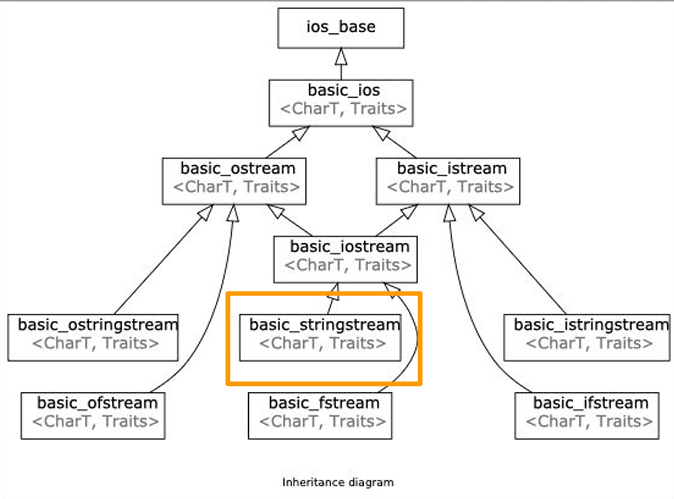

# C++ Fundamentals

## Types and Structs

C++是基于C（且兼容C）的高级语言。与C一样，它是编译型静态语言；而相对C，它强调面向对象编程的重要

一些C中相似的特性不再介绍（如基础类型，数组，结构）

相对于C的使用结构，我们还可以运用C++中的**类**，利用标准库或者自定义一些强大的对象。如下声明新的类型结构——使用`template`和`std::`中的结构

```c++
#include <iostream> //引入std::cout，std::endl
#include <utility>  //引入std::pair
#include <string>  	//std::string
//using namespace std;  其中std 指 C++ standard Library
//可以用来避免使用前缀——但这被认为是不好的习惯

auto get_apple_price(){ 		//auto是让编译器自动匹配类型，但仍为静态对象
    using Price = std::pair<std::string, int>;
    Price app_price = {"apple", 3}; 
    //与以下代码等效
    //std::pair<std::string, int> app_price = {"apple", 3};
    
	return app_price
}
```

其中`pair`定义代码如下，具体`template`的后续介绍

```cpp
template <typename T1, typename T2>
struct pair {
    T1 first;
    T2 second;
}; //include的作用
```


## Initialization and References

C++里有三种变量声明方式

### Direct initialization

直接使用以下两种形式声明，但可能会由于类型窄化，导致潜在的风险

```cpp
int main() {
    int foo1 = 12.0;
    int foo2(12.0); 	    //same
    //我们注意到，声明类型和值并不匹配，因为这里编译器自动使用了类型窄化
    return 0;
}
```

### Uniform Initialization

用括号包裹需要初始化的值——针对于数组和结构体，且不会有类型不匹配问题

```c++
#include <iostream>
#include <map>
int main() {
    std::map<std::string, int> ages{
        {"Alice", 25},
        {"Bob", 30},
        {"Charlie", 35}
    };}
```

### Structured Binding

基本语法如`auto [var1, var2, ...] = expression;`，可以解绑结构体和数组

```cpp
//解绑数组
int arr[] = {1, 2, 3};
auto [a, b, c] = arr; 

//基于C++简化的循环逻辑:	for (声明变量 : 容器) { ... }
//可以实现循环体直接赋值多个变量
for (const auto& [name, score] : scores) {
    std::cout << name << ": " << score << "\n";
}
```

### References

变量声明时，可以使用`&`进行引用声明

```cpp
int main() {
    int x = 10;
    int copy = x;	//重新copy一份
    int& reference = x;	//地址引用，修改reference即修改x
    return 0;
}
```

同样的，在函数传参时，可以通过`&`传入引用变量，继而直接修改原变量

```cpp
void squareN(​int& N‍) {
    N*=N;
}

int main() {
    int num = 5;
    squareN(num);
    // num 25 here!
    return 0;
}
```

## Memory and Pointers

所有的变量都需要存储在内存里。操作系统会自动为每个进程分配内存，被称为**address space**，它被分为以下的区间：

| 区间     | 描述                                                     |
| :------- | :------------------------------------------------------- |
| 共享内存 | 保留的内存空间，用于该进程和操作系统，或者其它进程的交流 |
| 栈       | 存储函数调用，局部变量，控制流信息。自动管理。           |
| 堆       | 存储动态分配，独立于函数调用的对象。需要特殊管理。       |
| 全局变量 | 在所有函数外部定义的变量，作用域从定义开始到文件结束     |
| 引入     | 也被称为*text*段，是进程代码的位置                       |

### 函数调用与栈

当一个函数被调用时，栈会为其分配一块内存（称为 **栈帧，Stack Frame**），存储以下信息：

- **返回地址（Return Address）**：
	函数执行完毕后，程序需要知道返回到哪里继续执行（通常是调用函数的下一条指令地址）。

- **参数（Arguments）**：
	传递给被调用函数的参数值（如果是值传递，参数会被拷贝到栈中；引用传递则可能存储指针）。

- **局部变量（Local Variables）**：
	函数内部定义的变量（如 `int x = 10;`）。

	特别的，局部变量的大小必须在编译时严格可知，且由于栈的大小有限，它不宜太大。

- **调用者的寄存器状态（Caller’s Registers）**：
	保存调用函数前的寄存器值（如栈指针、基址指针等），以便函数返回后恢复现场。

### 内存分配与堆

当你需要在运行时动态分配对象时，使用堆。

你需要首先请求获取一块指定大小的空间（可能是分散的）。如果没有足够的空间，会返回失败报错。如果有，则会返回起始位置的指针。当你不需要这个空间时，需要通过指针进行空间的释放。

对于同样的变量进行运算，堆的**效率不如**栈

!!! warning "堆指针"

    在现代C++中，不再建议使用原始指针（例如T*）来引用堆分配——这可能会导致内存泄漏。考虑改用智能指针，例如unique_ptr和shared_ptr，它们会自动解除分配。

### 指针

指针与常量的关系如下

|                         | non-`const` Pointee | **`const` Pointee**                    |
| :---------------------- | :------------------ | -------------------------------------- |
| **non-`const` Pointer** | `T*`                | `const T*` (or `T const*`)             |
| **`const` Pointer**     | `T* const`          | `const T* const` (or `T const* const`) |

C++引入了智能指针，使用`new`进行自动的管理，代码如下

```cpp
//赋值举例
auto ptr1 = new std::pair<int, double>;	  //未初始化
auto ptr2 = new std::pair<int, double> { 106, 3.14 }; //指定初始化
auto ptr3 = new std::pair<int, double>(); //初始化为0

//删除举例
T* ptr = new T;
delete ptr;

T* ptr = new T[n]; 
delete[] ptr; //*必须使用delete[]去删除数组*
```


## String

std::string 是C++中用于替代C的字符数组的字符串对象，提供更便捷，丰富的字符串操作，核心特性有

- **动态内存**：内部字符数组存储在堆上，自动扩容（如`append`时容量不足，重新分配更大空间），同时提供短字符串优化
- **接口丰富**：支持查找、子串、替换、迭代器等操作（如`find`, `substr`, `replace`）。
- **运算符重载**：支持`+`（拼接）、`=`（赋值）、`==`（比较）等运算符。

### 常用操作

|  **操作类型**   |                   **方法/示例**                   |
| :-------------: | :-----------------------------------------------: |
|  **构造/赋值**  |  `string s1;` `string s2 = "hello";` `s1 = s2;`   |
|  **访问字符**   |  `s[0]`（不检查越界） 或 `s.at(0)`（越界抛异常）  |
|  **追加/拼接**  |      `s.append("world")` 或 `s += "world";`       |
|  **查找/替换**  | `s.find("lo")`（返回位置） `s.replace(0,5,"hi")`  |
|    **子串**     |            `s.substr(起始位置, 长度)`             |
|  **大小/容量**  | `s.size()`（实际字符数） `s.capacity()`（总容量） |
| **清空/预分配** |   `s.clear()` `s.reserve(100)`（避免频繁扩容）    |

## Streams

> a general input/output(IO) abstraction for C++

Streams提供了一个处理终端IO数据通用方式

其中主要分为ostream, istream, 以及他们的交集，iostream



### stringstream

使用处理数据流的方式处理字符串——其中系统会自动根据空白符（空格，回车，制表符）进行切分

```cpp
#include <iostream>
#include <string>

int main() {
// create a stringstream 
std::string initial_quote = “Bjarne Stroustrup C makes it easy to shoot  yourself in the foot”; 
std::stringstream ss(initial_quote);	//基于传入变量，和类的初始化函数，给ss赋值
//声明并传入变量，根据空白符切分
std::string first; 
std::string last; 
std::string language, extracted_quote; 
ss >> first >> last >> language;
//通过getline，直接截取数据流到\n
std::getline(ss, extracted_quote);
    
std::cout << first << “ ” << last << “ said this: ‘” << language << “ “ << 
extracted_quote + “‘“ << std::endl;
```

`istream& getline(istream& is, string& str, char delim)`


### filestreams

```cpp
 int main() {

 std::ofstream ofs(“hello.txt”);  /// 打开文件，覆盖模式
 std::ofstream ofs.open(“hello.txt”, std::ios::app);  //打开文件，追加模式
 //将数据流写入文件
 if (ofs.is_open()) {
 ofs << “Hello CS106L!” << ‘\n’;
 }
 ofs.close();	//关闭文件
     
 //从文件中读取数据流
 std::ifstream ifs(“append.txt”)
 if (ifs.is_open()) {
 	std::string line;
 	std::getline(ifs, line);
 	std::cout << “Read from the file: “ << line << ‘\n’;
 }

 return 0;
 }

```


### ostreams

字符流输出，在传入终端前会存储在暂缓区，根据情况或接受的信号，再清除暂缓区并输出，如：

- `std::flush`：直接输出
- `std::endl`：补充`\n`再输出
- 暂缓区存满后自动进行输出

正常终端输出到`std::cout`，而报错信息则输出到`std:clog`, `std::cerr`

在有大量IO时，可以使用`std::ios::sync_with_stdio(false)`提高效率——即取消了与原`stdio.h`库的机制锁


### iostreams

与输出类似，数据流输入也具有暂存区，用`>>`读取逻辑如下：

- 数据流跳过开头的空白符，再一直输入

- 遇到三种**空白符**，输入暂停，**保留**空白符

- 将读取内容转为变量的类型——若是失败，则变量值不变

!!! warning "注意空白符！"
	`cin`会在空白符前暂停，并保留空白符在数据流中；而`getline`则会读取到**换行符**，并存入到字符串里。我们需要非常注意他们的区别，并尽量避免混用t

```cpp
//输入：3.14\nFabio Ibanez\n4.2
void cinGetlineBug() {
  double pi;
  double tao;
  std::string name;
  std::cin >> pi;
  std::getline(std::cin, name); //读取\n
  std::getline(std::cin, name);
  std::cin >> tao;
  std::cout << "my name is : " << name << " tao is : 
" << tao << " pi is : " << pi << '\n';
 }
```

