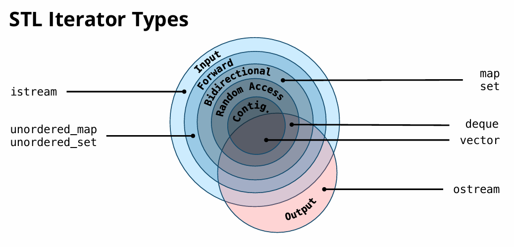

# Standard Template Library

## Introduction

**标准模板库（Standard Template Library，STL）** 是C++标准库的核心组成部分，提供了一系列通用的数据结构和算法模板，极大地提高了代码复用性和开发效率。STL基于**泛型编程**思想，主要包含以下四大组件：

- **容器（Containers）**：提供了存储和管理数据的模板，主要有序列式，关联式
- **迭代器（Iterators）**：提供统一的访问容器元素的接口，类似于指针
- **函数对象（Functors）**：包含各类函数对象、适配器
- **算法（Algorithms）**：提供了约100+个通用算法，通过迭代器操作容器

## Containers

### 各类容器简介

#### 有序容器

|     容器名称     | 数据结构 |                   特点                    |            底层实现            |
| :--------------: | :------: | :---------------------------------------: | :----------------------------: |
|    **vector**    | 动态数组 |   随机访问快，尾部插入高效，中间插入慢    |          连续内存数组          |
|     **list**     | 双向链表 | 插入/删除高效，不支持随机访问，内存不连续 |          双向链表节点          |
| **forward_list** | 单向链表 |     仅前向遍历，更省内存，插入/删除快     |          单向链表节点          |
|    **deque**     | 双端队列 | 头尾插入高效，随机访问较快，内存分段连续  |  多个固定大小数组块 + 索引表   |
|    **array**     | 静态数组 |    固定大小，栈内存分配，支持随机访问     | 连续内存数组（编译时确定大小） |

#### 关联性容器

使用`multiset/map`来允许重复键；排序性容器要求元素可比，哈希型容器要求元素可哈希；

|     容器名称      |  数据结构  |              特点              |          底层实现          |
| :---------------: | :--------: | :----------------------------: | :------------------------: |
|      **set**      |  有序集合  |  自动排序，唯一元素，查找高效  |  红黑树（平衡二叉搜索树）  |
|      **map**      | 有序键值对 |   键唯一，按键排序，查找高效   |   红黑树（存储pair对象）   |
| **unordered_set** |  无序集合  | 哈希表实现，查找最快，元素无序 |     哈希表（链地址法）     |
| **unordered_map** | 无序键值对 |  哈希表实现，键唯一，查找高效  | 哈希表（数组+链表/红黑树） |

#### 容器适配器

|      容器名称      | 数据结构 |                 特点                  |      底层实现       |
| :----------------: | :------: | :-----------------------------------: | :-----------------: |
|     **stack**      |    栈    |      LIFO 后进先出，限制顶部操作      | 默认基于 deque 实现 |
|     **queue**      |   队列   |      FIFO 先进先出，限制两端操作      | 默认基于 deque 实现 |
| **priority_queue** | 优先队列 | 元素按优先级排序，总返回最大值/最小值 |   vector + 堆算法   |

### 容器使用

容器初始化一般使用`std::container< T > {value1...}/(object);`，通过模版机制，容器支持不同类型的对象

对于遍历，大部分容器，我们迭代器，或者`const auto& item : container`进行元素的遍历

此外，大部分容器有其调用函数，包括数据访问、增删，底层地址获取等。

- 初始化可以使用`()`传参或者`=`赋值，一般使用`{}, {{}}`的临时数组，也可以深拷贝已有对象
- 数据访问一般可以使用`[]`和`at`（后者会检查越界），同时使用`.empty`判断是否为空
- 数据操作中，插入一般有`.insert(), .push(), .push_back()`，删除则往往可以使用`.erase()`
- 容器的循环和算法调用都可以使用迭代器作为统一接口

基于不同的底层实现，容器自动的进行扩容、数据迁移。

**有序容器**使用——以Vector为例：

```cpp
using namespace std;

/*======初始化======*/
// 方式1：默认构造（空vector）
vector<int> v1;
// 方式2：列表初始化
vector<int> v2 = {1, 2, 3, 4, 5};
// 方式5：指定大小n和默认值e
vector<int> v3(n, e); 

/*======数据访问和操作======*/
int first = vec[0];    // 不检查越界
int second = vec.at(1); // 会检查越界，抛出out_of_range异常
int* ptr = vec.data(); //访问底层数据

vec.push_back(4); // 尾部插入 
vec.pop_back(); 

vec.empty;	//是否为空
vec.clear(); //清空向量

/*======遍历======*/
// 方法1：C++11 范围for循环
for (const auto& item : vec) { //使用const auto&，防止复制消耗和修改风险
    cout << item << " ";
}
// 方法2：迭代器
for (vector<string>::iterator it = vec.begin(); it != fruits.end(); ++it) {
    cout << *it << " ";   //迭代器需要"*"来访问其值
}
// 方法3：下标访问
for (size_t i = 0; i < vec.size(); ++i) { // 使用size_t避免符号不匹配
    cout << vec[i] << " ";
}
```

无序容器使用——以map为例（实际上存储了大量`pair<const K, V>`

```cpp
/*======初始化======*/
// 方式1：默认构造空map
map<int, string> m1;
// 方式2：列表初始化（C++11+）
map<int, string> m2 = {{1, "Alice"},{2, "Bob"}};
// 方式3：拷贝构造
map<int, string> m3(m2); 

/*======遍历======*/
// 方法1：迭代器，略
// 方法2：C++11 范围for循环
for (const auto& pair : m2) {
    cout << "[" << pair.first << "]=" << pair.second << " ";
}
// 方法3：C++17 结构化绑定
for (const auto& [key, val] : m2) { 
    cout << key << "->" << val << endl;
}

/*======查找======*/
// 方法0：m.count(k)进行计数，m.contains(k)判断存在性
// 方式1：operator[]（注意：不存在时会创建默认值）
cout << "m2[2] = " << m2[2] << endl;      // 存在时访问

// 方式2：at()方法（推荐安全访问，不存在抛出out_of_range异常）
try {
    cout << "m2.at(3) = " << m2.at(3) << endl; 
} catch (const exception& e) {
    cout << "异常：" << e.what() << endl;
}

// 方式3：find查找（安全访问，返回*迭代器*）
auto it = m2.find(2);

//增删操作都可以用迭代器实现，具体细节在迭代器章节讲解
/*======插入======*/
// 方法1：insert直接插入pair
m1.insert(pair<int, string>(10, "Ten"));
m1.insert({k, v})
// 方法2：insert_or_assign（C++17+）
m1.insert_or_assign(20, "New Twenty");
// 方法3：使用operator[]插入
m1[40] = "Forty"; // 直接赋值插入

/*======删除======*/
// 方法1：erase通过键删除
size_t count = m2.erase(4); // 返回删除数量
// 方法2：清空整个map
m5.clear();
```


## Iterators

对于STL的大部分容器，其都有对应的迭代器，用于遍历里面所有的元素

迭代器的使用和数组**指针**非常相似，可以进行向前，可以取值——同时还有很多支持向后、修改值、随机访问

其中`.begin()`提供了首个元素的接口，`.end()`提供比较是否结束的接口

```cpp
std::vector<int> v {1,2,3,4,5};
auto it = v.begin(); //迭代器的类型为 std::container<T>::iterator, 一般使用auto即可
it += 2;       //向量迭代器具有随机访问能力
++it;        //迭代器一般使用前缀++     
if (it == --v.end()){...}
```

迭代器具体的集合分类和对应的典型容器如下：




## Functors

#### 函数对象

在STL里面，定义了许多函数对象——它们是类，但通过重载，也有类似函数的调用接口，如

```cpp
template <typename T>
struct std::greater {
	bool operator()(const T& a, const T& b) const {
		return a > b;
	}
};
```

由于函数类也是一个对象，所以它也可以含有内置的状态！

#### lambda

当我们需要在局部快速定义匿名函数对象时，可以使用 Lambda 表达式，基本语法：`[capture](params) -> ret_type { body }`，其中返回类型可以省略，捕捉对象可以为空

lambda函数相当于由编译器解析并插入的一段**函数结构体**——而其捕捉对象就是他的内置状态

```cpp
int x = 10;
auto func = [x, &y](int z) {  // 值捕获 x，引用捕获 y
    y = x + z; 
    return y * 2;
};

auto counter = [n=0]() mutable { return n++; };  // 如果需要修改捕获变量，使用mutable
```

常用的捕捉方式如下：

|    **捕获方式**    |   **语法示例**    |                  **作用**                  |           **注意事项**            |
| :----------------: | :---------------: | :----------------------------------------: | :-------------------------------: |
|     **不捕获**     |       `[]`        |             不捕获任何外部变量             |  只能使用 Lambda 参数和全局变量   |
|    **混合捕获**    |     `[x, &y]`     |            组合值捕获和引用捕获            |        可精确控制捕获方式         |
|   **包展开捕获**   | `[args...]``[&x]` | 捕获参数包（C++14）捕获外部变量 `x` 的引用 | 需确保被引对象生命周期长于 Lambda |
|  **全部引用捕获**  |       `[&]`       |           捕获所有外部变量的引用           |       容易引发悬垂引用风险        |
| **忽略未使用变量** |     `[=, &x]`     |      默认值捕获，但 `x` 单独引用捕获       |       显式覆盖默认捕获规则        |