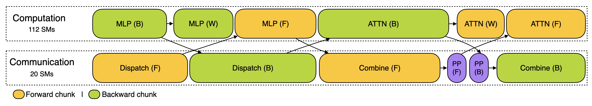
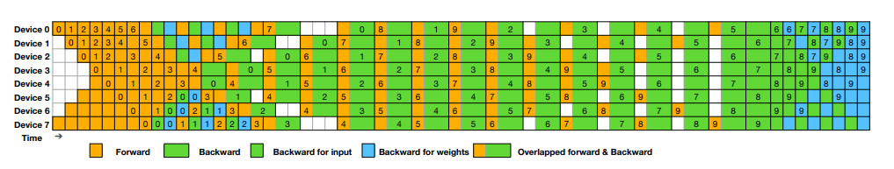

# FlashMLA

结合了MLA和flash attention。使用了hopper架构的ping-pong的计算方式

### 异步分组

采用异步流水线运行，利用 warp 专精化。

Cutlass中，有ping-pong操作。该操作采用生产者（Producer）、消费者（Consumer）模式。Ping-Pong例子中包含1个生产者、2个消费者，通过访存和计算的分工，提高计算效率

FlashMLA里面也使用了两个warp组。与ping-pong不同的是，这两个warp组是一种协作关系。

- warp_group_0(线程0~127): 负责进行attention scores运算、mask、softmax、部分PV计算。
- warp_group_1(线程127~255)：负责加载数据Q和K、部分PV计算。

## DeepEP

## **DualPipe & EPLB** 

DualPipe 的架构基于 Transformer 框架，并针对流水线并行进行了深度优化。其在ZB-PP划分粒度的基础上，DualPipe做了针对前向传播与后向传播都需要计算的情况，做了更细致的拆分。

DualPipe的核心思想是在一对单独的前向和反向块中重叠计算和通信。具体来说，每个计算块被划分为四个部分：**Attention、All-to-All Dispatch、MLP 和 All-to-All Combine**。对于后向传播块，Attention 和 MLP 进一步细分为输入梯度计算（**Backward for Input**）和权重梯度计算（**Backward for Weights**）。

如上图所示，对于一对前向和反向块，DualPipe通过重新排列这些组件，并手动调整专用于通信与计算的GPU SM（Streaming Multiprocessors）的比例，可以确保在执行过程中，全对全和PP通信都可以完全隐藏。

## DeepGEMM

## 3FS

