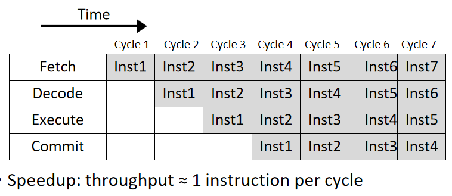
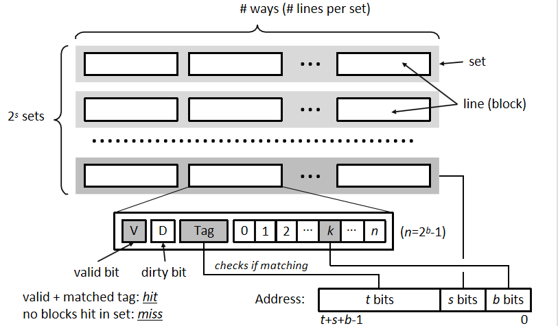

### ISA and x86 Instructions

- ISA（instruction set architecture）	=>	machine code
  															compile

​	#可以通过在C中嵌入汇编代码规定编译结果

- CISC(Complex Instruction Set Computer) and RISC(Reduced Instruction Set Computer)

#### Assembly Operations

- Arithmetic and Logic operations
- Transferring data between memory and register
- Control Logic
- Others

#### CPU Composition

- PC (program counter)	
- Register file (heavily used program data)
- Condition code

#### Register

- Integer registers:	16 <u>general purpose</u> registers, <u>64</u> bits each

- SIMD (Single Instruction Multiple Data) registers

  - Operations parallelize the execution <u>in data-level</u>
  - Compute for basic arithmetic and logic

  - Problem & Solution

    - **Problem**: Control divergence	(来自if语句等)

    - **Solution**: only to accelerate calculating conditions / speculative execution

      

### Processor Architecture

**Microarchitecture**: get designed for one ISA by different companies with different goals

#### CPU core work flow

- Fetch	- 	Decode	-	Execute	-	Commit (important for "out of order execution")

​		#These can be expanded (e.g. pre-decode, allocation)

- Pipeline:  maximize the use of every cycle.
- Pipeline defect
  - Data hazards  （需要前一条的指令的结果）
  - Control hazards  （控制语句跳过后续指令）
  - Structural hazards  (取存指令的冲突)

- Optimization for <u>control hazards</u>
  - Branch prediction (vulnerable to side-channel attacks)
  - speculative execution

### Memory Hierarchy

#### RAM

- SRAM (Static RAM): fast, costly	（ e.g. : cache）
- DRAM (Dynamic RAM): slow, cheap, needs refresh

#### Memory Layout

- 堆（Heap）和栈（Stack）是计算机内存管理中两种不同的区域
- 栈（Stack）
  - **分配**：栈内存是由编译器<u>自动分配和释放</u>的。它遵循后进先出。大小较小，速度较快。
  - **管理**：线性分配的，通过栈指针来管理。栈内存的生命周期严格受限于作用域，函数返回时栈帧被销毁。
- 堆（Heap）
  - **分配**：堆内存是由程序员手动分配和释放的。需要OS等程序管理内存块，处理碎片。堆通常较大，可以动态增长，按需分配。
  - **管理**：非线性分配的，通过函数管理（如malloc, free）。生命周期由程序员控制。

#### Virtual Memory

- **OS** utilizes <u>virtual memory</u> to isolate address spaces of different processes and provide <u>linear</u> address space.
- Address spaces are comparted into pages (typical size = 4KB)
- Upon access to a virtual address, hardware + OS (with a page table) converts it to a <u>physical address</u>
- If target page not in main memory, a <u>page fault</u> is triggered and OS has to load that page from disk (very slow)

#### Locality Strategy

- Temporal locality
- Spatial locality

#### Non-uniform Memory Access(NUMA)

- Independent local memory, commute by interconnect.
- Pros: avoid cache incoherence, exclusive memory space
- Cons: high time cost between different memory, **watch out**!

#### cache

- <u>SRAM-based</u> staging area for a <u>subset</u> in larger devices.
- Hierarchy:   L1(~10kb),	L2(~100kb),	L3(~10mb, often shared)
- Usage:	read hit / read miss / write hit / write miss

- Organization

​		**Unit parts:**	valid bit,	dirty bit (if written)	,tag(check)	 

- Cache coherence:

  - Problem: Private caches of different cores may contain the same cacheline.

  - Solution1:MSI Protocol, when write, broadcast a message on the interconnect to invalidate this cacheline in other caches.

    

### Concurrency Basics

#### Processes vs. Threads

- **Similarity**:	 own logical control flow,	run independently,	context switched
- **Difference**:
  - **概念**：进程是操作系统资源分配的基本单位，线程是 CPU 调度的基本单位,线程可以被视为进程的子集。
  - **资源**：同一进程中的线程共享资源，但每个线程具有独立的栈和寄存器；进程之间一般相对独立。
  - **开销**：取决于地址空间和资源的共享与否，线程的创建销毁相对进程开销都较小。进程的通信开销也更大。

#### Critical Section

- Definition: a block of code that only one thread of execution can enter at a time.
- Aim: Avoid conflict of a shared resource by multiple threads
- Solution: thread synchronization (E.g.   readers-writer lock)

​                                                                                                                                                                                                                                  