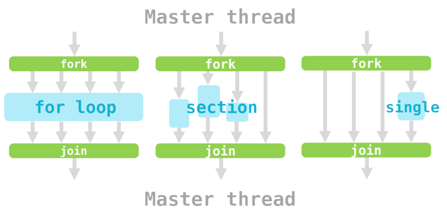
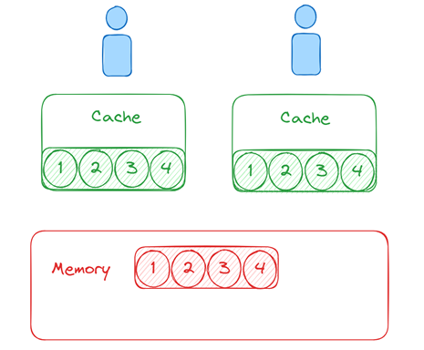

## OpenMP

一个支持多平台的，实现共享内容的并行计算编程API

开发者可以通过OpenMP，使得主进程并行区域分出多个线程进行执行。

能够方便地将单线程代码转化为多线程。

### 示例

```c
#include <omp.h>
int main() {
#pragma omp parallel
    {
        int ID = omp_get_thread_num();
        printf("hello (%d)", ID);
        printf("world (%d)\n", ID);
    }
```

- `#include <omp.h>`：引入OpenMP（C语音原生支持）
- `#pragma omp parallel`：创建一个并行区域（对后面一句代码生效）内的代码会被多个线程并行执行。
- `omp_get_thread_num();`：获取线程数，可以用环境变量*OMP_NUM_THREADS*设置

```bash
g++ -o 2_vector 2_vector.cpp -g -fopenmp
```

- 使用`-fopenmp`来启用OpenMP


### 指导语句Directives

| Pragma      | Directive                     | [clause[[,]clause]] |
| ----------- | ----------------------------- | ------------------- |
| #pragma omp | parallel, atomic, critical... | 0 to many           |

OpenMP中通过以`#pragma omp`开头的指导语句，划定并行区

可以使用`num_threads(n)`来实现线程数量指定

一般来说，OpenMP有三种分配任务方式



- for loop：

	通过for循环，自动为每个线程分配任务

	用`#pragma omp parallel for `作为开始

- section:

	将不同代码段分配给不同的线程执行，允许开发者显式划分任务

	格式如下：

	```c
	#pragma omp parallel sections{
	    #pragma omp section{// 代码段1
	}
	    #pragma omp section{// 代码段2
	}}
	```

- single：

	用于指定代码段只由一个线程执行，而其他线程等待该线程完成执行。

	在并行区内使用用`#pragma omp single `作为开始

	

### 负载分配

工作负载不同会导致线程负担不同，影响整体速度

OpenMP提供了不同的分配方式，来适应不同需求（默认Auto, 自动判断）

| 类型    | 概念                                               | 实现                                                         | 优点         | 缺点                   |
| ------- | -------------------------------------------------- | ------------------------------------------------------------ | ------------ | ---------------------- |
| Static  | 直接按照任务的数量，在开始就分配好各自线程的任务量 | `#.. schedule(static,n)`, n 表示每块的任务数，会自动循环分配后再执行程序 | 分配开支少   | 工作负载容易不平衡     |
| Dynamic | 设置任务栈，线程完成任务后自动出栈获取任务         | `#.. schedule(dynamic,n)`, n 每次取的任务数                  | 分配灵活     | 分配开支较高配         |
| Guided  | 任务划分先大后小，线程完成任务后自动获取新任务     | `#.. schedule(guided,n)`, n 表示最少的任务                   | 相对比较灵活 | 实践上并不一定为最优化 |

此外，for loop自动拆分一层任务循环

为了将任务拆分为更多子任务，可以使用`#..collapse(n)`

如使用`collapse(2)`对嵌套for语句进行拆分


### Data Hazard

#### 数据类型

在OpenMP中，并行时的数据类型有：

- **Shared**：默认在并行区域外声明的数据为共享数据
- **Private**：并行区内声明，以及循环变量，都是线程的专有数据。声明私有的变量在线程内重新初始化。
- **Firstprivate**：通过`firstprivate(sum)`子句实现，每个线程声明该专有变量，同时初始化为原始值。
- **Lastprivate**：通过`lastprivate(sum)`子句实现，变量会变成最后完成的循环的值

```c
//举例说明类型区别 sum初始为10
#pragma omp parallel num_threads(4) %数据类型(sum){
#pragma omp for
        for (int i = 0; i <= 99; i++) {sum += a[i];}
        printf("Sum = %d\n", sum);
}
printf("Outside Sum: %d\n", sum);

%shared：小于5060的某一数值（读写冲突）
%private     2200 1575 950 325 10
%firstprivate 2210 1585 960 335 10
%lastprivate (!放在for后面！） 2200
```

因为内存的读写原因，容易造成数据冲突


#### 解决冲突

- **Critical Section**：
	- 效果：只有一个线程能进入临界区，效率较低。
	- 实现：通过互斥锁，使得线程专有读写
	- 语句：` #pragma omp critical`+语句块

- **Atomic Operations** ：
	- 效果：针对*特定一些语句*，一次只能针对一个操作，实现读写共享
	- 实现：通过CPU层面的原子语句操作
	- 语句：` #pragma omp atomic`+单句

- **Reduction（归约）**：
	- 效果：针对*部分操作*，实现私有变量的归约（如乘法加法）
	- 实现：自动并和私有变量
	- 语句：`reduction(+:sum)`

#### 虚假共享



**虚拟共享**是指多个线程在不同的变量上操作，但这些变量位于同一个缓存行中

由于缓存一致性协议，读写操作会导致内存重读，频繁无效缓存行，降低性能。

采用一些技术可以解决虚假共享问题：

- **填充（Padding）**：在数组元素之间插入额外的空间，使得每个元素占据独立的缓存行。

- **对齐（Alignment）**：使用编译器提供的对齐指令来确保变量之间的距离足够大，以避免共享同一个缓存行。

	

### 优化流程

1. **Where to parallelize**: Profiling

2. **Whether to parallelize**: Analyze data dependency

3. **How to parallelize**: Analysis and Skills

	- Sub-task Distribution
	- Scheduling Strategy
	- Cache and Locality
	- Hardware Environment
	- Sometimes: Transform recursion to iteration

4. **Get Down to Work**: Testing

	- Ensure correctness while parallelizing

	- Be aware of overhead 

	- Check more details in official documents. (e.g. OpenMP on GPU)

	