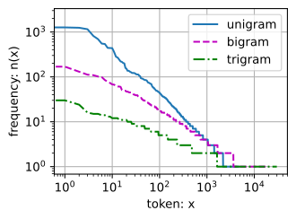
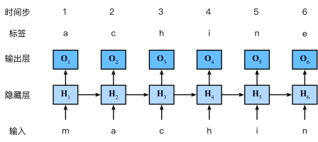
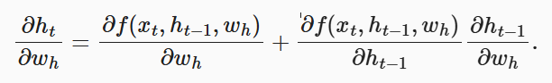
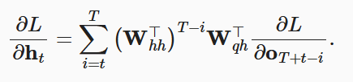
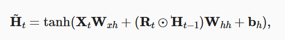
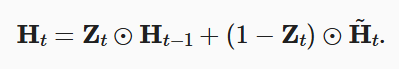
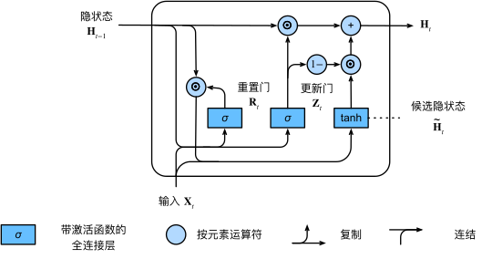
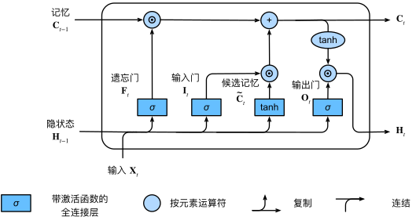
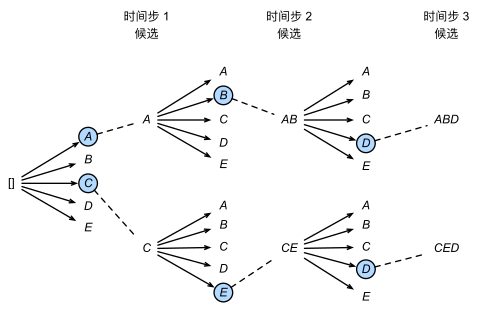

## 循环神经网络

### 语言序列模型

#### 词元化与自然语言统计

我们将语句进行分词，进行词频排序并且赋予唯一的数字编号，称为词元化

对于一般的自然语言语料库（英语），有以下特点：

- 有一些显著高词频的单词，往往是一些副词，它们被称为停用词
- 我们会人为指定额外的特定词元。对低频率词元视为相同的<unk\>词元。在小批量时用于将序列填充到相同长度的填充词元（“\<pad>”），以及序列的开始词元（“\<bos>”）和结束词元（“\<eos>”）
- 对词频进行作图，发现除了停用词外，大部分单词遵循双对数坐标图上的一条直线。这被称为**齐普夫定律**。对多元词元组合，<u>该定律仍旧成立</u>。
- n元组的数量并没有那么大，这说明语言中存在相当多的结构。因而拉普拉斯平滑非常不适合语言建模，需要基于深度学习的模型



#### 序列模型

序列模型，往往采用马尔科夫模型，通过以往数据预测未来的数据。

在语言模型上，往往采用

- 随机采样：随机抽取序列片段作为训练样本，增强模型泛化能力。

- 顺序分区：将数据集按时间顺序分割为连续的块，每个训练样本是连续的序列片段，有利于长期规律学习。

- 独热编码：将词元索引映射为一个长度为N（词表长度）的向量。

- 困惑度：所有的n个词元的交叉熵损失的平均值，来衡量输出结果的合理性。

	$\exp\left(-\frac{1}{n} \sum_{t=1}^n \log P(x_t \mid x_{t-1}, \ldots, x_1)\right).$

然而，模型参数会与时间步成指数增长关系——太短的时间步，能力又不足。因此，我们不如使用隐变量模型。

### 循环神经网络

#### 基础架构

使用隐变量存储先前状态的信息，有$P(x_t \mid x_{t-1}, \ldots, x_1) \approx P(x_t \mid h_{t-1}),$

其中时间步$t$的隐状态$H_t$，由新的输出$X_t$，以及前隐藏变量$H_{t-1}$所决定

而时间步$t$的输出$O_t$，隐藏变量$H_{t}$所决定

循环神经网络中，输出和输入都具有词表长度的维度，而隐藏层的维度可自行调节。



#### 梯度爆炸

循环神经网络很容易出现梯度爆炸问题——这是由于它隐藏层的反向传播链条过长。



（其中$\frac{\partial h_{t-1}}{\partial w_h}$又会继续展开运算。）

在恒等映射、无偏置的情况下有：



可见，梯度陷入到$W_{hh}$的潜在的非常大的幂。 在这个幂中，小于1的特征值将会消失，大于1的特征值将会发散。

为此，我们引入一些方法来解决这个问题：

- 球形梯度约束$ g^{'}=min\{1,\frac{\theta}{|g|}\} \cdot g $ ——实际上约束了梯度修改的最大绝对值
- 截断时间步，约束求导链条的长度，但会让模型侧重于短期影响
- 随机截断，引入符合退化分布的随机变量$\varepsilon$，且其期望为1，乘入表达式中。与暂退法有相似之处。

但是以上方法仍不能很好解决问题，因此我们发展出了一些更复杂的架构，在下一章中介绍

#### 代码实现

```python
#torch的简洁实现
num_hiddens = 256
rnn_layer = nn.RNN(len(vocab), num_hiddens)
#RNN模型的启动——输入一个随机的隐状态
state = torch.zeros((1, batch_size, num_hiddens))
X = torch.rand(size=(num_steps, batch_size, len(vocab)))
#模型的运行
Y, state_new = rnn_layer(X, state)
#最后使用全连接层处理输出
nn.Linear(self.num_hiddens, self.vocab_size)
output = self.linear(Y.reshape((-1, Y.shape[-1])))
```


## 现代循环神经网络

传统的循环神经网络，存在梯度消失或者爆炸的问题。同时还有许多问题，举例如下：

- 早期观测值具有非3常重要的意义
- 有大量无意义的观测值，需要降低其影响
- 序列的部分存在逻辑中断

因此，我们需要对提出一些新的方法。

####  门控循环单元

**关键**：引入了专门的机制来确定应该何时更新隐状态

每次调用模型时，都会基于隐状态和输入，通过全连接层，进行重置门和更新门的计算。

两个门都是（0,1）之间的向量。重置门控制“可能还想记住”的过去状态的数量； 更新门控制新状态中有多少个是旧状态的副本。

通过重置门，我们计算出候选隐状态$\tilde{\mathbf{H}}_t \in \mathbb{R}^{n \times h}$



通过更新门，我们控制多少的候选隐状态用于更新




		

#### 长短期记忆网络

隐变量模型存在着长期信息保存和短期输入缺失的问题，我们引入三个门，同时我们引入一个用于长期记忆的状态。

具体的数据流如下，其中$C_t$即长期记忆单元



#### 深度循环神经网络

通过对每一个轮的隐状态计算叠加深度，可以强化其能力——在`torch`中，我们使用`num_layers`参数指定


#### 束搜索

一般而言，我们在RNN中的每一时间步，采用最高概率的y输出

然而，这种贪心搜索的方式，不一定能保证序列的总概率最大化，故不一定是最佳序列

通过引入束搜索，我们在每一步保留n个总概率最大的序列进行计算，n即束宽



#### 双向循环神经网络

为了同时考虑未来的数据的影响，我们使用双向循环的方式

由于梯度链更长，双向网络的训练代价非常高

同时，由于训练时为双向，只是基于过去数据预测未来数据的误差很大


#### 编码-解码架构的循环神经网络

为了处理输入输出都是长度可变的情景（如机器翻译），我们引入了编码器-解码器架构

编码器：长度可变的序列作为输入， 并将其转换为具有固定形状的编码状态

解码器：将固定形状的编码状态映射到长度可变的序列


与之前的RNN网络不同的是，我们专门划分出了两个部分，利用隐状态传递了全部原文的信息

```python
class Seq2SeqEncoder(d2l.Encoder):
    """用于序列到序列学习的循环神经网络编码器"""
    def __init__(self, vocab_size, embed_size, num_hiddens, num_layers,
                 dropout=0, **kwargs):
        super(Seq2SeqEncoder, self).__init__(**kwargs)
        # 嵌入层
        self.embedding = nn.Embedding(vocab_size, embed_size)
        self.rnn = nn.GRU(embed_size, num_hiddens, num_layers,
                          dropout=dropout) #num_layers为深度

    def forward(self, X, *args):
        # 输出'X'的形状：(batch_size,num_steps,embed_size)
        X = self.embedding(X)
        # 在循环神经网络模型中，第一个轴对应于时间步
        X = X.permute(1, 0, 2)
        # 如果未提及状态，则默认为0
        output, state = self.rnn(X)  #为了适配注意力机制，存储了所有时间步输出
        # output的形状:(num_steps,batch_size,num_hiddens)
        # state的形状:(num_layers,batch_size,num_hiddens)
        return output, state
```

```python
class Seq2SeqDecoder(d2l.Decoder):
    """用于序列到序列学习的循环神经网络解码器"""
    def __init__(self, vocab_size, embed_size, num_hiddens, num_layers,
                 dropout=0, **kwargs):
        super(Seq2SeqDecoder, self).__init__(**kwargs)
        self.embedding = nn.Embedding(vocab_size, embed_size)
        self.rnn = nn.GRU(embed_size + num_hiddens, num_hiddens, num_layers,
                          dropout=dropout)
        self.dense = nn.Linear(num_hiddens, vocab_size)

    def init_state(self, enc_outputs, *args):
        return enc_outputs[1]

    def forward(self, X, state):
        # 输出'X'的形状：(batch_size,num_steps,embed_size)
        X = self.embedding(X).permute(1, 0, 2)
        # 广播context，使其具有与X相同的num_steps
        context = state[-1].repeat(X.shape[0], 1, 1)
        X_and_context = torch.cat((X, context), 2)
        output, state = self.rnn(X_and_context, state)
        output = self.dense(output).permute(1, 0, 2)
        # output的形状:(batch_size,num_steps,vocab_size)
        # state的形状:(num_layers,batch_size,num_hiddens)
        return output, state
```

##### 损失函数

需要注意的是，在计算损失函数时，我们要将序列中的填充词元mask。

基于独热编码，计算损失类同于分类问题，使用softmax和交叉熵即可

##### 模型评估 - BLUE

BLUE评估的是n元语法是否出现在标签序列当中，其定义公式通常如下

$\exp\left(\min\left(0, 1 - \frac{\mathrm{len}_{\text{label}}}{\mathrm{len}_{\text{pred}}}\right)\right) \exp\left(\Sigma_{n=1}^k w_n \ log \ p_n \right)$

关键参数：

- $p_n$：n-gram 的精确度，即预测序列与标签序列中匹配的 n-gram 数量 / 预测序列中的 n-gram 总数。
- $w_n$：权重（通常取 1/*k*，即各 n-gram 权重相等）
- $k$：最大 n-gram 长度（通常取 4）。
- $len_{label}$：标签序列的词元数。
- $len_{pred}$：预测序列的词元数。

前一项乘数，代表长度惩罚，当预测序列和标签序列差距越大，惩罚越大

后一项中，每一项都代表了一个n元的词元匹配

需要注意的是，$p_n$在长词元的情况下可能会归零，实际中可能会采用平滑方法

优点：

- 快速、自动化评估翻译质量
- 多粒度（n-gram）捕捉局部和全局匹配

缺点：

- 忽略词序和语义（如近义词无法得分）
- 对短句严格（若预测过短，BP 惩罚严重）
- 无法处理语言多样性（多个有效翻译可能得分低）