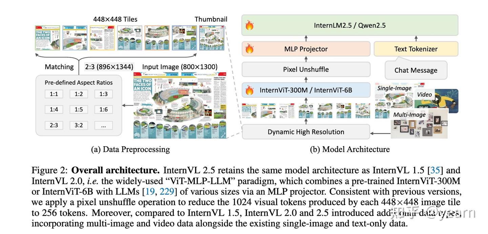
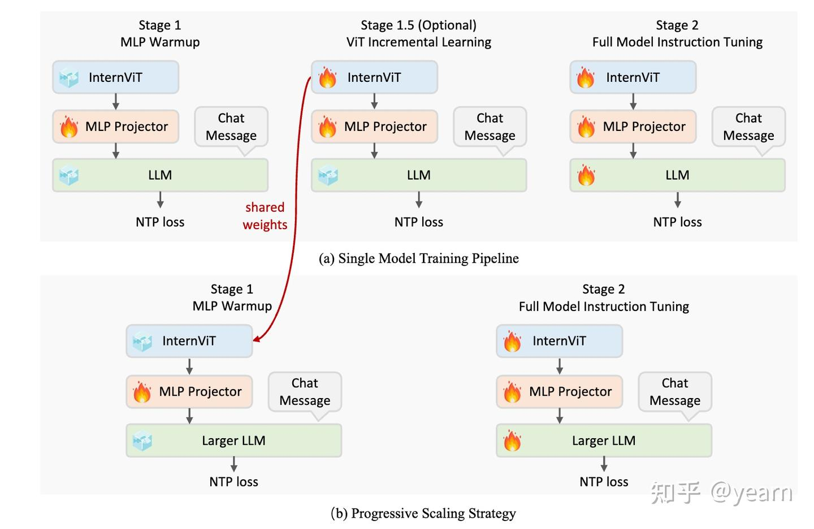

## ViT

ViT中patch大小为16x16，每张图片拆分为多个patch，作为序列输入到投影层转换后变为token并加上位置编码，随后进行常规的transformer的运算，最后接一个MLP进行图像分类工作。

ViT原论文中最核心的结论是，当拥有足够多的数据进行预训练的时候，ViT的表现就会超过CNN，突破transformer缺少**归纳偏置**的限制，可以在下游任务中获得较好的迁移效果。

当训练数据集不够大的时候，ViT的表现通常比同等大小的ResNets要差一些——因为CNN天然具有两种归纳偏置，一个是局部性，一个是平移不变性。因此在数据较少的时候，CNN也可以学习到一个相对较好的模型。

缺少归纳偏置让ViT应用于小数据集时非常依赖模型正则化（model regularization）和数据增广（data augmentation）。有论文表明，对于迁移学习来说，训练数据更多的模型和数据增强更多的模型相比较前者可能是更好的选择

## Internvl

使用了经典的ViT-MLP-LLM架构。ViT使用了InternViT-6B 或 InternViT-300M； MLP为一个随机初始化的两层投影器；

### ViT

**InternViT-6B**：采用了基础 ViT 架构，但将规模首次提升到60亿参数的大量级。该模型有 5.9B 参数，48 层，隐藏层大小为 3200，25 个头，并使用对比损失进行训练。引入了 QK-Norm 和 RMSNorm。通过分割数量的不同，可以实现动态分辨率。

**InternViT-300M**：这是一个蒸馏变体，使用余弦蒸馏损失，包含 0.3B 参数，24 层，隐藏层大小为 1024，16 个注意力头。

后续升级中，*删减*了最后三层，同时将分辨率提升到了*448*，并引入了**全局缩略图**保留全局信息。

同时每一次升级都默认伴随着**数据的巨大升级**。

通过Pixel Shuffle，将长序列的视觉token进行重排，将1024 tokens 转化为了 256 tokens。

### 训练过程

- 阶段1，只训练MLP Projector，冻结视觉编码器和语言模型（动态高分辨率策略）。应用较高的学习率以加速收敛，使MLP能够快速适应LLM的输入空间，并建立稳健的跨模态对齐。提高后续训练稳定性。
- 阶段1.5，针对视觉编码器和 MLP 投影器进行增量训练，提升处理稀缺领域（如多语言 OCR、数学图表）的能力。并保证LLM兼容性
- 阶段2，全模型指令微调——在**高质量的多模态指令数据集上**微调整个模型。
- 渐进式缩放训练：使用较小的LLM（20B）进行训练，再迁移到大型LLM

### 训练增强

- 随机对图像应用 JPEG 压缩（质量范围 75–100），以模拟互联网环境中的图像退化，从而增强模型对噪声图像的鲁棒性。
- 损失重加权：为平衡不同长度响应的 NTP 损失，采用平方平均重加权策略。这种方法有效缓解了对长或短响应的偏倚。

