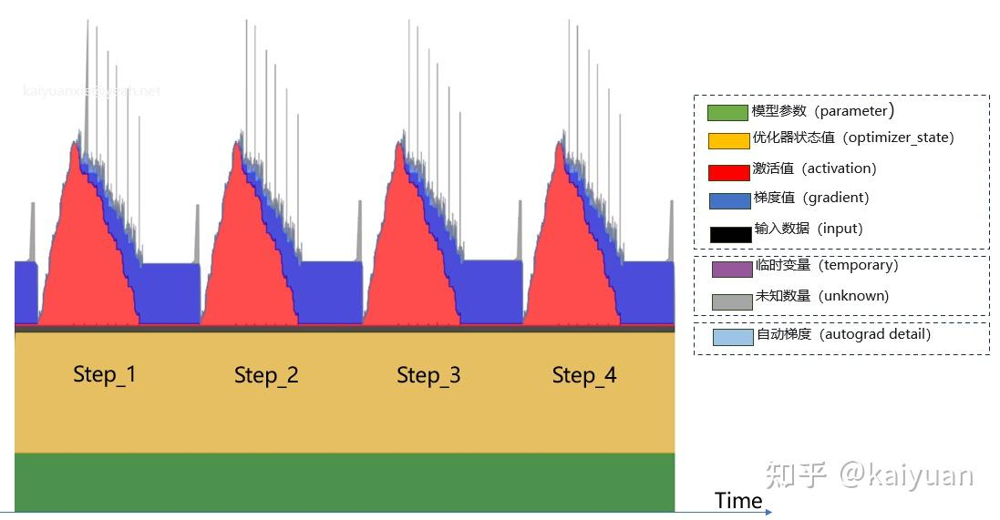
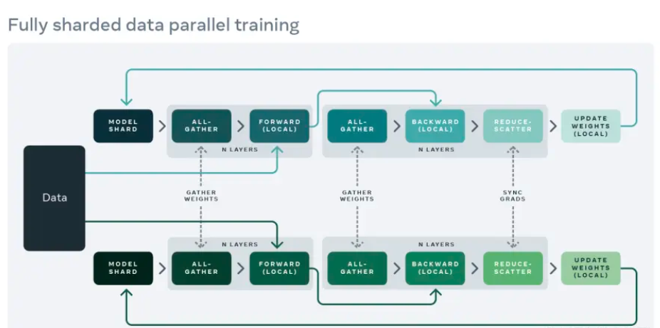
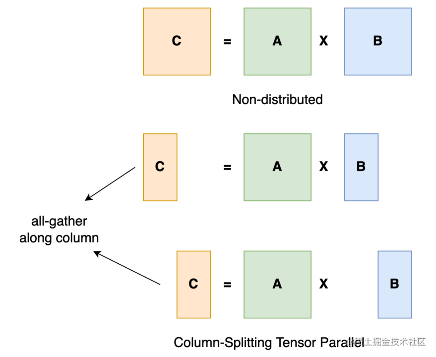
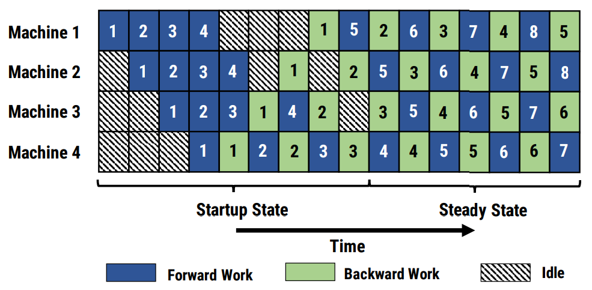
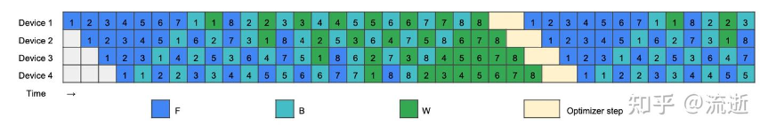

# LLM训练

## 优化器

###  Adam

Adam(Adaptive Moment Estimation)，结合了AdaGrad算法和RMSProp算法的优点，通过计算梯度的一阶矩估计和二阶矩估计来为不同的参数设计**独立的自适应性学习率**。

Adam算法的更新规则如下：

1. 初始化一阶矩估计（动量）$m_t$ 和二阶矩估计（梯度平方的移动平均）$v_t$ 为0，以及时间步长 $t=1$ ；

2. 在每次迭代中，计算梯度 $g_t$ ；

3. 更新一阶矩估计 $m_t$ 和二阶矩估计 $v_t$ ：$m_t = \beta_1 \cdot m_{t-1} + (1 - \beta_1) \cdot g_t$，$v_t = \beta_2 \cdot v_{t-1} + (1 - \beta_2) \cdot g_t^2$
   
4. 计算偏差修正的一阶矩估计 $\hat{m}_t$ 和二阶矩估计 $\hat{v}_t$ ，$t$为步数：$\hat{m}_t = \frac{m_t}{1 - \beta_1^t}$，$\hat{v}_t = \frac{v_t}{1 - \beta_2^t}$

5. 更新参数 $\theta$：，$\theta_t = \theta_{t-1} - \eta \cdot \frac{\hat{m}_t}{\sqrt{\hat{v}_t} + \epsilon}$   。其中，$\eta$ 是学习率，$\epsilon$ 是为了数值稳定性而添加的小常数（例如 $1e-8$ ），$\beta_1$ 和 $\beta_2$ 是超参数，通常分别设为0.9和0.999。

Adam算法有效性的核心如下：

- **动量法**：一阶矩$m_t$类似于动量法，通过累积历史梯度方向，同时具有加速收敛和抑制震荡的作用
- **二阶矩**：进一步放大极端梯度幅度的影响，历史梯度幅度大时会降低学习率，避免震荡
- **偏差修正**：由于初始时刻矩估计偏向零，Adam通过除以修正项（$1−β^t$）校正偏差，确保初期稳定性。

一般来讲，Adam需要float32来保持数值稳定，则需要$2 \times 4 \times 参数量$的额外空间

## 显存计算

## 并行策略

总体而言，大模型的并行策略有**DP, TP, PP**三种，同时还有常用的优化并行策略**ZeRO**

在实际应用中会结合多种并行策略。通常情况下，张量并行所需的通信量最大，而数据并行与流水线并行所需的通信量相对来说较小。因此，同一个服务器内使用张量并行，而服务器之间使用数据并行与流水线并行。

### 数据并行 DP

数据并行，即将每批次的数据分给不同设备/设备组，单个组中包含完整的模型。当一批次训练完成反向传播后，通过通讯聚合梯度并更新参数。

数据并行有通讯消耗少，训练效率高的特点。在显存足够的情况下可以尽量选择数据并行。

较早的DP是单机多卡的，有利用率不均衡等缺点。后续引入了分布式数据并行**DDP**，即多机多卡多进程，仅对梯度使用All-Reduce，更加高效、均衡、通信小。	

结合了ZeRO-3技术后，我们有显存消耗更小的**FSDP**（Fully Sharded Data Parallel）

典型实现：PyTorch DDP

### 张量并行 TP

张量并行训练是将一个张量沿特定维度分成 N 块，每个设备只持有整个张量的 1/N进行计算。同时不影响计算图的正确性，每组矩阵，都需要通信同步，来确保结果的正确性。

典型实现：Megatron-LM（1D）、Colossal-AI（2D、2.5D、3D）

### 流水线并行 PP

流水线并行的核心思想是，模型按层分割成若干块，每块都交给一个设备。在前向和反向传播过程中，分别正序和逆序调用模型。流水线并行需要在层间进行通信同步，总体来说通讯开销小于TP，但是由于层并行的顺序性，训练设备容易出现空闲状态（bubble）

为了减少Bubble，有以下优化方式：

- 微批次流水线并行：通过将传入的小批次（minibatch）分块为微批次（microbatch），提高利用率（但影响LN）

- 1F1B 策略：前向计算和反向计算交叉进行，可以及时释放不必要的中间变量。在研究表明，峰值显存可以节省 37.5%。在显存减少的情况下，可以进一步提高微批次数量来减少bubble。且流水线刷新更少（启动与收尾）

  但交替的计算，导致需要额外的权重存储，来使得前向和后向传播中使用<u>相同的权重版本</u>

  

- PipeDream-2BW ：双缓冲权重更新，每个设备有两个权重，定期更新稳定权重；通过减少权重存储，降低显存，来提高微批次数量，进而进一步提高bubble
  - 稳定权重（Stable Weights, Wₛ）：用于前向计算，所有设备共享同一版本。
  - 最新权重（Latest Weights, Wₗ）：用于反向计算，每个设备独立更新。

- 交错流水线/虚拟流水线：在设备数量不变的情况下，分出更多的流水线阶段，以更多的通信量，换取空泡比率降低。

- ZBPP：

	- 通过将反向计算分为两个部分，一个计算输入的梯度，另一个计算参数的梯度，实现了近似零流水线空闲

	

典型的流水线并行实现：GPipe、PipeDream、PipeDream-2BW、PipeDream Flush（1F1B）。

### 优化器并行 ZeRO

优化器并行主要是通过分布存储来降低模型的显存开销，但会增加通信开销。常见的方法为ZeRO，ZeRO有三个不同级别，对模型状态进行不同程度的分片：

- ZeRO-1 : 对优化器状态分片（Optimizer States Sharding）

	将优化器状态均分到每个模型上，每次进行反向传播、更新参数后，通过广播同步优化器参数（适合类Adam优化器）

- ZeRO-2 : 对优化器状态和梯度分片（Optimizer States & Gradients Sharding）

	原本DDP中是对所有梯度进行计算，现在则是计算并更新对应的梯度，随后再进行同步。（reduce scatter)

- ZeRO-3 : 对优化器状态、梯度分片以及模型权重参数分片（Optimizer States & Gradients & Parameters Sharding）

	每个GPU上仅存在模型的分片，每次计算前需要all-gather收集所有权重（可一层一层收集参数，有点类似TP）

### 补充内容

- 异构系统并行：通过共享内存和缓存一致性等机制可以实现更紧密的CPU-GPU集成，借此可以大大提升显存。例如，苹果自主研发的M系列芯片就实现了CPU和GPU的无缝内存共享和统一。（代价是共享内存略慢于显存）

- MOE并行：即将大模型拆分成多个小模型（专家），减少实际激活的参数。激活通过可训练并确保稀疏性的门。
- 重计算降低显存：不保存前向传播的中间结果，而是在反向传播时重新计算