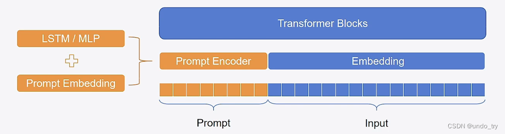
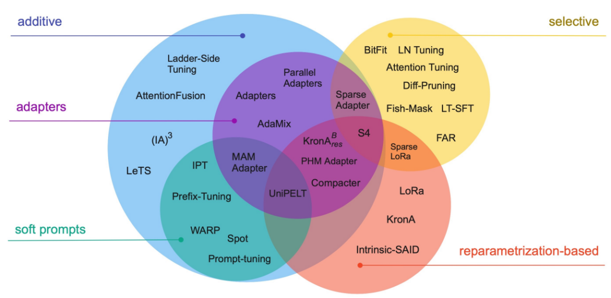

# LLM微调

大模型微调具有全参数微调，以及参数高效微调（Parameter-Efficient Fine-Tuning，简称PEFT）

前者需要大量的数据、计算资源和较长的训练时间，和LLM的训练比较相似。

而后者被更多采纳，它通过增加/微调一小部分的参数，来让大模型适应特定任务，适合快速适配。

## Soft Prompts

Soft Prompts（软提示）与Hard Prompts（硬提示）相对。软提示是**可学习**的连续向量，通过针对特定数据集进行训练获得，可以自动优化以适应不同任务。

软提示的工作原理是在模型输入层增加可学习的投影层，将原始输入映射到提示信息所表示的语义空间中。投影层中的参数通过训练数据学习得到，使得提示信息能够更好地适应任务需求。

Soft Prompts更适合较大规模，已经具备较强能力的模型。

### Prompt Tuning

Prompt Tuning（提示调优）是一种轻量级的微调方法。它在预训练模型的基础上，再选择了一个提示模板，加入到输入的序列前，组成新的序列（`[soft prompts] + [input text]`）；同时，它会在目标数据上进行训练，并只更新提升模板，来达到适配新任务的方式

Prompt Tuning所需的成本极低，且不改变模型内部权重，适合**大规模模型**的轻量级微调。

### Prefix-Tuning

相比与提示调优，Prefix-Tuning（前缀调优）相当于在transformer的每一层的加上了前缀。

$$
headi = Attn(xW^i_q, concate(P^i_k,CW^i_k), concate(P^i_v,CW^i_v))
$$

其中$P^i_k, P^i_v$是可以学习的向量。通过固定其他参数，训练更新该向量即可。实际上，这相当于在每层加了一个虚拟token。

### P-tuning

P—Tuning与Prompt Tuning类似，但它添加的提示词是通过一个神经网络（LSTM+MLP）生成的。

在预训练阶段，我们在初始化的虚拟token后，加入该神经网络计算后生成的嵌入token，随后进行训练（神金网络有助于收敛）

在实际推理时，与Prompt Tuning一样，我们只需要使用计算好的固定的虚拟token即可

## Adpater

基于适配器Adapter的方法在冻结的预训练模型的注意层和全连接层之后**添加额外的可训练参数**，以减少内存使用量并加快训练速度。

适配器的通常很小，但却能达到近似完全微调模型的性能。

### LoRA

LoRA，使用了低秩分解的方法，将大的权重矩阵分解为两个较小的矩阵的乘积，大大减少了微调的计算成本。

LoRA的实施过程大致如下：

1. 选择模型中需要微调的层（如Transformer模型中的自注意力层）；
2. 在这些层的权重矩阵中引入两个新的可训练矩阵A和B，它们的维度远小于原始权重矩阵；
3. 在模型的前向传播过程中，通过计算原始权重矩阵与矩阵A和B乘积的**和**来得到新的输出，其中矩阵A和B的乘积代表了低秩矩阵的更新；在训练过程中，只更新A和B的参数，而保持原始权重矩阵不变；

LoRA方法的秩是一个重要的超参，较低的秩可能无法学习到正确的模式，而较高的秩则可能需要更多的计算资源。

### QLoRA

QLoRA主要的工作其实是提出了4位标准浮点数量化和双重量化（可对模型使用），在这个基础上我们可以使用量化版本LoRA。

（这篇文章相关内容有待后续再学习）

### AdaLoRA

AdaLoRA通过奇异值分解（Singular Value Decomposition, SVD）来评估每个矩阵的重要性。在SVD中，一个矩阵可以被分解为三个特定的矩阵，其中一个包含了所谓的奇异值，这些奇异值可以告诉我们矩阵的哪些部分是重要的。AdaLoRA利用这些信息来动态调整每个LoRA矩阵的秩，秩较高的矩阵会有更多的参数被更新，而秩较低的则反之。

[AdaLoRA（Adaptive LoRA）详解 - 知乎](https://zhuanlan.zhihu.com/p/667432109)（待学习）

