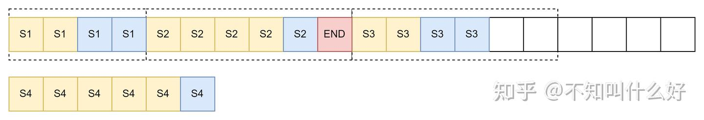
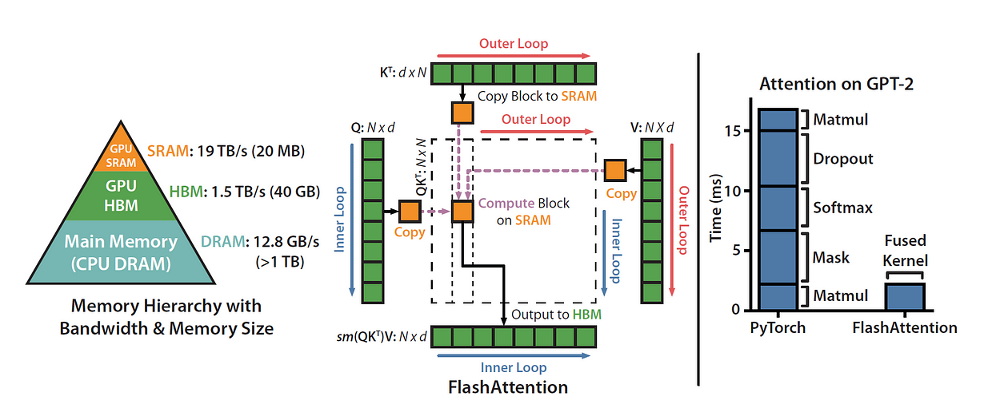
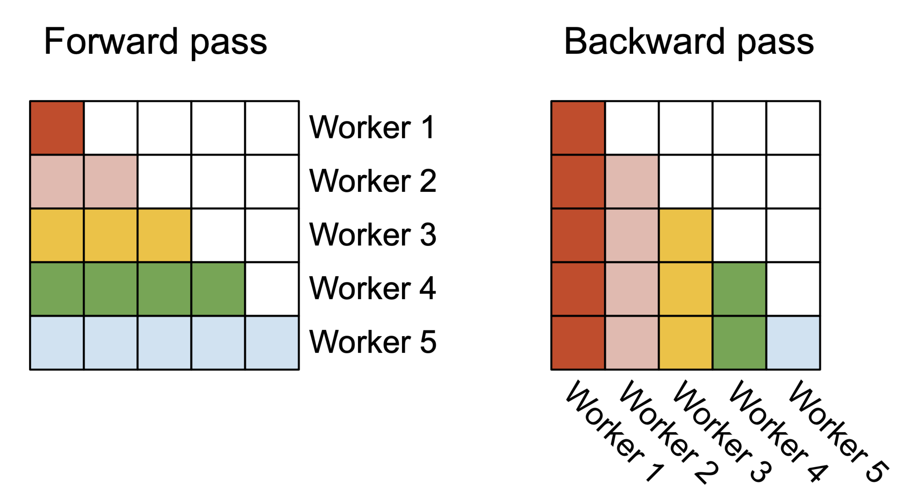
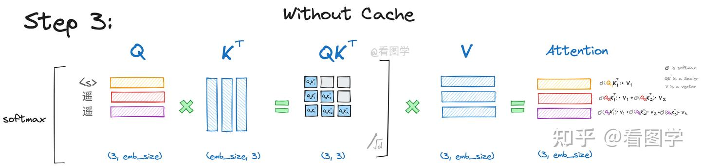
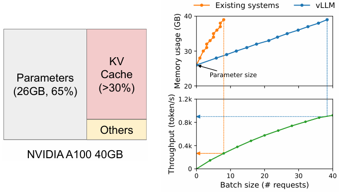

## Batching

### Native Batching

为每批次的输入都申请固定长度的内存空间——由于序列长度的差异，这将会导致大量内存浪费、计算资源浪费

### Continuous Batching

一旦有一个序列结束，我们就加入新的序列进入我们的批次当中，保证计算资源的充分使用

### Dynamic Batching

vLLM结合了其高效的内存利用机制（Paged Attention），实现了更加高效的动态批处理。

首先，请求会被放入waiting（等待prefill阶段），running（推理计算阶段），swapped（暂不涉及）

对于一批次请求，vLLM会首先放入请求直至预定的内存上限，随后进行生成（此处内存由分页机制高效管理）

当某次生成后，内存即将不足时，低优先级的任务将会释放kv cache并存储token，随后回到waiting队列

而每当有任务完成时，我们就检查waiting队列，并尝试加入新的任务至runing列表

## Flash Attention

Transformer模型在计算长序列的时候，在attention部分可能会频繁访问主显存HBM，从而导致计算速度下降。

具体而言，attention一次计算会涉及至少四次的主显存访问（SRAM无法存储一整行的结果）

1) 访问$Q_i, K_j$计算点积值 
2) 访问整行计算指数和 
3) 计算每个元素的softmax值，乘以对应$V_i$，并累加入$O_i$

为了减少主显存的访问，我们希望能在每次计算时尽可能多地计算结果——**使用递推式**

### safe softmax

为了避免指数溢出，我们利用Softmax的平移不变性
$$
m = \max_i(x_i); \quad \text{softmax}(x_i) = \frac{e^{x_i - m}}{\sum_{j=1}^{d} e^{x_j - m}}
$$

这里涉及到多次的循环，也就意味着多次的内存访问。
那么能否优化呢？我们可以使用递推式的方式。

$$
\begin{align}
d'_i &= \sum_{j=1}^{i} e^{x_j - m_i} \\
&= \left( \sum_{j=1}^{i-1} e^{x_j - m_i} \right) + e^{x_i - m_i} \\
&= \left( \sum_{j=1}^{i-1} e^{x_j - m_{i-1}} \right) e^{m_{i-1} - m_i} + e^{x_i - m_i} \\
&= d'_{i-1} e^{m_{i-1} - m_i} + e^{x_i - m_i} \tag{10}
\end{align}
$$

则实际上的算法有

$$
\begin{aligned}
& \textbf{for } i \leftarrow 1, N \textbf{ do} \\
& \quad x_i \leftarrow Q[k,:] K^{T}[:, i] \\
& \quad m_i \leftarrow \max(m_{i-1}, x_i) \\
& \quad d'_i \leftarrow d'_{i-1} e^{m_{i-1}-m_i} + e^{x_i-m_i} \\
& \textbf{end} \\
& \textbf{for } i \leftarrow 1, N \textbf{ do} \\
& \quad a_i \leftarrow \frac{e^{x_i-m_N}}{d'_N} \\
& \quad o_i \leftarrow o_{i-1} + a_i V[i,:] \\
& \textbf{end} \\
& O[k,:] \leftarrow o_N
\end{aligned}
$$

### Flash Attention

那么我们能否进一步优化呢，我们有
$$
\begin{aligned}
a_{i} &\leftarrow \frac{e^{x_{i}-m_{N}}}{d_{N}^{\prime}} \quad (11) \\
o_{i} &\leftarrow o_{i-1}+a_{i}V[i,:]\quad (12)
\end{aligned}
$$

即以下的式子，但它依赖于全局变量N。

$$
\boldsymbol{o}_{i}:=\sum_{j=1}^{i}\left(\frac{e^{x_{j}-m_{N}}}{d_{N}^{\prime}}V[j,:]\right)\quad(13)
$$

我们可以尝试先写出局部式，再推导递推式，看是否能获取最终结果

$$
\begin{aligned}
o_{i}^{\prime} & =\sum_{j=1}^{i}\frac{e^{x_{j}-m_{i}}}{d_{i}^{\prime}}V[j,:] \\
 & =\left(\sum_{j=1}^{i-1}\frac{e^{x_{j}-m_{i}}}{d_{i}^{\prime}}V[j,:]\right)+\frac{e^{x_{i}-m_{i}}}{d_{i}^{\prime}}V[i,:] \\
 & =\left(\sum_{j=1}^{i-1}\frac{e^{x_{j}-m_{i-1}}}{d_{i-1}^{\prime}}\frac{e^{x_{j}-m_{i}}}{e^{x_{j}-m_{i-1}}}\frac{d_{i-1}^{\prime}}{d_{i}^{\prime}}V[j,:]\right)+\frac{e^{x_{i}-m_{i}}}{d_{i}^{\prime}}V[i,:] \\
 & =\left(\sum_{j=1}^{i-1}\frac{e^{x_{j}-m_{i-1}}}{d_{i-1}^{\prime}}V[j,.]\right)\frac{d_{i-1}^{\prime}}{d_{i}^{\prime}}e^{m_{i-1}-m_{i}}+\frac{e^{x_{i}-m_{i}}}{d_{i}^{\prime}}V[i,.] \\
 & =\boldsymbol{o}_{i-1}^{\prime}\frac{d_{i-1}^{\prime}e^{m_{i-1}-m_{i}}}{d_{i}^{\prime}}+\frac{e^{x_{i}-m_{i}}}{d_{i}^{\prime}}V[i,:] & \mathrm{(14)}
\end{aligned}
$$

我们可以看到，$o^{\prime}_i$的最终式和$o_i$是一致的，而它还存在着只依赖于局部变量的递推式——这意味着我们可以在计算过程中递推得来。

$$
\begin{aligned}
x_i &\leftarrow Q[k,:] K^T[:,i] \\
m_i &\leftarrow \max(m_{i-1}, x_i) \\
d_i' &\leftarrow d_{i-1}' e^{m_{i-1} - m_i} + e^{x_i - m_i} \\
o_i' &\leftarrow o_{i-1}' \frac{d_{i-1}' e^{m_{i-1} - m_i}}{d_i'} + \frac{e^{x_i - m_i}}{d_i'} V[i,:]
\end{aligned}
$$

因此，我们就可以通过分块后，再存储、计算上面的中间变量，从而在一次访存中直接计算$o_i$的值，大大减少访存瓶颈

### Flash Attention 2 & 3 （待完善）

Flash Attention 2 提出，由于现在的GPU对矩阵运算进行了优化，因此可以通过**减少非矩阵乘法操作的浮点运算次数并尽可能多地执行矩阵乘法操作**的方式

同时，可以在序列长度维度上同时并行化前向传播和反向传播（除了批次和头数维度），以提高GPU资源的利用率。

此外Flash Attention 2还将遍历顺序调换了，有利于减少访存

Flash Attention 3在2的基础上通过最新硬件的新功能，包括张量核心和TMA的异步性，又提升了一倍的训练速度。

## KV cache

​		

## PagedAttention

现有的推理引擎在使用可用 GPU 内存时效率不高，通常仅使用 **20%到40%** 的GPU 内存。这意味着大量的内存资源被浪费，而这种资源利用率低下会直接影响推理性能。

为了解决该问题，我们可以引入操作系统中**内存分页(Memory Paging)**的概念，来优化内存，尤其是KV cache。

#### 分页概念

具体来说，PagedAttention 将每个序列的 KV cache划分为**块**，每个块包含固定数量 token 的键和值。在注意力计算过程中，PagedAttention 内核会高效地识别和获取这些块。

块内部是连续的，但块之间的存储不需要连续。因此，我们可以像在操作系统的虚拟内存中一样以更灵活的方式管理键和值keys & values：可以将块视为页面pages，将tokens视为字节bytes，将序列sequences视为进程processes。序列的连续 **逻辑块 logical blocks** 通过 **块表** **block table** 映射到非连续 **物理块** **physical blocks**。物理块在生成新tokens时按需分配。

#### 内存管理

原先的系统，在分配内存时，会进行多余的内存预留，并且内部会有碎片化；不同内存之间也会有无法利用的碎片。

通过类似内存分页的机制，PagedAttention 处理每个进程（序列）的请求时，会依据token分配对应的块，并基于块的管理减少内存空间的浪费。

而当内存不够时，部分不常使用的块，将被移动到硬盘上的交换文件中，以便腾出内存空间。（类似操作系统）

同时PagedAttention 还支持共享的内存/前缀（当部分输入相同时），以及对可能重复使用的前缀的持久缓存

#### 