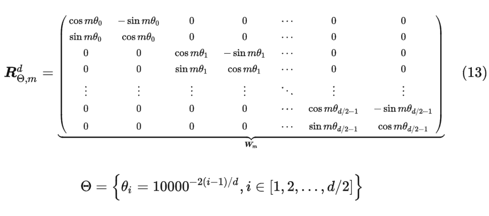
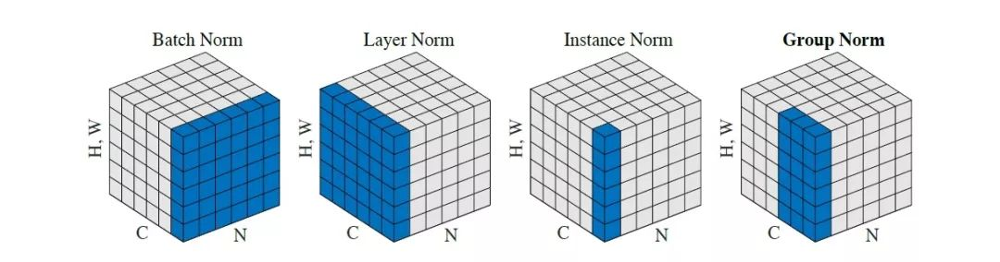

## 分词器

### 概述

对于输入文本，我们要使用分词器将其分割为token。Tokenizer有三种常见的分词方式：

- word level：简单易懂，但是对不好处理未登录词，同时处理中文这样的语言比较麻烦
- char level：容易导致token膨胀，同时划分的token从直觉上讲意义不大
- sub-word level：介于两者之间，重要的原则是<u>不应将常用词拆分为更小的子词，而应将稀有词分解为有意义的子词</u>

### BPE (Byte-Pair Encoding)

字节对编码 (BPE) 最初是作为一种压缩文本的算法开发的，后来被OpenAI采纳为分词器，流程如下

#### 词表构建

**输入文本**：`"low lower lowest"`

1. 初始词表：`{'l', 'o', 'w', 'e', 'r', 's', 't', '</w>'}`（`</w>`表示词的结尾）
2. 合并高频对`(l,o)` → `lo`，词表新增`lo`，由于原文本不存在独立于`lo`的`l, o`，删去这两个字母。
3. 重复上述结果直到无法合并，或者达到预期词表长度。
4. 分词结果：`"low low er low est"`。

#### 编码解码

对于新输入的文本，通过在降序排列的词表里匹配子串来实现分词——若无法分词则替换为`<unk>`

解码时，合并相邻子串直至结尾为`</w>`

#### BBPE

Google Brain团队引入了一种基于**字节级别**的分词方式，它与BPE相似，但是直接使用字节作为基础字母，能更好地兼容多语言、罕见词，并且能缩小词表大小。

### WordPiece

WordPiece与BPE的思路类似，但是使用了最大似然估计来匹配合并词。
$$
\mathrm{score}(A,B)=\frac{\mathrm{freq}(A,B)}{\mathrm{freq}(A)\times\mathrm{freq}(B)}
$$
也就是，每次选取合并后使语言模型概率提升最大的对象。（类比n-gram的思想）

同时，wordpiece还引入了`##`作为特殊标记，表示这个子词**必须与前一个子词拼接**才能形成完整单词，如`##zer`

### Unigram

Unigram与前两者相比是不同的思路: 它从一个较大的词汇表开始,然后从中删除token,直到达到所需的词汇表大小。具体流程如下：

1. 对于语料库的单词，添加所有子词进入词表，假设子词之间独立，以频率作为概率，<u>对于每个单词选取分词概率最大的那个</u>。

	> 穷举分词方法计算量较大，在实际中，我们可以使用维特比（Viterbi）算法来解决。

2. 使用**单词频数**乘以**概率**的乘积（最大似然）作为全局概率，每次删除使得全局概率变化最小的的词表单词

3. 重复2.，直到词表长度符合预期（注意，基础单词不能删减，才能应对OOV的词

### SentencePiece

为了适应不同语言，我们需要一个统一的分词器——如中文这样的语言不能直接使用空格分词。

为此，我们可以直接从句子的角度——将一个句子视为整体，使用上述的词表构建方式，由句子触发构建词表

SentencePiece的特点包括：

- 纯数据驱动：直接从句子中训练分词和去分词模型，不需要预先分词；
- 语言无关：将句子视为Unicode字符序列，不依赖于特定语言的逻辑；
- 多种子词算法：支持BPE和Unigram算法；
- 确定性：使用相同的模型文件可以获得相同的分词/去分词结果；
- 直接生成词汇ID：管理词汇到ID的映射，可以直接从原始句子生成词汇ID序列；

## 位置编码

一个好的位置编码应当有以下的性质

- 为每个位置输出唯一的编码；
- 不同长度的句子之间，任何两个位置之间的差值应该保持一致；
- 具备远程衰减的特性（符合注意力衰减）

### 正余弦位置编码

对每个token，token的每个维度，有以下的编码信息

在绝对位置上，类似于`10101011`这样，在向量上嵌入一个等长的，唯一的位置信息编码，供模型学习

在相对位置上，有任意有token偏移$\delta$相同的两个位置编码，他们之间可以用仅由维度$j$决定的矩阵进行转换，有相对位置的一致性

$$
\mathrm{PE}(pos,2i)=\sin\left(\frac{pos}{10000^{2i/d_{\mathrm{model}}}}\right),\quad\mathrm{PE}(pos,2i+1)=\cos\left(\frac{pos}{10000^{2i/d_{\mathrm{model}}}}\right)
$$

### 可学习的位置编码 Learned Positional Encoding

通过在输入向量时，计算一个可学习的位置编码矩阵`PositionEmbedding(max_len, d_model)`，来实现位置编码。

这种方式有更好的灵活性、适应性，但是可能有过拟合的风险。

### 旋转位置编码RoPE

#### 二维向量的情况

我们希望在查询和键的向量中嵌入位置信息。进而，我们希望找到一个内积，满足以下形式：（$f$将输入转为查询/键）

$$
\langle f_q(x_m, m), f_k(x_n, n) \rangle = g(x_m, x_n, m-n)
$$

在二维的情况下，我们可以通过**乘以**一个旋转向量来实现——这里，我们将两个维度分别作为实部与虚部

$$
\begin{aligned}
f_q(x_m, m) &= (W_q x_m) e^{im\theta}\\
f_k(x_n, n) &= (W_k x_n) e^{in\theta}\\
g(x_m, x_n, m-n) &= \operatorname{Re} \left[(W_q x_m)(W_k x_n)^* e^{i(m-n)\theta}\right]\\
\end{aligned}
$$

注意，此时的内积与复数内积的实部**有差别**，取为`ad+cb`，但仍满足内积性质，且符合**直接点积**，计算公式化简如下

$$
\begin{gathered}
<f_q(\boldsymbol{x}_m,m),f_k(\boldsymbol{x}_n,n)> \\
=\Bigg(\left(
\begin{array}
{cc}\cos(m\theta) & -\sin(m\theta) \\
\sin(m\theta) & \cos(m\theta)
\end{array}\right)\left(
\begin{array}
{c}q_m^{(1)} \\
q_m^{(2)}
\end{array}\right)\Bigg)^T\Bigg(\left(
\begin{array}
{cc}\cos(n\theta) & -\sin(n\theta) \\
\sin(n\theta) & \cos(n\theta)
\end{array}\right)\left(
\begin{array}
{c}k_n^{(1)} \\
k_n^{(2)}
\end{array}\right)\Bigg) \\
=\left(
\begin{array}
{cc}q_m^{(1)} & q_m^{(2)}
\end{array}\right)\left(
\begin{array}
{cc}\cos(m\theta) & \sin(m\theta) \\
-\sin(m\theta) & \cos(m\theta)
\end{array}\right)\left(
\begin{array}
{cc}\cos(n\theta) & -\sin(n\theta) \\
\sin(n\theta) & \cos(n\theta)
\end{array}\right)\left(
\begin{array}
{c}k_n^{(1)} \\
k_n^{(2)}
\end{array}\right) \\
=
\begin{pmatrix}
q_m^{(1)} & q_m^{(2)}
\end{pmatrix}
\begin{pmatrix}
\cos(m\theta)\cos(n\theta)+\sin(m\theta)\sin(n\theta) & -\cos(m\theta)\sin(n\theta)+\sin(m\theta)\cos(n\theta) \\
-\sin(m\theta)\cos(n\theta)+\cos(m\theta)\sin(n\theta) & \sin(m\theta)\sin(n\theta)+\cos(m\theta)\cos(n\theta)
\end{pmatrix}
\begin{pmatrix}
k_n^{(1)} \\
k_n^{(2)}
\end{pmatrix} \\
=
\begin{pmatrix}
q_m^{(1)} & q_m^{(2)}
\end{pmatrix}
\begin{pmatrix}
\cos((m-n)\theta) & -\sin((m-n)\theta) \\
\sin((m-n)\theta) & \cos((m-n)\theta)
\end{pmatrix}
\begin{pmatrix}
k_n^{(1)} \\
k_n^{(2)}
\end{pmatrix}
\end{gathered}
$$

#### 多维向量的情况

类似的，我们在多维相邻当中，将每两个维度作为一组，进行类似的旋转变化，以允许对应的内积实现。

以上是$f$的旋转矩阵，12其中不同组的移动角度，类似与正余弦编码，采用了与维度相关的变化。

该矩阵是正交的，因此不会影响模型的表达能力。

同时由于该矩阵较为稀疏，我们可以采用如下逐位相乘计算。

#### RoPE的优势

RoPE 与正余弦编码有相似之处，不同的是，它采用了乘法，并且对每层输入都可以进行嵌入。

由于沿用了正余弦编码的$\theta_i$，RoPE也有远程衰减的特性，证明如下

使用阿贝尔变化如下，其中有$h_{i+1}-h_i$由于选择，距离上下锁定，而$\Sigma|Si|$是衰减的

$$
记h_i=\boldsymbol{q}_{[2i:2i+1]}\boldsymbol{k}_{[2i:2i+1]}^*,S_j=\sum_{i=0}^{j-1}e^{\mathrm{i}(m-n)\theta_i}
\newline
\begin{aligned}
\left|\sum_{i=0}^{d/2-1}\boldsymbol{q}_{[2i:2i+1]}\boldsymbol{k}_{[2i:2i+1]}^*e^{\mathrm{i}(m-n)\theta_i}\right| & =\left|\sum_{i=0}^{d/2-1}S_{i+1}(h_{i+1}-h_i)\right| \\
 & \leq\sum_{i=0}^{d/2-1}|S_{i+1}||h_{i+1}-h_i| \\
 & \leq\left(\max_i|h_{i+1}-h_i|\right)\sum_{i=0}^{d/2-1}|S_{i+1}|
\end{aligned}
$$

RoPE最大的优点，还在于它在计算量不大的情况下，能有效地保持位置信息的**相对关系**，并且有相当好的**外推性**

## Attention

### **Multi-Head Attention**

对于Transformer中的每一个模块，我们都将输入的矩阵映射为对应$Q, K, V$（块之间的矩阵相互独立）

使用不同的、可学习的矩阵，保证了模型的泛化能力，同时避免了对自身的过度”关注“
$$
Q = XW^Q,\quad K = XW^K,\quad V = XW^V
$$
由于多头注意力，一般有$ W^Q,W^K,W^V  \in \mathbb{R}^{d\times d_k} $

> 多头注意力将词特征降维到$d/h$的维度，所以实际上的总计算量并没有增加，同时有助于学习不同的模式。

注意力函数本质上是**一个查询(query)到一系列键值对(key-value)的映射**，一般采用以下公式

$$
\text{Attention}(Q,K,V) = \text{softmax}\left(\frac{QK^T}{\sqrt{d_k}}\right)V
$$

我们使用点积来减少计算量（同时论文表示大规模时效果更好）；除以$\sqrt{d_k}$，来减少方差，使得Softmax的结果更合理，减少梯度消失的情况（假设$Q_{ik}, K_{jk}$为方差为1的随机变量，则点积和的方差为$d_k$，同除$\sqrt{d_k}$后方差归为1。)

最后，我们将每个头的输出$head_i \in\mathbb{R}^{n\times d_k}$拼接为$\mathbb{R}^{n\times d}$，再通过**可学习矩阵** $W_o \in \mathbb{R}^{n\times n}$转化输出。

### MQA & GQA

为了减少KV cache的消耗，Multi-Query Attention(MQA)被提了出来——即Q的转换矩阵保持不同，但所有头共享一组KV转换矩阵

由于MQA的精度损失较多，Group-Query Attention(GQA)被提了出来。它将注意力头分组，每组共享相同的KV转换矩阵（如Qwen-32B就采用了40/8的GQA）

### Multi-Head Latent Attention

DeepSeek 团队提出了一种，基于低秩矩阵，压缩并存储所有KV信息的方式，进而减少KV cache，并提高模型表达能力。

对于KV部分，我们先将输入转为低秩矩阵$\mathbf{c}^{KV}_t$，其维度为$d_c$，再由它计算出KV。

特别需要注意的是，在MLA中，取$d_h = 128, n_h=128$，其乘积大于$d_{model}$

$$
\begin{aligned}
\mathbf{c}^{KV}_t &= W^{DKV}\mathbf{h}_t\\
\left[k^C_{t,1};k^C_{t,2};...;k^C_{t,n_h} \right]&=k^C_t=W^{UK}\mathbf{c}^{KV}_t\\
\left[v^C_{t,1};v^C_{t,2};...;v^C_{t,n_h} \right]&=v^C_t=W^{UV}\mathbf{c}^{KV}_t\\
\end{aligned}
$$

对于Query部分，类似的，我们使用稍大一点的低秩矩阵，其维度为$d^{'}_c$，由它计算查询

$$
\begin{align}
\mathbf{c}^{Q}_t = W^{DQ}\mathbf{h}_t\\
\left[q^C_{t,1};q^C_{t,2};...;q^C_{t,n_h} \right]=q^C_t=W^{UQ}\mathbf{c}^{Q}_t\\
\end{align}
$$

由于我们在计算点积时，通过**矩阵融合**（如下），可以把低秩转换矩阵之间融合到计算中，因此我们可以仅存储$\mathbf{c}^{KV}_t$作为**KV cache**

对于k，我们在可以按下面一式，将该转换矩阵融入q的计算当中，$\mathbf{c}^{KV}_t$直接当做K使用

而对于v,我们有下面二式，通过加和，分块矩阵，我们最终可以把转换矩阵$W^{UV}$融入输出转换矩阵$W^o$。在这种情况下，$\mathbf{c}^{KV}_t$可以直接当做查询使用

$$
q_{t,i}^T\times k_{j,i}=(W_{(i)}^{UQ}\mathbf{c}_t^Q)^T\times W_{(i)}^{UK}\mathbf{c}_t^{KV}=(\mathbf{c}_t^Q)^T\times(W_{(i)}^{UQ})^TW_{(i)}^{UK}\times \mathbf{c}_t^{KV}
\\\\
\begin{align}
o_{t,i} = \sum s_j v_j&=\sum s_j W_{j}^{UV}\mathbf{c}^{KV}_t \;\;(s_j \ from \ Softmax)\\
u_{t,i} = \sum \ W^o_{i,j}o_j &=\sum \left(\ W^o_{i,j} \sum s_k W_{k}^{UV}\mathbf{c}^{KV}_t\right)\\
&=\sum \left(\left(\sum  W^o_{i,j}W_{k}^{UV}\right) \times s_k\mathbf{c}^{KV}_t\right)
\end{align}
$$

最后，我们还需要考虑如何将位置编码RoPE嵌入进去——由于RoPE计算不兼容上述的矩阵融合操作，我们将额外计算QK的位置信息，并拼接到QK向量后面。DeepSeek团队使用了$d^R_h=d_h/2$，并且$k^R_t$类似于MQA，由全体注意力头共享。

$$
\begin{align}
\left[q^R_{t,1};q^R_{t,2};...;q^R_{t,n_h} \right]=q^R_t&=RoPE\left(W^{RQ}\mathbf{h}_t\right)\\
q_{k,i} &= [q^C_{t,i};q^R_{t,i}]\\
k^R_t&=RoPE\left(W^{KQ}\mathbf{h}_t\right)\\
k_{k,i} &= [k^C_{t,i};k^R_{t}]\\
\end{align}
$$

MLA中，我们只需要存储$d_c$维度的低秩矩阵$\mathbf{c}^{KV}_t$和存储$d^R_h$维度的位置编码$k^R_t$，每层存储内存仅为$2.25d_h$（按原论文设置）

同时，由于引入了低秩矩阵，在输入转化过程中，也降低了一定程度的计算量（将大的矩阵转为两个小矩阵的运算）

非常需要注意的是，在DeepSeek团队采用的MLA中，$d_h \times n_h$大于$d_{model}$！这是因为这是因为MLA的**KV Cache大小跟h**无关，增大h只会增加计算量和提升模型能力，但不会增加KV Cache，所以不会带来**速度瓶颈**。（因为推理过程中，更多的瓶颈在于带宽瓶颈和显存瓶颈，而非计算瓶颈）

## 归一化

### 概念

归一化 (Normalization)，是将数据缩放到0-1之间，有以下常见的形式

- Min-Max 归一化，适用于分布较均匀的数据，范围在[0,1]之间： $X_{new}=\frac{X-X_{min}}{X_{max}-X_{min}}$

- 标准化，是将数据缩放到均值为0，方差为1，但不保证范围：$X^{\prime}=\frac{\mathrm{X-Mean}}{\text{Standard deviation}}$

- L1 归一化，归化为单位L1范数，适用于稀疏数据（如词频向量）：$X_{\text{norm}} = \frac{X}{\|X\|_1} = \frac{X}{\sum_{i=1}^{n} |X_i|}$

- L2 归一化，常用于余弦相似度计算或神经网络输入标准化：$X_{\text{norm}} = \frac{X}{\|X\|_2} = \frac{X}{\sqrt{\sum_{i=1}^{n} X_i^2}}$

一般在神经网络中，我们采用标准化；以图像处理为例，一般有如下的归一化方式：

1. **BN**是在batch上，对N、H、W做归一化，而保留通道 C 的维度，对较小的batch size效果不好；

2. **LN**在通道方向上，对C、H、W归一化，主要对RNN效果明显；

3. **IN**在图像像素上，对H、W做归一化，用在风格化迁移；

4. **GN**将channel分组，然后再做归一化；

	

### 神经网络的归一化

一般而言，神经网络的归一化有以下特点：

- 归一化：在训练过程中，BatchNorm 对每个小批量（mini-batch）的数据进行归一化处理，即计算该批量数据的均值和方差，并使用这些统计量将数据标准化，使得数据的均值为 0，方差为 1。
- 缩放和偏移：归一化后的数据会经过两个**可学习的参数**，即缩放因子（gamma）和偏移因子（beta），这两个参数允许网络在训练过程中学习到最佳的归一化方式。（恢复一定的表达能力）

$$
\hat{x}_i= \frac{x_i-\mu_B}{\sqrt {\sigma_B^2+ \epsilon }}, \quad y_i=\gamma\hat{x}_i+\beta
$$

- Normalization技术旨在应对内部协变量偏移问题，它的核心在于将数据调整到一个统一的标准，以便进行有效的比较和处理。

	为了实现这一目标，***我们需要确保参与归一化的数据点在本质上是可比的***	

#### BatchNorm

BatchNorm, 批归一化，旨在提高神经网络的训练速度、稳定性和性能。BatchNorm 主要解决的问题是在训练深度神经网络时出现的内部协变量偏移（Internal Covariate Shift）——即隐藏层分布变化，导致的梯度消失或爆炸。BatchNorm 沿批次维度，**每个通道**单独处理

应用：BatchNorm 通常在神经网络的层之间应用，特别是在卷积层或全连接层之后，**激活函数之前**。

#### LayerNorm

LayerNorm，层归一化，与批归一化类似。具体来说，LayerNorm 会计算单个样本在**其所在层**的所有激活值的均值和方差，并使用这些统计量来归一化该样本的激活值。这种方法不依赖于**batch_size**，允许网络使用更小的小批量大小进行训练。

应用：LayerNorm 可以应用于神经网络的任何层，包括卷积层和循环层，通常放在激活函数之前。

#### Transformer中使用LayerNorm

一般来说，BN关注的是批次中每一列的数据，这些数据代表了不同样本的**同一个特征**，因此，BN要求不同样本之间的特征近似。以图像为例，会在固定通道`C`下，对所有批次和长宽像素进行统计量计算——我们认为同一通道代表同一特征， BN 能够稳定每个通道的分布。

而LN适用于那些在不同样本之间难以直接比较的情况，通过对每个样本的**所有特征**进行归一化，稳定分布。如Transformer下，不同样本之间的特征可能具有完全不一样的语意，因此不好跨样本进行归一化。

同时，NLP问题下的样本序列长度不定，BN还会有对齐的问题。

### 归一化进阶

#### PreNorm 和 PostNorm

PreNorm 是 LayerNorm 放在了计算网络**之前**，PostNorm 是 LayerNorm 放在了 残差连接**之后**。

- Post-norm 在残差之后做归一化，对参数的<u>正则化效果更好</u>，进而模型的收敛性也会更好
- Pre-norm 相对 Post-norm ，因为有一部分参数未经过 Norm 加在了后面，这防止了模型出现梯度消失的问题。
- 如果层数比较少的话 PostNorm 的效果会更好，如果层数比较高的话就需要通过 PreNorm 来防止梯度爆炸或梯度消失。

#### RMS Norm

[Root Mean Square Layer Normalization](https://arxiv.org/pdf/1910.07467)这篇论文指出，LN影响最重要的是缩放不变性，而不是平移不变性。因此，我们可以去除LN当中的偏移和偏移因子，只保留缩放部分和缩放因子，可以在保留效果基本不变的情况下，减少运算。

#### QK Norm

由于点积结果$Q K^T$可能会很大，导致梯度不稳定，因此我们可以对 *Q* 和 *K* 的**行向量**分别进行归一化（如L2归一化），有注意力分数为

$$
Q_{norm}=\frac{Q}{\left\lVert Q \right\rVert_2},\; K_{norm}=\frac{K}{\left\lVert K \right\rVert_2}
\\Attention(Q,K,V)=softmax \left( \frac{Q_{norm}K_{norm}^T}{\tau}\right)V
$$

其中$\tau$是可学习的温度参数（代替固定的$\sqrt{d_k}$ ）

## 激活函数(待完善)

Relu 及变体(leaky Relu，PRelu)

SwiGLU = Swish（类似平滑的relu） + GLU函数(门控机制，向量拆分为两部分)

## 量化策略

### 精度介绍

| 精度类型 | 位数 |   范围（近似）   |  浮点数位数分配（符号/指数/尾数）  |     典型应用场景      |
| :------: | :--: | :--------------: | :--------------------------------: | :-------------------: |
|   FP32   |  32  |    ±3.4×10³⁸     |               1/8/23               | 传统训练与高精度推理  |
|   FP16   |  16  |    ±6.55×10⁴     |               1/5/10               |   混合精度训练/推理   |
|   BF16   |  16  |    ±3.4×10³⁸     |               1/8/7                | 大模型训练（TPU/GPU） |
|   FP8    |  8   | 依配置（见下文） |   1/5/2（E5M2）或 1/4/3（E4M3）    |    下一代硬件加速     |
|   TF32   | 19*  |    ±3.4×10³⁸     | 1/8/10（实际存储为32位，计算截断） | NVIDIA Ampere架构训练 |
|   INT8   |  8   |    -128 ~ 127    |                 \                  |       量化推理        |
|   INT4   |  4   |      -8 ~ 7      |                 \                  |     极低比特量化      |

### 量化类型

按照量化方法可以划分为线性量化、非线性量化（如对数量化）等多种方式。线性量化有可以分为对称和非对称。

对称量化的特点是量化后的值中零点必须对应于原始值中的零，即量化操作的**零点固定不变**。这种方式通常使用两个参数（量化的最小值和最大值）来定义量化的范围，而这个范围是以零为中心对称的。