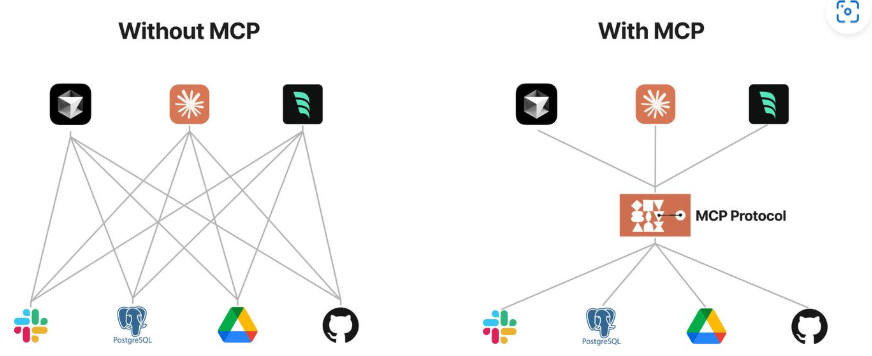
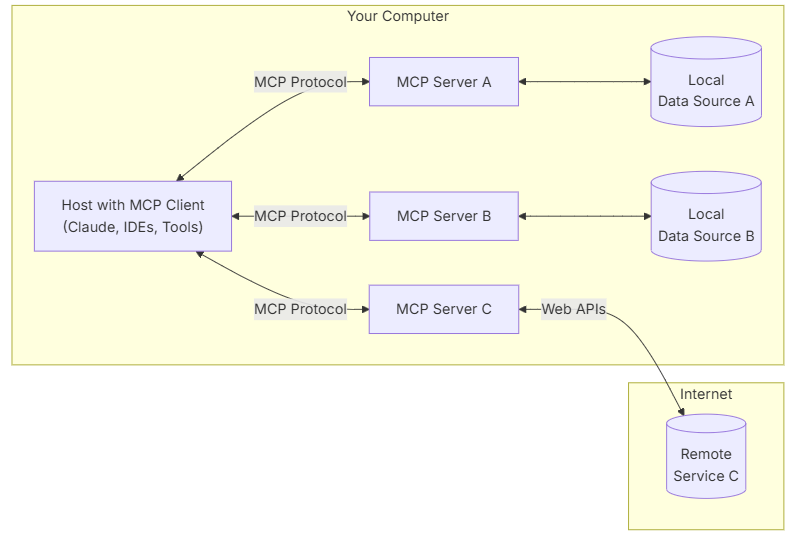

# 模型拓展

## MCP

MCP （Model Context Protocol，模型上下文协议），定义了应用程序和 AI 模型之间交换上下文信息的方式，使得开发者能够以一致的方式将各种数据源、工具和功能连接到 AI 模型。MCP的目标是使得AI应用程序的开发和集成变得简单而统一。



### MCP的起源

MCP出现之前，一般通过手动的数据检索和嵌入来为大模型提供额外信息。

为了更好的自动化，各大公司引入了`fuction call`的方式，通过向模型提供预定义的函数信息，允许模型调用可传参数的函数。

然而不同公司的`fuction call`差异较大，互不兼容——这也是我们希望创建一个统一协议的原因。

MCP，作为上下文的统一协议就此诞生，它有以下的优势：

- **生态** - MCP 提供很多现成的插件，你的 AI 可以直接使用。
- **统一性** - 不限制于特定的 AI 模型，任何支持 MCP 的模型都可以灵活切换。
- **数据安全** - 你的敏感数据留在自己的电脑上，不必全部上传。

### MCP实现




在实现过程中，我们会需要一个运行的MCP服务，它能够提供可用的工具列表，并响应AI的调用

MCP允许AI的调用内容包括：

- Resources（资源）：类似文件的数据，可以被客户端读取
- Tools（工具）：可以被 LLM 调用的函数（最重要的协议内容）
- Prompts（提示）：预先编写的模板

为了兼容大部分模型，目前的工具接入是，也是直接通过文本嵌入实现的

```python
     system_message = (
         "You are a helpful assistant with access to these tools:\n\n"
         f"{tools_description}\n"
         "Choose the appropriate tool based on the user's question. "
         "If no tool is needed, reply directly.\n\n"
         "IMPORTANT: When you need to use a tool, you must ONLY respond with "
         "the exact JSON object format below, nothing else:\n"
         "{\n"
         '    "tool": "tool-name",\n'
         '    "arguments": {\n'
         '        "argument-name": "value"\n'
         "    }\n"
         "}\n\n"
         "After receiving a tool's response:\n"
         "1. Transform the raw data into a natural, conversational response\n"
         "2. Keep responses concise but informative\n"
         "3. Focus on the most relevant information\n"
         "4. Use appropriate context from the user's question\n"
         "5. Avoid simply repeating the raw data\n\n"
         "Please use only the tools that are explicitly defined above."
     )
```

由于直接通过文本理解，再调用，因此工具的名称、文档描述、参数说明都是至关重要的。

MCP开发时，可以不直接提供相关的说明，而是使用装饰器`@mcp.tool()`来实现工具注册和描述

```python
@mcp.tool()
def count_desktop_txt_files() -> int:
    """Count the number of .txt files on the desktop."""
    # Get the desktop path
    username = os.getenv("USER") or os.getenv("USERNAME")
    desktop_path = Path(f"/Users/{username}/Desktop")

    # Count .txt files
    txt_files = list(desktop_path.glob("*.txt"))
    return len(txt_files)
```

目前而言，MCP，主要由cloud提出并推广，还没有被广泛地使用，但有很好的潜力

### MCP常用工具

| 类别         | 工具名称          | 官方/社区 | 功能描述                   | 链接                                                         |
| ------------ | ----------------- | --------- | -------------------------- | ------------------------------------------------------------ |
| **开发工具** | Git Server        | 官方      | Git仓库操作与版本控制      | [GitHub](https://github.com/modelcontextprotocol/servers/tree/main/src/git) |
|              | PostgreSQL Server | 官方      | 只读数据库查询             | [GitHub](https://github.com/modelcontextprotocol/servers/tree/main/src/postgres) |
|              | Filesystem Server | 官方      | 本地文件读写（需权限控制） | [GitHub](https://github.com/modelcontextprotocol/servers/tree/main/src/filesystem) |
| **网络/云**  | Brave Search      | 官方      | 网页搜索API集成            | [GitHub](https://github.com/modelcontextprotocol/servers/tree/main/src/brave-search) |
|              | Cloudflare Server | 官方      | Cloudflare资源管理         | [GitHub](https://github.com/cloudflare/mcp-server-cloudflare) |
