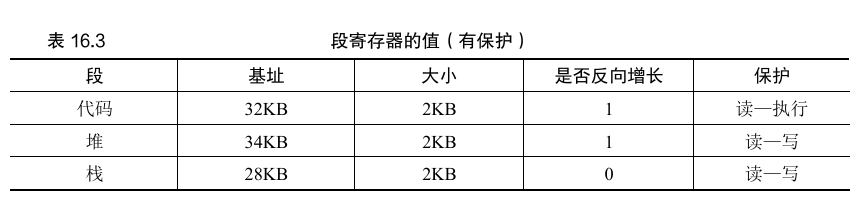
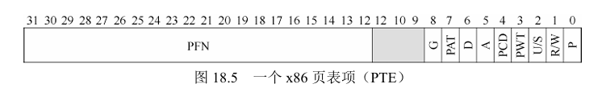

# 内存虚拟化

## 虚拟内存

### 概述

**虚拟内存（Virtual Memory）**是操作系统提供的一种抽象机制。

它将物理内存和磁盘空间结合，为<u>每个进程</u>提供<u>连续的、隔离的地址空间</u>。

在虚拟内存下，应用程序无需感知数据实际存储位置，由操作系统加载程序运行需要的部分到物理内存

### 地址空间

一般来说，程序会被分配一个虚拟的地址空间，存放以下内容：

- 代码：程序的执行代码，一般被放置于地址空间的开头
- 堆：包括`malloc`分配的数据等，存放程序全局的数据。一般接着代码部分，顺序存储。
- 栈：包括局部变量、函数参数等。栈从地址空间的尾部开始，逆向增长。

### 目标

虚拟化内存有这样三个目标：

- 透明：程序几乎意识不到内存虚拟化的特点，好像拥有独立的地址空间。
- 效率：减少虚拟内存转换的开销，提高运行效率。这一般需要硬件支持。
- 安全：应当隔离进程之间，进程和系统之间的内存空间，确保安全性。


## 分段系统

### 直接地址转化

一个最简洁高效的方法是，我们确实地在内存中分配和进程地址空间一样的空间

这时候我们只需要将虚拟内存加上一个偏移量（对应硬件内存的起始值），就可以实现转换

从硬件上，我们会设置两个专用的寄存器：

- 基址寄存器：存放实际加载地址
- 界限寄存器：分配空间的限制大小。当虚拟内存访问偏移量大于界限，则访问报错

实际操作中，每个内存地址只需要加上基址，再做界限检查，即可转换

### 分段

我们注意到，堆和栈之间有大量的空间，可能并不会被用到，但却需要预先分配。

于是，分段的方法诞生了：我们对地址空间的每一个逻辑段，分配对应的物理内存，以及寄存器对

这样，我们可以分离堆和栈，并在其没有用到对应内存时不具体分配物理内存



为了确定虚拟内存在哪个段，我们将虚拟内存前两位（或一位），作为段的识别码

同时为了适应反向增长以及确定段的保护权限，我们还会存储“是否反向增长”，”保护位”等相关内容

事实上，在早期系统当中，允许将地址空间划分为大量较小的段，并通过段表进行转换。

### 段系统的弊端

分段系统最大的问题，在于分配的空间块大小不一

这会导致物理内存在多次申请和释放后，分散为不同的区域，并留下许多无法应用的内存碎片

一种解决的方法是紧凑，然而这会带来大量开销。而空闲空间管理的算法也无法达到应用最优解。


## 空闲空间管理

### 背景

我们在用户态的内存分配，或者非固定内存的操作系统中，可能会遇到外部碎片的问题

也就是虽然内存实际上有足够的空间，但由于空间过于分散，所以无法分配足够的连续内存

因此如何合理地分配、管理空闲空间是重要的。

我们的讨论建立在一些假设上：

- 我们的总体内存空间是固定的、连续的。
- 一个内存片段一旦被分配，我们就认为它完全被占用，且无法移动（紧凑）

### 通用机制

#### 合并与切割

一般而言，我们会维护一个空闲列表（其具体的数据结果可能会变化）

空闲列表会存储，每一个空闲的内存片段的开头和长度。

在分配时，我们会寻找合适的片段，并进行分配——这时会空闲列表

而在释放时，我们在释放内存片段的同时，还需要让它跟周围的内存片段进行合并。

!!! note "free是如何释放的"

    我们知道，在C程序中使用free，只需要传入内存地址，那么函数是怎么确定释放的空间大小的呢？
    
    事实上，系统在分配内存空间时，会在空间地址前，写入头块，可能包括空间大小和正确性验证。调用free时，会先访问地址前的头块，获取必要信息，再进行内存释放。

#### 嵌入空闲列表

我们的空闲列表也需要存储在内存空间中，应该如何实现？

教材提供了一种链表结构的简单实现

- 初始构建一个，具有空余大小和下一个节点位置的节点，并让头结点指向它
- 每当分配新内存时，遍历链表，寻找可分配的节点
- 每当释放内存时，插入一个新节点，同时遍历链表，寻找可合并的相邻节点

事实上，为了减少查找时间，我们往往会用平衡树等高级数据机构，换取更高的性能

### 分配策略

#### 基本策略

- 最优匹配：遍历空间列表，寻找所有可能的空闲块，选择最小的候选者
- 最差匹配：同样遍历，但选取最大的空闲块（但研究表明其更容易导致过量碎片）
- 首次匹配：选取第一个可行的空闲块（为了减少碎片，空间列表最好有序）
- 下次匹配：从上次查找结束的位置开始寻找，避免对列表开头的频繁分割

#### 分离空闲列表

分离空闲列表，是为一些经常申请少量**固定**大小内存的应用，设立独立的列表，减少碎片和延迟

solaris的厚块分配队列就基于这种思想。它会在内核启动时，为频繁请求的内存对象创建一些**对象缓存**。

每个对象缓存都分离了特定大小的空闲列表。并且会自动向通用内存申请**内存厚块**进行拓展，或者被回收。

厚块分配程序另外一个特点是，它将空闲对象保持在预初始化状态，避免了频繁的初始化和销毁，减少了开销

#### 伙伴系统

为了让合并变得简单，人们开发了二分伙伴系统。

在二分系统中，空间被不断二分切割，直到满足用户需求的最小大小。（由于只能分配2次幂，会有内部碎片的问题）

而当内存释放的时候，系统会检查旁边等大小的“伙伴”，并试图迭代地向上合并——这大大减少了合并的开销。


## 分页系统

### 页映射

在分页系统中，操作系统一般将虚拟/物理内存划分为固定大小的页（通常4KB，但可指定2MB、1GB大页），作为操作的基础单元。

页内物理地址连续，页间的物理地址可能不联系，但是通过排列在页表当中，在进程眼中是连续的。

通过引入页的概念，我们保证了内存分配都是固定大小，进而大大减少了碎片，提高了利用率。

虚拟内存的转换有着**虚拟页→物理页帧**的映射，这种映射记录在页表（Page Table）当中。页表基址有专门的页表机制寄存器存放。

页表记录着**物理页帧号**，以及**状态位**（如存在位（Present/Absent）、修改位（Dirty）、访问位（是否被程序访问过）等），一个完整的页表项为4/8字节



以32位系统，简单页表为例，假设虚拟地址`0x12345678`，有`0x12345`为页表项地址（相对于页表基址，每个进程独有），查询页表获得物理页帧，如`0xABCDE678`即真实物理地址。而后面的`0x678`则为实际偏移。

页映射也有一些缺点：

- 性能：由于转换虚拟内存需要访问内存中的页表，这会带来访问开销
- 存储开销：对于每个进程，都需要有一个能完整映射全体物理地址的页表——这是一个连续的数组，在32位（4GB内存）下，一般需要4（页表项）x 2^20（页表基址范围）= 4MB的页表存储空间（无论进程大小），这会大大提高内存占用。

### TLB

#### 概念

由于页表在物理内存上，转换虚拟地址会造成访问开销。我们通过引入**地址转换旁路缓冲存储器**（translation-lookaside  buffer，TLB）来缓解。

TLB的算法很简单：

- 我们在CPU cache当中（如L1，L2）存储经常使用的条目
- 页表查询时优先从TLB中读取，如果命中，直接返回物理内存
- 如果未命中，再进行从物理内存上的页表进行查询，并更新TLB

由于空间局部性（数据往往相邻）和时间局部性（程序往往会多次引用同一），TLB的命中率很高，能大大减少虚拟内存转换的开销，特别是多级页表。在程序运行中，典型的页表命中率>95%。

!!! note "处理TLB未命中"

    在不同的指令集架构上，TLB未命中的处理方式略有不同。
    
    在CISC上，硬件全权处理TLB。硬件会存储页表位置，并指定页表格式。发生未命中时，会遍历页表并找到正确的页表项，用它来更新TLB。
    
    而在RISC上，操作系统负责接管。TLB未命中会抛出异常，并陷入内核态，由指定的异常处理程序接管，更新TLB，返回并重新尝试执行命令。

#### 实现

TLB一般为32/64项，每一项存储VFN，PFN，以及其他信息，以MIPS举例如下：

- VPN：存储虚拟地址。在MIPS中仅存储19位，因为一半给了内核。
- PFN：存储物理地址。在MIPS中存储24位，即支持64GB的内存。
- 全局位G：表示是否由多个进程共享
- ASID：精简的进程号，用于区分不同进程
- 一致性位：包括有效位（例如初始化时是无效的）、脏位（是否写过）

若TLB空间满了，一般通过**LRU**策略（最近最少使用），替换最久未使用的条目。

为了防止TLB访问不存在的页，物理页被释放或替换后，会进行广播，保证TLB同步更新，同时页表项的内容也会更新

TLB为实现分页系统带来了可能。但是，TLB容易造成性能问题，特别是大量TLB未命中的情况。为了提高TLB的性能，可以使用大页、PCID（跨进程）、预取等优化技术。


### 多级页表

实际上，大部分的进程并不会使用所有的页表内容，我们只需要存储那些用到的页表的映射就好了，于是我们引入了多级页表。

具体而言，虚拟内存将表示为`多个页表索引+偏移`的形式，查找时会从高级页表查询至低级页表，直至获取真实的物理地址。

当进程需要完全占用时，多级页表仍需要同样的高存储空间；但是当不需要完全占用时，我们可以不创建中间的高级页表对应的低级页表（最高级页表仍需存在，但标记子页表为**无效的**，不具体创建），进而降低空间占用。

多级页表虽然节约了我们的存储空间，却带来了**时间上的开销**，对于n级页表，每次访问需要进行n次内存访问，造成时间开销。


### 页交换

#### 机制

为了实现超越物理内存大小的内存空间，我们需要引入页交换机制，以支持超大地址空间和多进程。

简单而言，我们会在磁盘上划定一段交换空间，将一些内存的内容置于此，并使用存在位标记，PFN记录磁盘位置。

当程序试图访问不存在内存上时，会触发页错误，进而陷入内核态，由操作系统执行处理程序，进入磁盘I/O。

为了保存有少量的空闲内存，许多操作系统会维护”高低水位”的机制，并设立对应的守护进程。

#### 策略

由于物理内存的大小限制，我们需要在页错误时交换部分页到磁盘。

理论上的最优策略，是交换最远使用到的缓存（但这不现实）。而其他实际策略如下：

- FIFO（先进先出）
- 随机（不会有特别不适应的情况）
- LRU（最少最近使用）

值得一提的是LRU在大部分情况下表现良好，但在循环顺序负载下表现极差，有一些策略试图解决这个问题（如扫描抗性）

然而，实现LRU有较高的消耗，实际常常用近似LRU替代，时钟算法就是一种实现

时钟算法运用了循环列表，操作系统不断遍历并交换**使用位**为0的页面。被访问过的页面被硬件置为1，在遍历后被系统置为0。


### 页的操作

修改页的操作会如下进行：

1. 进程访问虚拟地址时，CPU的MMU（内存管理单元）通过页表查找对应的物理页。
2. 若页表项标记为“存在”（Present=1），直接修改物理页内容。
3. 若页表项标记为“不存在”（Present=0），触发**缺页异常（Page Fault）**，操作系统需从磁盘（如交换空间或文件）加载该页到物理内存，更新页表后，进程继续执行修改。
4. 修改页后，系统会自动设置**Dirty Bit**，内核线程会定期更新页到磁盘。

当物理内存不足时，会选择被替换的页面，将其存储到磁盘空间中。常见的置换算法有LRU，Clock等。

特别的若页被标记为**COW**（写时复制 Copy-on-Write，如父子进程共享内存），首次修改时会触发复制新页，避免直接修改原页。


## 内存的系统调用

### 基本指令

在 Linux 系统中，`mmap`、`munmap` 和 `mprotect` 是三个关键的内存相关的系统调用。它们分别对应内存映射、内存释放、权限修改。

```c
void *mmap(void *addr, size_t length, int prot, int flags, int fd, off_t offset);
//申请虚拟地址空间，成功返回映射区域的起始地址，失败返回 MAP_FAILED
int munmap(void *addr, size_t length);
//释放由 mmap 映射的内存区域，或撤销文件映射。
int mprotect(void *addr, size_t length, int prot);
//动态调整已映射内存区域的访问权限（如将只读内存改为可写）。
```

其中内存保护权限**`prot`**，通过位掩码指定：

- `PROT_READ`：可读
- `PROT_WRITE`：可写
- `PROT_EXEC`：可执行
- `PROT_NONE`：不可访问（用于隔离内存）

### 常用标志

|      **标志**       |                           **作用**                           |                         **适用场景**                         |
| :-----------------: | :----------------------------------------------------------: | :----------------------------------------------------------: |
|  **`MAP_SHARED`**   | 共享映射，修改会同步到文件（若映射文件），且对其他进程可见。 |          - 进程间通信（IPC）<br /> - 文件持久化修改          |
|  **`MAP_PRIVATE`**  |  私有映射，修改采用写时复制（COW），不影响文件或其他进程。   | - 动态内存分配（类似`malloc`）<br /> - 只读文件映射（避免修改原文件） |
| **`MAP_ANONYMOUS`** |           匿名映射，不关联文件，直接分配物理内存。           | - 大块内存分配（替代`malloc`） <br />- 进程间共享匿名内存（需配合`MAP_SHARED`） |
|   **`MAP_FIXED`**   |        强制使用指定地址（`addr`参数），若冲突则失败。        |              - 特殊内存布局需求（如嵌入式系统）              |
| **`MAP_NORESERVE`** |          不预留交换空间（swap），适合稀疏内存分配。          |           - 分配超大但稀疏使用的内存（如稀疏矩阵）           |
| **`MAP_POPULATE`**  |            预加载页到物理内存，减少后续缺页中断。            |                    - 实时系统或低延迟场景                    |
|  **`MAP_LOCKED`**   |             锁定内存，禁止被交换到磁盘（swap）。             | - 安全敏感数据（防交换泄露）<br /> - 实时应用（避免换页延迟） |
|  **`MAP_HUGETLB`**  |       使用大页（Huge Pages），减少TLB缺失，提升性能。        |         - 高性能计算（HPC）、数据库等大内存带宽应用          |

### 文件映射

通过传入`fd`可以将内存与文件之间建立联系。`fd`一般从3开始，跳过`stdin, stdout, sdterr`。匿名内存一般设`fd`为`-1`

系统会定期扫描页缓存，同步变化的内容到磁盘。同时，也可以调用函数强制同步。

```c
#include <sys/mman.h>
#include <fcntl.h>
#include <unistd.h>

int main() {
    int fd = open("test.txt", O_RDWR);  // 打开文件
    char *ptr = mmap(NULL, 4096, PROT_READ | PROT_WRITE, MAP_SHARED, fd, 0);
    
    ptr[0] = 'A';  // 修改映射的内存（实际修改页缓存）
    msync(ptr, 4096, MS_SYNC);  // 强制同步到磁盘
    munmap(ptr, 4096);
    close(fd);
    return 0;
}
```

###  入侵虚拟内存

我们可以通过其他进程，入侵进程的虚拟内存。

一个非常典型的案例，就是游戏的作弊器——通过观察游戏分配内存，在游戏内事件发生后的变化，可以找到关键的内存位置。对它们进行修改就可以实现游戏作弊（生命值、金钱等）

而我们也可以基于此实现更复杂的操作。如劫持时间相关的系统函数，实现变速（变速齿轮）、用一段代码勾住函数执行，实现自动操作（开镜自瞄）等

当然，除了游戏以外，入侵虚拟内存还有广泛的应用：例如使用gdb进行调试，或者对系统内核进行热更新。