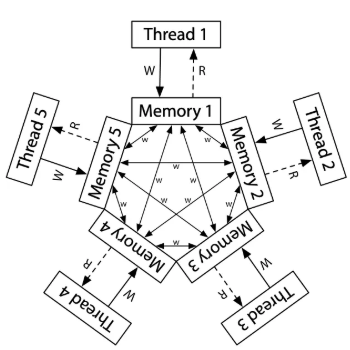

# 并发

## 打破串行思维

C 语言状态机的多线程：共享的全局变量，独立的帧栈列表

汇编语言状态机的多线程：共享的地址空间，独立的寄存器（栈指针SP，指向不同的内存位置）

### 状态迁移的原子性假设失效

多线程下，状态迁移再也不是顺序执行：

**共享内存**推翻了 “原子性” 假设——load 读到的值都可能是别的线程写入的

!!! note "并发1+1"

    在两个线程下分别执行1000次sum++，其结果是不确定的——实际上它可以在2-2000直接随机浮动
    对于最小的情况，解释如下：
    - A线程读取后，B线程写入999次，A再写回		 |           sum=1
    - 而后B再读入，A写入999次，B再写回		  |	          sum=2

### 程序顺序执行的假设失效

编译器进行程序优化时，必须基于顺序执行的假设——然而，在并发的情况下，这种优化可能是灾难性的。

即使使用`while (!flag); `这样的直接标志，也有可能因编译优化而带来意想不到的结果。

我们可以使用特殊标记，如`volatile` 修饰变量，来避免优化——但这会带来运行效率的大幅下降

### 全局指令执行顺序的假设失效

我们认为的共享内存，在所有线程视角眼中的等价的——然而实际上，处理器内部还隐藏了一个动态编译器和缓存共同作用：

具体而言，由于CPU的多级缓存，一项写入可能一直在CPU的缓存上，而不会及时写入主存，从而不会被其他线程共享。同时编译器可能会进行乱序执行指令来优化指令，造成意外的逻辑错误：

```c
// 线程 A
x = 1;
ready = true;  // CPU 可能先执行 ready = true，再执行 x = 1
// 线程 B
while (!ready) {}
printf("%d", x);  // 可能打印未初始化的 x（如 0）
```

这使得使并发程序的行为变得更难理解：并发程序执行的结果，甚至可以不是<u>所有执行过指令的某个排列顺序运行的结果</u>！



!!! note "x86和arm的内存模型"

    x86 架构的内存比 ARM 更接近 “真正的共享内存”
    x86架构采用**强一致性内存模型**：
    - 写操作（Store）的顺序对所有 CPU 核心可见的顺序一致。x86 的每个 CPU 核心有一个写缓冲区，保证了写操作的全局顺序一致性
    ARM 采用**弱一致性内存模型**:
    - CPU 和编译器可以自由重排序内存访问。若要保持顺序写入，要求程序员手动插入内存屏障。
    
    但无论是x86还是ARM，都使用了 MOESI缓存一致性协议，确保了当一个核心修改数据时，其他核心的缓存会**自动失效**，强制从主存或最新缓存读取。


## 互斥

为了阻止前文所说的问题，我们可以在可能发生冲突的地方，人为设置锁机制，保证临界区仍满足执行的原子性。通过放弃部分并行，来实现计算的可靠性。

### Peterson算法

Peterson算法是经典的，应用于**双线程**的互斥算法。它的核心理念是举旗+谦让。

首先，当需要访问临界区时，线程会举旗说明，同时将`turn`优先交给对方。这样可以保证，同时访问时，先来的线程使用，并避免同时访问。

```c
Pi:
flag[i] = ture; turn = j;
while (flag[j] && turn == j);
critical section;// 访问临界区
flag[i] = false;
 
Pj:
flag[j] = true; turn = i;
while (flag[i] && turn == i);
critical sectionl// 访问临界区
flag[j] = false;
```

Peterson算法提供了一种独立于硬件的互斥锁的实现形式，然而它对更多线程的拓展性并不好。

### 自旋锁

通过在硬件上引入原子操作，我们简洁地可以实现多线程的互斥锁。

硬件层面的原子操作**要么完全执行，要么完全不执行**，不会被其他操作中断或干扰，通过以下方式实现：

- 总线锁定

	执行操作时，CPU 会通过锁总线（Bus Locking）或缓存一致性协议（如 MESI）确保：

	- 该指令独占访问目标内存地址。
	- 其他 CPU 核心在此期间无法读写同一内存地址。

- **单指令完成**：操作在一条指令内完成，**不会被中断**。

常见的，用于实现互斥的原子操作如Test-and-Set (TAS)、 Compare-and-Swap (CAS)、 Load-Linked/Store-Conditional (LL/SC)等

以TAS举例，通过`xchg`保证原子交换，可以实现临界区的加锁和独有

```assembly
; 使用TAS指令实现自旋锁
spin_lock:
    mov eax, 1          ; 锁定值
    xchg eax, [lock_var] ; 原子交换
    test eax, eax       ; 检查旧值
    jnz spin_lock       ; 非零则继续自旋
    ret

spin_unlock:
    mov dword [lock_var], 0 ; 释放锁
    ret
```

当交换失败，即未获得锁时，线程会不断检查，直至获取锁。这种占用CPU，等待锁释放的方式被称为自旋锁。

### 互斥锁

互斥锁在自旋锁的基础上，允许等待锁的线程暂时休眠，减少CPU占用。这种中断依赖于操作系统的介入。

在未能获取锁时，类似于进程中断，操作系统会存储线程的信息，并记录到等待队列当中。当锁被释放时，会自动从等待队列中选取线程获取锁继续执行。

互斥锁保证了在等待锁时，线程不会持续占用CPU资源，然而休眠和唤醒会引入额外的时间开销（微妙级），因此更适合长时间的临界区处理。

同时，唤醒的也有着不同的策略。一般会结合先进先出（FIFO）和优先级（非公平锁）。

为了让操作系统能明确等待队列，互斥锁的变量需要由操作系统来定义（自旋锁则没有该限制）

### 读写锁

RWLock（读写锁）是一种特殊的同步机制，它在互斥锁的基础上进行了优化，区分了读操作和写操作，以提高并发性能。其核心思想是：**读操作可以共享，写操作必须互斥**。这种设计适用于读多写少的场景，能够显著减少线程间的竞争。

在读数据上，多个线程可以同时持有读锁，访问共享资源（并发读）。只要没有写锁被持有，读锁的获取总是成功的。

而在写数据上，类似于互斥锁，写锁是独占的，同一时间只能有一个线程持有写锁（与任何读锁或其他写锁互斥），所有读锁和其他写锁的请求会被阻塞。

读写锁也可以设置读优先、写优先的不同策略，适应不同的业务需求。

一个实现的参考：（写锁由所有读者控制，且控制在读锁的临界区）

- 读者需要获取读锁
- 如果是第一个读者，获取写锁；无论如何，释放读锁
- 读取数据后，读者需要获取读锁
- 如果是最后一个读者，释放写锁；无论如何，释放读锁
- 为了避免饿死写者，可以区分读-进入锁和读-出去锁

### **RCU（Read-Copy-Update）**

RCU（Read-Copy-Update）类似于读写锁，但是它有延迟修改的特性。RCU的核心思想是**“读无锁，写延迟回收”**。RCU能够最大化读性能，在Linux内核当中被广泛使用。

在读数据上，RCU完全不设任何锁限制，性能极高

而在写数据上，RCU会先创建数据的副本（新版本），修改副本。然后通过**原子替换指针**，保证新数据对后续读数据可见。而原本的旧数据则会在所用读线程退出后，**延迟回收**

RCU写操作的开销较高，但换取了读操作的近乎无开销，适合读极多、写极少的场景。	


## 并发数据结构

上面我们通过锁的结构，在理论上实现了并发。但应用到真实数据结构场景还有着诸多挑战。

一个简单的方法是直接对整个加锁，然而这往往会抵消并发的性能优势。实践时，我们可以此进一步去优化过渡到多个锁。

下面我们将讨论在数据结构上更多细节的修改。

### 并发计数器

对于计数器，我们可以直接在读写计数器时设置锁——然而频繁的读写会导致阻塞和低效

更好的方法是**懒惰计数器**——它通过多个局部计数器和全局计数器来实现，当局部计数器达到阈值时，在向全局计数器加锁并更新。在高阈值下，懒惰计数器的表现与单线程几乎相同，同时保持了并发的优势

### 并发链表

对于链表，正常来讲，我们可以在为结点提供锁对象，在插入函数处获取锁而结束时释放锁。

一个小的改进是，我们可以只在核心修改的区域加锁（而在创造新节点的位置不需要），这样可以较少报错时所需要考虑的锁控制。

一种提高链表操作的并发程度方法的是，为每个结点设置锁，这被称为**过手锁**。然而这种并发的方案并不一定比单锁快——频繁的获取和释放锁也会带来巨大的开销。实际中，我们应该测试不同的方案，或者选择两种方案的杂糅。

链表作为一种基础的数据存储结构，可以进一步作为其他适配器的容器实现（如散列表）

!!! note "锁与控制流"

    在撰写函数时，我们要格外注意控制流状态的变化。很多函数会在开始获得锁和分配内存等状态操作。如果错误发生，函数应当返回**初始状态**，这需要格外注意。

### 并发队列

教材提供的是链表实现队列，关键为队列头和尾分别加一个锁。两个锁允许队列的出入队操作可以并发操作。

更完整的有界队列，需要控制边界问题的并发情况，这将在后续条件变量时讨论。


## 同步

互斥并不总是能满足多个并发线程协作完成任务的需求，我们需要同步机制让共享内存的线程协作

同步在互斥锁的基础上，最重要的就是**等待和唤醒机制**的实现。线程的启动和休眠不再是由操作系统决定，而是相互作用。

!!! note "互斥锁实现同步"

    我们可以让每一个等待同步的线程都首先试图获取一把 “绝对不可能得到” 的锁——它们会等待，然后由后来的同步者释放这把锁。这实际上可以视为下面等待和唤醒机制的一种底层实现。

### 条件变量

相较于锁，条件变量更适合协作的概念——线程是通过条件变量来判断执行情况。为了减少线程自旋等待开销，条件变量还可以延伸休眠相关的两个操作，其中内置了对锁的操作：（实际上，两个操作都必须在锁内）

- **wait**：加入等待条件变量成功的队列，一般有以下操作
	- 释放互斥锁`m`
	
	- 将线程放到等待队列，知道条件变量`c`被其他线程`signal`
	
		**（等待和释放操作是原子的，这是同步关键的关键）**
	
	- 被唤醒后，重新获取互斥锁，再释放互斥锁，结束`wait`操作


- **signal**：唤醒等待队列中的所有线程，一般有以下操作
	- 唤醒条件变量`c`下的等待队列


在实现中，我们会采用**”共享锁”**的机制保证互斥，以父子进程为例解释

- 父进程获取锁后，依据条件判断，进入休眠状态，随后释放锁。
- 子进程只有获得锁（即父进程休眠）才能唤醒父进程，避免永眠
- 条件变量`pthread_cond_t c`与互斥锁相关联
- 共享数据`done`在临界区内，通过锁机制避免读写冲突

```c
pthread_cond_wait(pthread_cond_t *c, pthread_mutex_t *m);  
pthread_cond_signal(pthread_cond_t  *c); 

int done = 0; 
pthread_mutex_t m = PTHREAD_MUTEX_INITIALIZER; 
pthread_cond_t c = PTHREAD_COND_INITIALIZER; 

void thr_exit() { 
    Pthread_mutex_lock(&m); 
    done = 1;  	//done避免了子进程在父进程获取锁前结束，导致永眠
    Pthread_cond_signal(&c);  
    Pthread_mutex_unlock(&m); 
} 

void *child(void *arg) { 
    printf("child\n"); 
    thr_exit(); 
    return NULL;
}

void thr_join() { 
    Pthread_mutex_lock(&m); 
    while (done == 0)  //用if是等价的，但是while会更安全
        Pthread_cond_wait(&c, &m);  //具有原子执行释放锁和休眠的作用
    Pthread_mutex_unlock(&m); 
} 

int main(int argc, char *argv[]) { 
    printf("parent: begin\n"); 
    pthread_t p; 
    Pthread_create(&p, NULL, child, NULL); 
    thr_join(); 
    printf("parent: end\n"); 
    return 0; 
} 
```


使用条件变量可以解决很多实际需求：

- 父进程需要知道子进程是否完成，通过对共享的条件变量可知（如子进程的`join()`）
- 计算图：有需要$u \to v$的执行条件，那么可以在每个$u$完成后**signal**每个$v$


### 生产者和消费者

生产者/消费者（producer/consumer）问题，也叫作有界缓冲区（bounded buffer）问题。、

这个问题假设如下：有一个或多个生产者线程和一个或多个消费者线程。生产者把生成的数据项放入缓冲区；消费者从缓冲区取走数据项，以某种方式消费。

为了实现同步，我们应当设立一个条件变量，让各个线程根据条件决定等待还是工作。

然而这里出现了一个问题：应该唤醒哪个线程？如果生产者唤醒了另一个生产者，这将导致全部线程休眠。

一个方法是，采用两个条件变量——一个用于唤醒生产者，一个用于唤醒消费者。

另一个方法是，唤醒所有线程。这可能会带来额外开销，但在休眠条件复杂的情况下更简单有效。

```c
void *producer(void *arg) { //生产者代码示例
    int i;
    for (i = 0; i < loops; i++) {
        Pthread_mutex_lock(&mutex);
        while (count == MAX)  //使用while，更安全
            Pthread_cond_wait(&empty, &mutex); //等待empty条件变量
        put(i);
        Pthread_cond_signal(&fill); //唤醒fill条件变量
        Pthread_mutex_unlock(&mutex);
    }
}
```


### 信号量

信号量的特点是：

- 它有着内置的值。一般初始化可能为1, 0等（取决于情况）
- 每个调用`sem_wait`的线程都会令信号量减1，若信号量为负则休眠（i.e. 负值的绝对值等于等待的线程）
- 每个调用`sem_post`的线程都会令信号量加1，并尝试唤醒一个或多个线程。

个人感觉，信号量实际上是集成条件变量和锁的高级实现。

- **锁**：二值信号量本身相当于锁。

- **条件变量**：它可以避免手动撰写临界区。同时信号量的值，本身就蕴含着条件变量中的循环判断。
- **信号外置**：每个信号量**内置锁**（意味着休眠不释放锁），而条件变量往往共用锁，前者更需要注意是否死锁

```c
//利用信号量实现锁机制
#include <semaphore.h>
sem_t s; 
sem_init(&s, 0, 1);  //第二个参数为同步设置；第三个为初值
sem_wait(&m);
//临界区
sem_post(&m);

//信号量由于休眠释放锁，可能会死锁
void *producer(void *arg) { 
    int i; 
    for (i = 0; i < loops; i++) { 
        sem_wait(&empty);   //与条件变量不同
        sem_wait(&mutex);   //信号量中信号传递外置
        put(i);             //避免获取锁后等待信号休眠
        sem_post(&mutex);   //导致死锁
        sem_post(&full);          
    } 
}
```


## 基于事件的并发

### 概念

基于事件的并发针对两方面的问题：

- 多线程应用中，正确处理并发很有难度.
- 开发者无法控制多线程在某一时刻的调度。程序一般只能创造线程，具体的调度会交给操作系统。

于是，我们可以使用基于事件的并发：

它通常**依赖于一个或多个事件循环 (Event Loop)** 来监听和分发事件，并由相应的事件处理器 (Event Handler) 来处理这些事件。这种模型的**核心思想是非阻塞 I/O (Non-blocking I/O)**，即当一个操作（如读取文件或网络请求）需要等待时，程序不会阻塞，而是继续处理其他事件，直到等待的操作完成并触发一个事件。

```c
while (1) {  //主循环等待某些事件发生
    events = getEvents();  //包括请求的事件和非阻塞返回事件
    for (e in events) 
        processEvent(e);  //处理一个事件时，它是系统中发生的唯一活动
} 
```

### 异步I/O

为了避免线程被一些需要长时间等待的事件阻塞（如磁盘、键鼠），现代操作系统引入了异步I/O的机制

操作系统提供了一些接口，一些接口允许应用程序发出异步I/O请求并返回控制权，而另外的接口能让程序确定事件是否已完成。

以磁盘读取为例，程序需要传递读取的文件信息，还需要指定目标内存地点。

随后，在发起异步I/O后，可以通过指定函数，检查任务是否完成。

但这也带来了一个问题：在多个异步I/O时，检查任务本身就会带来很大的消耗

为了解决这个问题，一些系统提供了基于**中断**（interrupt）的方法。此方法使用 UNIX 信号（signal）在异步 I/O 完成时通知应用程序，从而消除了重复询问系统的需要。

!!! note "UNIX信号"

    信号提供了一种与进程通信的方式。
    
    具体来说，可以将信号传递给应用程序。这样做会让应用程序停止当前的任何工作，开始运行信号处理程序（signal handler），即应用程序中某些处理该信号的代码。完成后，该进程就恢复其先前的行为。
    
    信号有许多类型，如HUP（挂断）、INT（中断）、SEGV（段违规）等
    
    有趣的是，有时是内核本身发出信号。例如，当你的程序遇到段违规时，操作系统会发送一个SIGSEGV。你甚至可以专门为某些错误，配置信号捕获行为（如调试）。
    
    当一个信号被发送到一个没有配置处理该信号的进程时，一些默认行为就会生效。对于SEGV来说，这个进程会被杀死。

### 事件处理的一些问题

- **状态管理**：因为事件处理之间相对独立，需要手动管理、传递一些状态信息。
- **多核事件处理**：为了利用多个CPU，事件服务器可能需要并行运行多个事件处理程序，这又将带来传统并发的一些问题
- **隐式阻塞**：一些隐式阻塞（如页错误），可能导致事件不进行异步I/O，而进行等待，影响效率
- **API语意变化**：函数可能会从非阻塞变为阻塞等。


## M2 协程

### 特性

协程允许在**单个线程**中通过协作式调度实现多任务的交替执行。与线程的抢占式调度不同，协程需要**主动让出控制权**。

- **存储状态**：协程的创建和切换成本极低，通常只需保存少量寄存器状态，而线程需要内核参与，开销更大
- **用户态调度**：协程的切换通过程序中 `yield` 或 `await`来自行控制
- **切换方式**：协程必须主动释放执行权，其他协程才能运行（区别于线程并发），不需要**锁**

python当中的`asyncio`、生成器，以及JavaScript的 `Promise/Async`都属于协程

### 实现

协程的实现，关键在于状态保存，包括**寄存器状态**和**函数帧栈**

寄存器状态可以使用c的标准库`setjmp`相关函数直接实现保存于跳转

函数栈帧状态可以通过汇编码转移函数栈帧到堆内存上

```c
static inline void invoke_co_on_new_stack(void *stack_top, void (*entry_func)()) {
#if __x86_64__
    asm volatile (
        "movq %0, %%rsp; call *%1" // 设置新的栈顶指针 (rsp) 并调用入口函数
        : /* 无输出操作数 */
        : "r"(stack_top), "r"(entry_func)
        // ABI规定的一些寄存器可能会被修改，需要告知编译器
        : "memory", "rdi", "rsi", "rdx", "rcx", "r8", "r9", "rax"
    );}
```


## 并发Bug

复杂并发程序，哪怕经过大量的检测，也有可能遗留在苛刻条件下触发的bug

一些对大型项目的研究指出，这些bug许多是非死锁的，也有很多死锁的，下面将分别讨论

### 非死锁缺陷

非死锁问题占了并发问题的大多数，课本主要讨论了以下两种：

- 违反原子性缺陷 ：
	- 有一些函数、代码片段本意上是原子的，但却没有强制（例如条件判断+操作）
	- 这类bug一般可以通过在前后加锁，保证原子性。
- 违反顺序缺陷：
	- 如果两个不同线程的代码，在本意上具有先后顺序，就有可能报错（例如初始化和引用）
	- 这类bug一般可以通过引入条件变量，来实现同步。

### 死锁缺陷

#### 死锁的来源

死锁问题往往来源于多个锁竞争——线程1持有锁A，线程2持有锁B，都在等待对方的锁。

具体而言，死锁有以下四个必须的条件：

- 互斥：线程对于需要的资源进行互斥的访问（例如一个线程抢到锁）。  
- 持有并等待：线程持有了资源（例如已将持有的锁），同时又在等待其他资源（例如，需要获得的锁）。  
- 非抢占：线程获得的资源（例如锁），不能被抢占。 
- 循环等待：线程之间存在一个环路，环路上每个线程都额外持有一个资源，而这 个资源又是下一个线程要申请的。

而由于代码库中的复杂依赖，这种多个锁竞争的问题往往很隐蔽。例如操作系统中就会有相当复杂的依赖

另外，封装也会让问题复杂化，一个调用可能就蕴含着多个锁的申请。

#### 预防死锁

对应的，我们可以根据死锁的条件来预防死锁的出现

- 避免循环：
	- 对于多个锁，我们严格设定获取的顺序，或者部分有序（partial  ordering）
	- 很多时候，我们不确定传入的锁，那我们亦可以按锁地址的大小排序，来规定顺序
- 保证所有资源的抢占：
	- 我们可以在获取多个锁的区域统一加锁，保证一定能获取所有锁
	- 该方法在并行性能上并不是很好，并且必须要求知道所有锁
- 等到时不抢占资源
	- 在尝试获取其他锁失败时，可以放弃所有锁，重新开始获取
	- 但该方法可能会带来活锁（livelock），即多个线程反复获取
- 避免互斥：
	- 使用硬件层面提供的原子指令，从而避免锁的使用（但其实可能产生活锁）


## 一些补充

### 现实中的并发

- 高性能计算：一般会使用MPI（进程通讯）和OpenMP（多平台线程级实现）。
- 分布式计算：由一个或多个总控对全局的请求串行处理（计算时间远大于分配时间的情况）
- GPU并行：计算密集，又数据密集，使用专用的并行物理设备实现（线程束同步执行）


### GO与Goroutine

Go 语言是由 Google 开发的开源编程语言，具有简洁、高效和强大的并发特性

**Goroutine** 是 Go 语言并发的核心：

- 比线程更**轻量**的执行单元：
	- 初始栈空间通常只有几 KB，但可以动态增长和收缩
	- 创建和销毁的开销远小于线程
	- Goroutine 的切换由 Go 运行时在**用户态**完成，因此速度极快
- Go 调度流程：
	- M, P, G 模型：M 是执行 Go 代码的实体，需绑定真实处理器P，而G代表了Goroutine
	- 发起调度：每个Goroutine会进入某个P的本地运行队列（LRQ），如果失败，会放在全局运行队列
	- 执行调度：M会尝试从对应P的队列中执行G，若为空，则会尝试窃取其他队列的任务
- **阻塞和切换**：
	- 当G执行了阻塞操作，它会从 M 上剥离并允许M执行其他G（类似**协程**）
	- 当阻塞操作完成后，G 会被放回到某个 P 的 LRQ 中，等待再次被 M 调度执行
	- 当M也被G阻塞时，调度器会将P交给另外一个M

GO还在通信、内存、锁机制上有许多的创新和实现。使用GO是当代并发编程非常高效、简洁的一个选项。


### Intel 处理器

#### AVX (Advanced Vector Extensions)

- **架构/目标 (Architecture/Goal)**: AVX 是一套面向 x86 处理器的 **SIMD (Single Instruction, Multiple Data) 指令集扩展**，旨在通过允许单个指令同时处理多个数据元素，来**提升浮点密集型和数据并行计算任务的性能**。

- **特点 (Features)**:

	- **加速各类计算**: 显著提升在科学计算、金融分析以及其他大规模并行数据处理中，涉及的**浮点和整数运算速度**。

	- **处理更大数据块**: 引入了更宽的向量寄存器（最初为 256 位，后续通过 AVX-512 扩展至 512 位），使得 CPU **一次能够处理更大批量的数据**，从而提高吞吐量。

	- **增强的编程与效率**: 提供了更灵活的指令格式（如三操作数指令，避免了对目标寄存器的覆盖）和对内存操作的改进（如支持非对齐内存访问），有助于**简化编程并提高代码执行效率**。

		

#### AMX (Advanced Matrix Extensions) - 2021 年

* **架构/目标**: AMX 是一套新的指令集扩展，专为加速人工智能 (AI) 和机器学习 (ML) 工作负载中的**矩阵乘法**和相关的运算而设计。它不是传统意义上的 SIMD 扩展，而是更专注于 tile-based（基于块）的矩阵操作。

* **特点**:
    * **显著加速 AI 推理和训练**: 尤其是在处理深度学习模型中常见的矩阵运算时，AMX 能提供比 AVX-512 VNNI (Vector Neural Network Instructions) 更高的吞吐量。
    
    * **与 SIMD 协同**: AMX 并不是要取代 AVX-512，而是与其协同工作。数据通常会先通过 AVX 指令进行预处理和后处理，然后由 AMX 执行核心的矩阵运算。
    
    	
