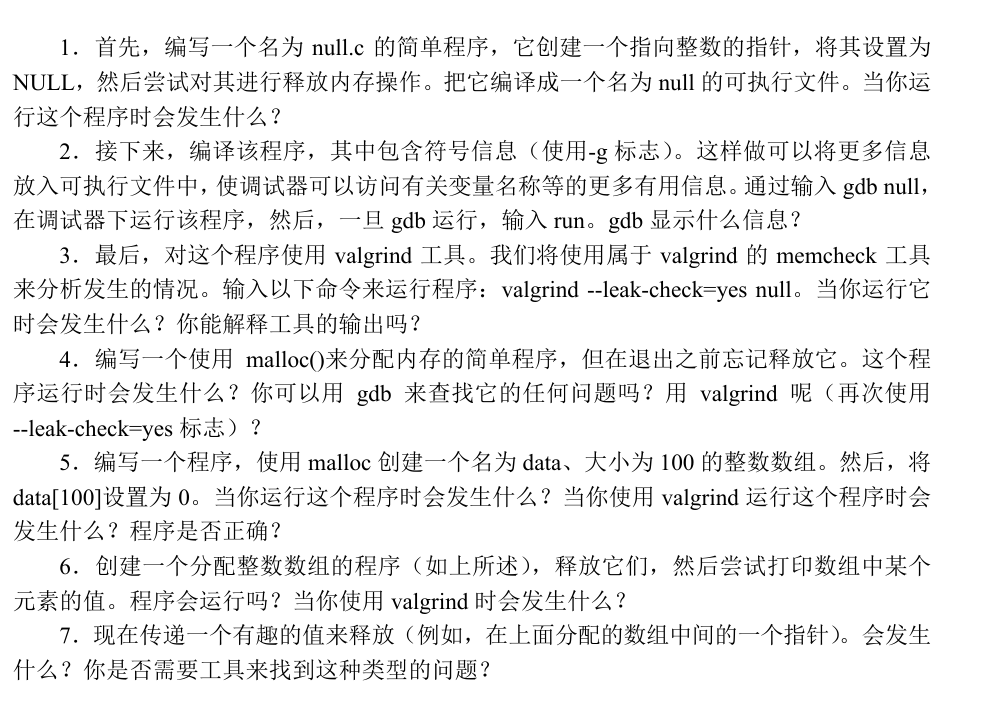

# 虚拟化

## 进程

### 概述

进程，是操作系统提供的基本的抽象，是一段运行的程序。

我们希望不同进程同时运行，通过时分共享CPU技术，操作系统给每个进程独享CPU的假象。

进程的状态包含了其所用的独立的内存空间（包括堆和栈）、寄存器信息、进程状态（运作、阻塞、就绪等）

通过保存这些状态，操作系统可以进行上下文切换，即切换不同的进程，给人以并行的假象

### 进程API

在UNIX系统中，常见的系统调用有`fork`, `exec`, `wait`

#### Fork

`fork`会复制一个几乎完全相同的进程，但是进程号（PID），以及`fork`的返回值会不同

```c
int rc = fork(); 
if (rc < 0) {        // fork failed; exit 
    fprintf(stderr, "fork failed\n"); 
    exit(1); 
} else if (rc == 0) { // child (new process) 
    printf("hello, I am child (pid:%d)\n", (int) getpid()); 
} else {             // parent goes down this path (main) 
    printf("hello, I am parent of %d (pid:%d)\n", rc, (int) getpid()); 
}
```

#### Wait

`wait`相对简单，他会等待子进程，或者指定的进程结束（`waitpid`）

### Exec

`exec`会从可执行程序中加载代码和静态数据，并覆盖**自己**的代码段和静态数据，再由操作系统执行

实际上，`exec`相当于切换到一个新的程序进行运行，之前的程序如同不存在了

特别的，`exec`会保存打开了的文件描述符，影响代码的输入和输出（如shell的重定向）

```c
printf("hello, I am child (pid:%d)\n", (int) getpid());
char *myargs[3];
myargs[0] = strdup("wc");   // program: "wc" (word count)
myargs[1] = strdup("p3.c"); // argument: file to count
myargs[2] = NULL;           // marks end of array
execvp(myargs[0], myargs);  // runs word count
printf("this shouldn't print out");
```

`exec`有很多的变体，例如上述代码中`v`代表传入字符串参数，`p`代表从路径读取代码片段，此外还有`e`用于修改环境变量


操作系统这样设计调用的API，在保持简洁可用的基础，可以通过组合实现复杂的操作

例如shell作为命令行交互的程序，它对命令的实现其实就是`fork -> 传参与重定向 -> exec (原程序wait)`


## 时分共享CPU

为了在单个CPU运行多个进程，我们需要引入合适的切换机制

这样的切换机制，需要我们保证**控制权**，既有对特权的控制，也有操作系统的实时接管的能力。

### 受限执行

首先，我们希望对进程进行一定的限制，保证操作系统对关键功能的操控权。

当我们启动程序时，会分配好其所需内存等环境，并从主函数启动，随后将CPU控制权交付于进程。

那么问题来了，进程应该如何执行一些**受限操作**（例如获取系统资源，磁盘I/O）

为此，我们引入了两种模式——“用户态”和”内核态”。

- 在用户态下，进程不能直接进行受限操作，而是需要调用系统函数执行，并**陷入**内核态
- 在内核态下，操作系统接管控制权，它会根据请求执行操作，在完成后再**陷阱返回**，回到用户态

操作系统会提供数百个公开的系统函数调用（如访问文件、管理进程、进程通信等）供程序调用。

程序可以通过将参数放入特定的栈或寄存器，进行特定的系统函数调用（当然，这些一般已经内置在库函数当中了）

而陷入内核态，以及陷阱返回的过程，都需要进行上下文切换，这个过程中会将程序的寄存器和栈进行保存。

值得一提的是，用户态和内核态的切换自然会带来开销（近微秒级）。在高性能程序实现时，需要我们尤为注意这一点。

!!! note "陷阱表"

    操作系统内核需要一个**“事件处理指南”**，来指导CPU如何处理特殊事件。这个指南就是陷阱表。
    
    陷阱表里存放的是指向特定处理程序的指针（地址），每个编号都对应一个处理程序。而我们所说的系统调用，就由陷阱表指向内核中实现这些功能的代码。当 CPU 遇到特殊事件，比如你点击鼠标（硬件中断）、程序请求操作系统服务（系统调用），或者程序出了错（异常）时，CPU 就会暂停当前的工作，并通过一个特殊的编号（中断向量）去查阅陷阱表。
    
    显然，陷阱表的执行，以及位置的确定也属于特权，需要在内核态中进行。

### 时钟中断

直接执行的一个问题是如何实现进程之间的切换——因为程序执行时，操作系统**没有运行**！

操作系统只有在进程结束时，或者在其进行系统调用时会具有操控权（即运行），然而万一程序不能及时交出操控权怎么办？

在这里，我们引入**时钟中断**机制，也就是每隔几毫秒，进程会被中断，交给操作系统中预先配置的中断处理程序控制。此时，操作系统 重新获得CPU的控制权，也就可以控制是否需要切换进程。

时钟设备由操作系统在程序启动时引入，由硬件控制。

最后，我们展示以下时间线，作为操作系统时分共享CPU实现的一个示例：

| 操作系统的启动 (内核模式)                                    | 硬件                                                         | 程序 (应用模式) |
| :----------------------------------------------------------- | :----------------------------------------------------------- | :-------------- |
| 初始化陷阱表                                                 | 记住以下地址：<br>系统调用处理程序<br>时钟处理程序           |                 |
| 启动中断时钟                                                 | 启动时钟<br>每隔 x ms 中断 CPU                               |                 |
|                                                              |                                                              | 进程 A……        |
|                                                              | 时钟中断<br>将寄存器 (A) 保存到内核栈 (A)<br>转向内核模式<br>跳转到陷阱处理程序 |                 |
| 处理陷阱                                                     |                                                              |                 |
| 调用 switch()例程<br>将寄存器 (A)保存到进程结构(A)<br>将进程结构 (B)恢复到寄存器(B)<br>从陷阱返回 (进入 B) |                                                              |                 |
|                                                              | 从内核栈 (B) 恢复寄存器 (B)<br/>转向用户模式<br/>跳转到 B 的程序计数器 |                 |
|                                                              |                                                              | 进程 B……        |


## 调度策略

### 基本概念

调度策略研究的是，我们如何让进程运行的顺序达到一个“最佳”的方式

衡量最佳，我们可以观测进程中的两个指标

- 周转时间：即从发起进程到结束进程的总时间（包括等待时间）
- 响应时间：即发起进程到首次运行的时间（对交互类型的进程，这很重要）

一般而言，我们有一些基础的策略，如FIFO（先进先出），STCF（最短完成时间优先），RR（轮转）

此外，我们亦可以在进程阻塞时（如I/O）切换进程，提高利用率。

当然，这些基础的问题在无法很好地适应复杂的应用情景，于是我们有以下的调度策略。

### 多级反馈队列

多级反馈队列（MLFQ）通过应用一套规则，实现了更泛化更好用的调度。

#### 调度规则

正如名称，MLFQ的核心在于有多个不同**优先级**的**队列**，满足：

- 优先执行优先级高的队列
- 同优先级的队列中的进程，采用轮转机制

为了让运行时间很短、频繁放弃CPU的交互型工作优先执行，而长时间的计算工作放低优先级，我们设立以下优先级下降规则：

- 工作进入系统时，放在最高优先级（最上层队列）
- 工作用完整个时间片后，降低其优先级（移入下一个队列）
- 如果工作在其时间片以内主动释放CPU， 则优先级不变。

通过这样的下降机制，我们可以在串行任务情况下减少周转时间，而在交互时下减少响应时间。

但是，此时会出现①低优先级进程“饿死”；②欺骗性进程通过主动退出，来保证优先级，这两个问题。

于是，我们还需要以下的规则

- 每个一段时间，令所有进程进入最高优先级队列（避免“饿死”）
- 记录进程时间配额，一旦用完配额，就降低其优先级（避免欺骗性占用）

MLFQ不对工作的运行方式有什么要求，却能适应性地提高全局调动，因此被广泛应用

#### MLFQ调优及拓展

- MLFQ有许多需要设定的超参，例如时间片长度、配额，这很难保证在当前系统下最优。
- 可以通过修改不同队列的时间片长度，更好地适应实际需求
- 一些MLFQ的变体会用数学公式来调节优先级，使之更符合期望


### 比例配额

比例配额的思想基于，确保每个工作获得一定比例的CPU时间

#### 彩票调度

彩票调度引入了彩票数作为配额的比例，并通过随机抽奖的方式来选择运行的进程

随机抽奖，引入了随机性来应对非常规情况，并且保持轻量和性能。

彩票数还可以发展为彩票货币，具有兑换、转让、膨胀（非竞争情况）等方法，提高了调度的灵活性。

#### 调度实现

彩票调度很重要的一点，就是它实现简单、轻量——只需要随机数生成和链表即可

同时，在工作执行总时间较长的情况下，彩票调度也兼顾了公平性和响应时间

但彩票调度有一个核心问题——如何分配**彩票数**。这个问题仍没有最佳答案。

#### 步长调度

彩票调度在运行时间较短时，可能并不能产生正确的比例。

基于此，我们可以根据进程票数（配额）分配不同的步长，步长和票数成反比。

调度的算法也很简单，每次随机选择一个行程最短的进程执行，随后在它的行程上加上其步长。

通过这一方式，步长调度可以保持进程调度的比例和配额相同。

#### 小结

比例配额机制很有趣，但是在分配额度，以及I/O阻塞上处理的并不好，因此它并没有被广泛应用。

配额机制现在更多被应用在虚拟数据中心中，用于简单高效地分配不同虚拟机的时间（同时这里份额更好确定）

### 多处理器调度

当下的处理器几乎都有多个CPU核心，因此涉及到了多处理器调度的问题。

由于单进程具有更好的缓存亲和性，我们尽可能将进程保持在一个CPU上

#### 单队列调度

单队列调度，相当于我们几乎沿用单处理器的调度方式。也就是CPU从全局共享的队列中选取下一个工作执行。

但是为了保证扩展性，访问全局队列需要设置锁机制等，会影响性能。

此外，从全局队列选取，也容易造成CPU在不同进程间切换，对缓存亲和性不友好。

#### 多队列调度

在多队列调度中，每个CPU都有独自的队列，每个队列都可以使用不同的调度策略。

显然，多队列调度有更好的扩展性、缓存亲和性。但是它可能会导致**负载不均**

可以通过工作迁移，工作窃取的方式平衡负载（但这又会带来额外的开销）

### Linux 多处理器调度（待完善）

Linux社区实际上并没有达成多处理调度的共识，有以下三种（前两者是多队列）：

- **O(1) 调度器**: 以固定的时间复杂度选择下一个任务，注重高效的调度决策，但已被取代。
- **CFS (完全公平调度器)**: 致力于为所有任务公平分配CPU时间，通过虚拟运行时间和红黑树实现，是当前Linux的默认调度器。
- **BFS (Brain Fuck Scheduler)**: 追求极致的桌面低延迟和响应性，采用全局单队列和虚拟截止时间机制，更适合核心数较少的系统。





