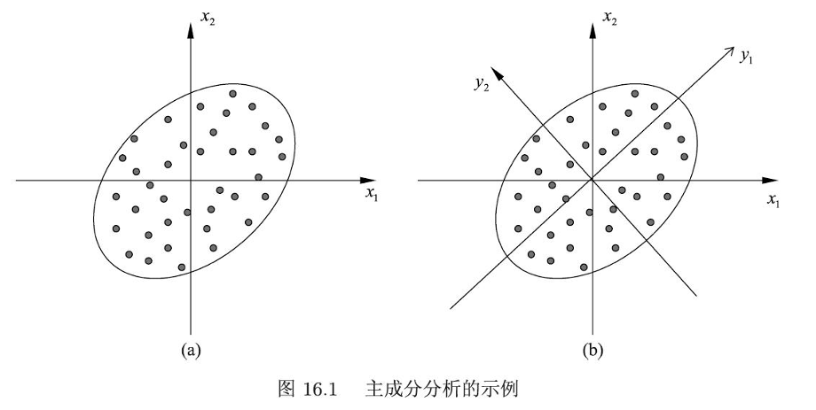

# 主成分分析

## 概述

主成分分析 (PCA) 是一种统计方法，用于**简化复杂数据集**。

其核心思想是将原始数据中可能相关的多个变量，转换为一组数量更少、线性不相关的新变量，这些新变量被称为**主成分** (Principal Components)。其核心目标是：

* **降维**：用较少的主成分来代表原始数据的大部分信息，去除冗余和噪声。
* **揭示结构**：找到数据中最重要的变化方向（即方差最大的方向）。

简单来说，PCA 试图在保留最多信息的前提下，用更少的特征来描述数据，方便后续分析、可视化或建模。它关注的是数据本身的内部结构和变异性。

在数据总体上做的主成分分析为总体主成分分析；对应的，样本上的为样本主成分分析

## 基本思想

主成分分析的核心思想，就是将向量进行坐标系选择变换，投影到正交的新坐标轴上，满足向量在每一轴上的方差最大。

即，在所有正交变换下方差最大的向量，作为第一主成分；而在与第一主成分正交的变化下，方差最大的向量为第二主成分，以此类推。

而如果我们只选取前几个主成分，作为新的特征，也就相当于实现了信息的压缩。

## 算法原理

### 定义

假设 $\boldsymbol{x}=(x_{1},x_{2},\cdots,x_{m})^{\mathrm{T}}$ 是 $m$ 维**随机变量**，其均值向量是 $\boldsymbol{\mu}$

$$
\boldsymbol{\mu}=E(\boldsymbol{x})=(\mu_{1},\mu_{2},\cdots,\mu_{m})^{\mathrm{T}}
$$

协方差矩阵是 $\Sigma$

$$
\Sigma=\operatorname{cov}(\boldsymbol{x},\boldsymbol{x})=E\left[(\boldsymbol{x}-\boldsymbol{\mu})(\boldsymbol{x}-\boldsymbol{\mu})^{\mathrm{T}}\right]
$$

考虑由 $m$ 维随机变量 $\boldsymbol{x}$ 到 $m$ 维随机变量 $\boldsymbol{y}=(y_{1},y_{2},\cdots,y_{m})^{\mathrm{T}}$ 的线性变换

$$
y_{i}=\alpha_{i}^{\mathrm{T}}\boldsymbol{x}=\alpha_{1 i}x_{1}+\alpha_{2 i}x_{2}+\cdots+\alpha_{m i}x_{m} 
$$

其中 $\alpha_{i}^{\mathrm{T}}=(\alpha_{1 i},\alpha_{2 i},\cdots,\alpha_{m i})$，$i=1,2,\cdots, m$。

我们定义主成分如下：

给定如式(16.1)的线性变换，若满足以下条件：  

- 线性变换矩阵 $[\alpha_{i}]^{\mathrm{T}}$ 是一组单位正交基
- 任意$y_i$与$y_j$之间互不相关，即变换后协方差为0

- $y_{i}$ 是与 $y_{1}, y_{2}, \cdots, y_{i-1}$ 不相关的 $\boldsymbol{x}$ 的所有线性变换中方差最大的。  

此时称 $y_{1}, y_{2}, \cdots, y_{m}$ 分别为 $\boldsymbol{x}$ 的第一主成分、第二主成分、…、第 $m$ 主成分。  

特别的，由于方差受变量跨度影响，我们一般会先对变量进行**规范化**

### 算法

由主成分分析的定义，我们可以在前置条件下迭代求对应的变换，来求出主成分，即：

**第k步**有，在与 $\alpha_{1}^{\mathrm{T}}\boldsymbol{x},\alpha_{2}^{\mathrm{T}}\boldsymbol{x},\cdots,\alpha_{k-1}^{\mathrm{T}}\boldsymbol{x}$ 不相关的 $\boldsymbol{x}$ 的所有线性变换中，取满足约束条件 $\alpha_{k}^{\mathrm{T}}\alpha_{k}=1$ 下，方差最大的变换，即得到 $\boldsymbol{x}$ 的第 $k$ 主成分。  

每一步，我们相当于在求解如下优化问题：
$$
\begin{array}{ll}
\max_{\alpha_k} & \alpha_k^T \Sigma \alpha_k \\
\text{s.t.} & \alpha_i^T \Sigma \alpha_j = 0, \quad i\ne j \\
& \alpha_i^T \alpha_i = 1
\end{array}
$$
通过拉格朗日乘子法，我们可以得出一个重要的结论：
$$
\Sigma \alpha_k - \lambda \alpha_k = 0
$$

由此, $\lambda$ 是 $\Sigma$ 的特征值, $\alpha_2$ 是对应的单位特征向量。于是, 目标函数

$$
\alpha_k^T \Sigma \alpha_k = \alpha_k^T \lambda \alpha_k = \lambda \alpha_k^T \alpha_k = \lambda_k
$$
也就是说，主成分的方差就是特征值，方向就是单位特征向量！我们有如下表述

设 $\mathbf{x}$ 是 $m$ 维随机变量, $\Sigma$ 是 $\mathbf{x}$ 的协方差矩阵, $\Sigma$ 的特征值分别是 $\lambda_1 \ge \lambda_2 \ge \dots \ge \lambda_m \ge 0$, 特征值对应的单位特征向量分别是 $\alpha_1, \alpha_2, \dots, \alpha_m$, 则 $\mathbf{x}$ 的第 $k$ 主成分是
$$
y_k = \alpha_k^T \mathbf{x} = \alpha_{1k} x_1 + \alpha_{2k} x_2 + \dots + \alpha_{mk} x_m, \quad k=1, 2, \dots, m 
$$
$\mathbf{x}$ 的第 $k$ 主成分的方差是
$$
\text{var}(y_k) = \alpha_k^T \Sigma \alpha_k = \lambda_k, \quad k=1, 2, \dots, m 
$$
即协方差矩阵 $\Sigma$ 的第 $k$ 个特征值。

特别的，当协方差矩阵有重根时，重根构成的空间的任意正交基都可以是主成分。

## 性质

### 基础性质

- 总体主成分 $\mathbf{y}$ 的协方差矩阵是对角矩阵，且为原协方差矩阵的特征值组成。

$$
\text{cov}(\mathbf{y}) = \Lambda = \text{diag}(\lambda_1, \lambda_2, \dots, \lambda_m)
$$

- 总体主成分 $\mathbf{y}$ 的方差之和等于随机变量 $\mathbf{x}$ 的方差之和（由迹可得）

$$
\begin{aligned}
\sum_{i=1}^m \sigma_{ii}=
\sum_{i=1}^m \text{var}(x_i) = \text{tr}(\Sigma) 
= \text{tr}(\Lambda) = \sum_{i=1}^m \lambda_i = \sum_{i=1}^m \text{var}(y_i)
\end{aligned}
$$
- 第 $k$ 个主成分 $y_k$ 与变量 $x_i$ 的相关系数 $\rho(y_k, x_i)$ 称为因子负荷量，它表示第 $k$ 个主成分 $y_k$ 与变量 $x_i$ 的相关关系。

$$
\rho(y_k, x_i) = \frac{\sqrt{\lambda_k} \alpha_{ik}}{\sqrt{\sigma_{ii}}}, \quad k, i = 1, 2, \dots, m 
$$
- 第 $k$ 个主成分 $y_k$ 与 $m$ 个变量的因子负荷量满足

$$
\sum_{i=1}^m \sigma_{ii} \rho^2(y_k, x_i) = \lambda_k 
$$
- $m$ 个主成分与第 $i$ 个变量 $x_i$ 的因子负荷量满足（可以取$k$个，作为因子贡献率）

$$
\sum_{k=1}^m \rho^2(y_k, x_i) = 1 
$$
### 最优选择

我们做出主成分分析后，我们期望选取部分主成分来代替原先的特征。可以证明以下定理，说明选择前k个主成分是**最优选择**：

**定理**：

对任意正整数 $q$, $1 \le q \le m$，考虑线性变换$ y = B^T x \quad $

其中 $y$ 是 $q$ 维向量，$B^T$ 是 $q \times m$ 矩阵，令 $y$ 的协方差矩阵为

$$
\Sigma_y = B^T \Sigma B
$$

则 $\Sigma_y$ 的迹 $\text{tr}(\Sigma_y)$ 在 $B=A_q$ 时取得**最大值**，其中矩阵 $A_q$ 由正交矩阵 $A$ 的前 $q$ 列组成。

在实际应用中，我们通过衡量选取主成分的累计方差占比（方差贡献率），来选择具体的$k$，具体定义为：

$k$ 个主成分 $y_1, y_2, \cdots, y_k$ 的累计方差贡献率定义为 $k$ 个方差之和与所有方差之和的比

$$
\sum_{i=1}^k \eta_i = \frac{\sum_{i=1}^k \lambda_i}{\sum_{i=1}^m \lambda_i}
$$

通常取 $k$ 使累计方差贡献率达到规定的百分比以上，例如 70%~80% 以上。

累计方差贡献率反映了主成分保留信息的比例，但它不能反映对某个原有变量 $x_i$ 保留信息的比例

这时如下计算 $k$ 个主成分 $y_1, y_2, \cdots, y_k$ 对原有变量 $x_i$ 的贡献率：

$$
v_i = \rho^2(x_i, (y_1, y_2, \cdots, y_k)) = \sum_{j=1}^k \rho^2(x_i, y_j) = \sum_{j=1}^k \frac{\lambda_j \alpha_{ij}^2}{\sigma_{ii}}
$$

## 样本主成分分析

### 样本分析及算法

在实际中，我们需要使用样本来估计总体，这时候我们只需要样本均值代替总体均值，样本协方差矩阵代替总体协方差矩阵。

同样的，为了避免量纲影响，我们一般会先对样本进行规范化，此时有样本协方差等于样本相关矩阵。

具体算法如下：

- 求规范化后数据的样本协方差，并求出特征值和特征向量
- 取累计方差贡献率合适的前$k$个特征值$\lambda$，以其对应的单位特征向量作为变换矩阵$A_k$
- 求出线性变换后的向量$\mathbf{y_j} = A^T \mathbf{x_j} $，作为原向量的近似替代。

一般我们可以将主成分分析的结果，作为其他机器学习算法的输入（如聚类）

### 奇异值分解算法

回忆之前的章节，奇异值分解可以得到一个矩阵（线性变换）的截断的良好近似。

我们定义$ X' = \frac{1}{\sqrt{n-1}} X^T$，则原协方差矩阵直接有$S_X = X'^T X' $

主成分分析归结于求协方差矩阵 $S_X$ 的特征值和对应的单位特征向量，所以问题转化为求矩阵 $X'^T X'$ 的特征值和对应的单位特征向量。

假设 $X'$ 的截断奇异值分解为 $X' = U \Sigma V^T$，那么 $V$ 的列向量就是 $S_X = X'^T X'$ 的单位特征向量。

因此，$V$ 的列向量就是 $X$ 的主成分。于是，求 $X$ 主成分可以通过求 $X'$ 的奇异值分解来实现。

具体算法如下:

- 定义$ X' = \frac{1}{\sqrt{n-1}} X^T$	
- 求**截断**奇异值分解 $X' = U \Sigma V^T$,此时$V$的前$k$列即构成$k$个主成分分析，$V$即$A$
- 有转换后的样本$Y = V^TX$

