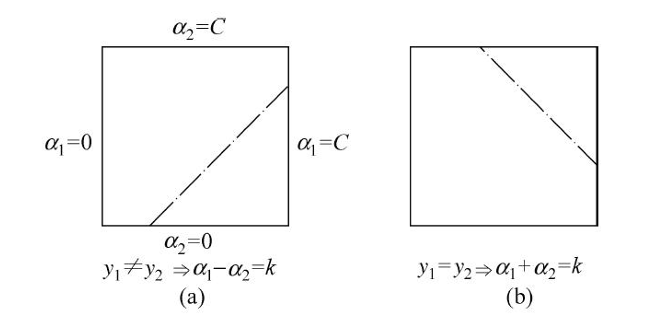

# 支持向量机 (SVM) 

## 概述

**支持向量机 (Support Vector Machine, SVM)** 是一种监督学习算法，一般用于**二元分类**问题。

SVM的核心思想，是特征空间中找到一个**最优的超平面 (hyperplane)**，该超平面能够将不同类别的数据点分隔开来，并且**间隔最大**。该超平面即构建起一个线性分类器；同时通过核技巧，使它成为实质上的非线性分类器。

SVM的学习策略就是间隔最大，可形式化为一个求解**凸二次规划**问题。其模型由简到繁，为硬间隔支持向量机，软间隔支持向量机，非线性支持向量机（引入核函数）

SVM的决策函数仅由支持向量决定，因此内存效率高；且使用不同的核函数 灵活地处理数据。

**关键概念：**

* **超平面 (Hyperplane):** 在 $n$ 维空间中，一个 $n-1$ 维的子空间。
* **间隔 (Margin):** 数据点到超平面的最短距离。SVM 的目标是找到具有最大间隔的超平面。
* **支持向量 (Support Vectors):** 离超平面最近的那些数据点。这些点“支撑”着这个最优超平面，如果移动或移除这些点，超平面很可能会改变。这也是 SVM 名称的由来。

## 硬间隔支持向量机

**硬间隔支持向量机**，或者说**线性可分支持向量机**是最简单的一种 SVM 模型。它适用于线性可分的数据样本。

### 模型定义

* **输入空间：** $\mathcal{X} \subseteq \mathbb{R}^n$ (特征空间)
* **输出空间：** $\mathcal{Y} = \{+1, -1\}$ (类别标签)
* **训练数据集：** $T = \{(x_1, y_1), (x_2, y_2), \dots, (x_N, y_N)\}$，其中 $x_i \in \mathcal{X}$，$y_i \in \mathcal{Y}$。

在特征空间中，划分超平面可以用以下线性方程来描述：

$$
w \cdot x + b = 0
$$

其中：

* $w = (w_1, w_2, \dots, w_n)^T$ 是**法向量 (normal vector)**，决定了超平面的方向。
* $b$ 是**偏置 (bias)**，决定了超平面与原点之间的距离。

对于线性可分的数据集，我们希望找到一个超平面，使得对于所有的样本 $(x_i, y_i)$

* 如果 $y_i = +1$，则 $w \cdot x_i + b \ge +\delta$
* 如果 $y_i = -1$，则 $w \cdot x_i + b \le -\delta$

### 函数间隔与几何间隔

* **函数间隔 (Functional Margin):** 对于给定的训练样本 $(x_i, y_i)$ 和超平面 $(w, b)$，函数间隔定义为：
  
	$$ 
	\hat{\gamma}_i = y_i(w \cdot x_i + b) 
	$$

	对于所有样本，超平面的函数间隔是：

	$$
	\hat{\gamma} = \min_{i=1,\dots,N} \hat{\gamma}_i 
	$$
	
	函数间隔的大小可以被人为地通过缩放 $w$ 和 $b$ 来改变。

* **几何间隔 (Geometric Margin):** 为了得到一个不受参数缩放影响的度量，我们引入几何间隔。对于给定的训练样本 $(x_i, y_i)$ 和超平面 $(w, b)$，几何间隔定义为样本点到超平面的带符号距离，然后乘以其类别标签：
  
	$$
	 \gamma_i = y_i \left( \frac{w \cdot x_i + b}{\|w\|} \right) = \frac{\hat{\gamma}_i}{\|w\|} 
	 $$

	其中 $\|w\|$ 是 $w$ 的 L2 范数，即 $\|w\| = \sqrt{w_1^2 + w_2^2 + \dots + w_n^2}$。
	对于所有样本，超平面的几何间隔是：
	
	$$
	 \gamma = \min_{i=1,\dots,N} \gamma_i 
	 $$

	几何间隔是数据点到超平面的真实距离，不受 $w$ 和 $b$ 缩放的影响。

### 问题转换

线性可分 SVM 的目标是找到一个超平面 $(w, b)$，使得几何间隔 $\gamma$ 最大化。

根据几何间隔的定义 $\gamma = \frac{\hat{\gamma}}{\|w\|}$，我们可以将问题转化为在约束 $y_i(w \cdot x_i + b) \ge \hat{\gamma}$ 下最大化 $\frac{\hat{\gamma}}{\|w\|}$。注意到函数间隔 $\hat{\gamma}$ 的取值不影响最优化问题的解我们可以令函数间隔 $\hat{\gamma} = 1$。这样，约束条件变为：

$$
y_i(w \cdot x_i + b) \ge 1, \quad \text{for } i = 1, 2, \dots, N
$$

所以，最小化$\gamma$即最大化$\|w\|^2$，于是最优化问题可以表示为：

$$
\begin{aligned}
\min_{w,b} \quad & \frac{1}{2}\|w\|^2 \\
\text{subject to} \quad & y_i(w \cdot x_i + b) \ge 1, \quad i = 1, 2, \dots, N
\end{aligned}
$$

这是一个**凸二次规划 (Convex Quadratic Programming)** 问题，存在唯一的全局最优解。

此时有，最优解 $(w^*, b^*)$ 下，那些使得约束条件 $y_i(w^* \cdot x_i + b^*) = 1$ 成立的数据点 $(x_i, y_i)$ 就是**支持向量**。

这些支持向量恰好位于间隔边界上（$H_{\pm}: w \cdot x + b = \pm1$），对最优超平面的选择起关键作用作用。

有**间隔大小**为几何间隔的两倍，等于 $\frac{2}{\|w\|}$。

## 对偶算法

由上文所说，我们可以将基本的SVM问题转为带有不等式约束的凸二次规划问题。然而，直接求解较为复杂。

因此，我们通常通过求解更容易解决的**对偶问题 (Dual Problem)** 来得到原始问题的解，同时方便引入核函数。

#### 对偶问题

对于上述带有 $N$ 个不等式约束的优化问题，我们引入 $N$ 个乘子子 $\alpha_i \ge 0$（与约束一一对应），转化问题为：

$$
\begin{aligned}
&\min_{w,b} \; \max_{\alpha \ge 0} \; L(w, b, \alpha) \\
&L(w, b, \alpha) = \frac{1}{2}\|w\|^2 - \sum_{i=1}^{N} \alpha_i [y_i(w \cdot x_i + b) - 1]
\end{aligned}
$$

这是因为：

* 为了使 $\max_{\alpha \ge 0} L(w, b, \alpha)$ 尽可能小，如果 $y_i(w \cdot x_i + b) - 1 > 0$，那么 $\alpha_i$ 必须为 0 才能使该项最大化为0。如果 $y_i(w \cdot x_i + b) - 1 = 0$，那么 $\alpha_i$ 可以取任意非负值，该项仍为0。所以当约束满足时，$\max_{\alpha \ge 0} L(w, b, \alpha) = \frac{1}{2}\|w\|^2$。
* 如果某个约束 $y_k(w \cdot x_k + b) < 1$ 不满足，即 $y_k(w \cdot x_k + b) - 1 < 0$，那么我们可以令 $\alpha_k \to \infty$，这将导致 $\max_{\alpha \ge 0} L(w, b, \alpha) \to \infty$。

所以，$\min_{w,b} \; \max_{\alpha \ge 0} \; L(w, b, \alpha) $ 的解与原始问题的解是一致的。

且通过上述推导，我们可以知道，最后结果中如果 $\alpha_i > 0$，则 $y_i(w \cdot x_i + b) - 1 = 0$，即 $y_i(w \cdot x_i + b) = 1$。这意味着对应的样本 $x_i$ 是**支持向量**，它恰好位于间隔边界上。

### 求解对偶问题

下面，我们从外到内求解该对偶问题。

求解 $\min_{w,b} L(w, b, \alpha)$，需对$w, b$求偏导，带入，有对偶问题变成了只关于 $\alpha$ 的优化问题

$$
\begin{aligned}
\max_{\alpha} \quad & W(\alpha) = \sum_{i=1}^{N} \alpha_i - \frac{1}{2} \sum_{i=1}^{N} \sum_{j=1}^{N} \alpha_i \alpha_j y_i y_j (x_i \cdot x_j) \\
\text{subject to} \quad & \sum_{i=1}^{N} \alpha_i y_i = 0 \\
& \alpha_i \ge 0, \quad i = 1, 2, \dots, N
\end{aligned}
$$

其中$\alpha$的约束由$b$偏导得来。

这仍然是一个二次规划问题，但其约束通常比原始问题更简单。有多种算法可以求解这个问题，例如序列最小最优化算法 (Sequential Minimal Optimization, SMO)。

通过求解对偶问题得到了最优的 $\alpha^* = (\alpha_1^*, \alpha_2^*, \dots, \alpha_N^*)^T$，根据偏导条件，有

$$
\begin{aligned}
w^* &= \sum_{i=1}^{N} \alpha_i^* y_i x_i \\
b^* &= y_j - w^* \cdot x_j, \;\; \{j: \alpha_j>0\}
\end{aligned}
$$

## 软间隔支持向量机

**软间隔支持向量机 (Soft Margin SVM)**允许样本点不完全线性可分（一般取近似线性可分）。它允许某些样本点不满足严格的间隔约束，即允许它们出现在间隔边界之内，甚至被错误分类。

### 模型改进

为了允许某些样本点违反 $y_i(w \cdot x_i + b) \ge 1$ 的约束，我们为每个样本点 $(x_i, y_i)$ 引入一个**松弛变量 (slack variable)** $\xi_i \ge 0$。

约束条件变为：$ y_i(w \cdot x_i + b) \ge 1 - \xi_i, \quad i = 1, 2, \dots, N $

* 如果 $\xi_i = 0$，则样本点 $x_i$ 满足硬间隔约束，位于间隔边界上或正确分类侧且在间隔之外。
* 如果 $0 < \xi_i < 1$，则样本点 $x_i$ 位于间隔边界之内，但仍然被正确分类。
* 如果 $\xi_i = 1$，则样本点 $x_i$ 恰好在分离超平面上（$w \cdot x_i + b = 0$），但它仍然在正确的分类一侧（因为它满足 $y_i(w \cdot x_i + b) = 0 \ge 1-1$）。这种情况实际上意味着它在“容忍范围”的边界上。
* 如果 $\xi_i > 1$，则样本点 $x_i$ 被错误分类。

因此，我们希望总的松弛量 $\sum_{i=1}^{N} \xi_i$ 尽可能小，我们用**惩罚参数 ** $C > 0$ 来控制惩罚程度。较大的C意味着对训练数据拟合得更好，但可能会降低泛化性。

有最终问题改进为：

$$
\begin{aligned}
\min_{w,b,\xi} \quad & \frac{1}{2}\|w\|^2 + C \sum_{i=1}^{N} \xi_i \\
\text{subject to} \quad & y_i(w \cdot x_i + b) \ge 1 - \xi_i, \quad i = 1, 2, \dots, N \\
& \xi_i \ge 0, \quad i = 1, 2, \dots, N
\end{aligned}
$$

软间隔支持向量机的对偶问题改变不大，唯一的变化是拉格朗日乘子 $\alpha_i$ 有了一个上限 $C$ (因为 $\alpha_i = C - \mu_i$ 且 $\mu_i \ge 0$)

此时有向量的分类结果如下：

* 位于间隔边界上的点 ($0 < \alpha_i \le C, \xi_i = 0$)。
* 位于间隔内部的点 ($\alpha_i = C, 0 < \xi_i \le 1$)。
* 被错误分类的点 ($\alpha_i = C, \xi_i > 1$)。

## 非线性支持向量机

很多实际问题的数据是非线性可分的，我们可以通过核技巧来实现非线性的支持向量机。

### 核技巧

一个直接的思路时通过映射 $\phi(x)$ ，将原始数据映射到特征空间并进行线性分类，但该映射函数很难找到。

**核技巧**允许我们在高维特征空间中进行计算，而无需显式地定义映射 。

**核函数 (Kernel Function):** 

- 如果存在映射 $\phi$，对于 $\forall x_i, x_j \in \mathcal{X}$，它们在特征空间中的内积等于某个函数，则该函数为核函数。
- 由内积得，核函数是半正定的——即对于任意有限样本集 $\{x_1, \dots, x_m\}$，矩阵$[K(x_i, x_j)]_{m \times m}$ 正定

$$
K(x_i, x_j) = \phi(x_i) \cdot \phi(x_j)
$$

**核技巧的核心思想：** 直接定义和使用核函数 $K(x_i, x_j)$，而不是显式地进行特征映射 $\phi(x)$。

通过使用核函数，对偶问题可以重写为：

$$
\begin{aligned}
\max_{\alpha} \quad & W(\alpha) = \sum_{i=1}^{N} \alpha_i - \frac{1}{2} \sum_{i=1}^{N} \sum_{j=1}^{N} \alpha_i \alpha_j y_i y_j K(x_i, x_j) \\
\text{subject to} \quad & \sum_{i=1}^{N} \alpha_i y_i = 0 \\
& 0 \le \alpha_i \le C, \quad i = 1, 2, \dots, N
\end{aligned}
$$

决策函数变为：

$$
f(x) = \text{sign} \left( \sum_{i \in SV} \alpha_i^* y_i K(x_i, x) + b^* \right)
$$

其中 $SV$ 是支持向量的集合。

### 常用核函数

* **线性核 (Linear Kernel):**
	
	$$ 
	K(x_i, x_j) = x_i \cdot x_j 
	$$ 

	这对应于原始的线性 SVM。此时，特征空间就是输入空间本身。

* **多项式核 (Polynomial Kernel):**
	
	$$
	 K(x_i, x_j) = (x_i \cdot x_j + c)^d 
	 $$

	其中 $d$ 是多项式的次数，$c$ 是常数。它将数据映射到 $d$ 次多项式特征空间。

* **径向基函数核 (Radial Basis Function Kernel, RBF Kernel) / 高斯核 (Gaussian Kernel) :**
	
	$$ 
	K(x_i, x_j) = \exp \left( - \frac{\|x_i - x_j\|^2}{2\sigma^2} \right) = \exp(-\gamma \|x_i - x_j\|^2) 
	$$

	其中 $\sigma > 0$ 是高斯函数的带宽（或 $\gamma = \frac{1}{2\sigma^2}$ 是一个可调参数）。RBF 核可以将数据映射到无限维特征空间。这是最常用也最强大的核函数之一，因为它能够处理复杂的数据分布。它对参数 $\gamma$ 和 $C$ 的选择比较敏感。

* **Sigmoid 核 (Sigmoid Kernel):**
	
	$$
	 K(x_i, x_j) = \tanh(\beta (x_i \cdot x_j) + \theta) 
	 $$

	其中 $\beta$ 和 $\theta$ 是参数。Sigmoid 核在某些条件下（特定参数）才满足 Mercer 定理。在实践中，它的性能有时不如 RBF 核。
	
* **字符串核函数**：用于离散集合上

## 序列最小最优化算法SMO

在前面我们推导出了SVM 的对偶问题，这是一个二次规划 (QP) 问题。当训练样本数量 $N$ 非常大时，通用的 QP 求解算法通常效率低下，因为它们可能需要计算和存储一个 $N \times N$ 的矩阵 (Hessian 矩阵，即核矩阵 $K$)。

**序列最小最优化算法 (Sequential Minimal Optimization, SMO)**是一种高效解决 SVM 对偶问题的算法。它特别适用于大规模数据集和非线性核函数的情况。

### 核心算法

SMO 的核心思想是将一个大的 QP 问题分解为一系列**尽可能小的 QP 子问题**进行迭代求解。SMO 选择的最小子问题是**同时优化两个拉格朗日乘子 $\alpha_i$ 和 $\alpha_j$**，而固定其他所有乘子，则约束变为：

$$
\alpha_1 y_1 + \alpha_2 y_2 = -\sum_{k=3}^{N} \alpha_k y_k = \text{constant} 
$$

由于 $y_i \in \{-1, +1\}$，所以 $y_i^2 = 1$。两边同乘 $y_1$：$ \alpha_1 + \alpha_2 y_1 y_2 = K_{const} y_1 $。这样，$\alpha_1$ 可以用 $\alpha_2$ 来表示（或反之），从而将对两个变量的优化问题简化为对一个变量的优化问题。

带入到原有的目标函数，有新的优化问题如下：

$$
\begin{aligned}
\min_{\alpha_1, \alpha_2} \quad W(\alpha_1, \alpha_2) = & \frac{1}{2} K_{11} \alpha_1^2 + \frac{1}{2} K_{22} \alpha_2^2 + y_1 y_2 K_{12} \alpha_1 \alpha_2 \\
& - (\alpha_1 + \alpha_2) + y_1 \alpha_1 \sum_{i=3}^{N} y_i \alpha_i K_{i1} + y_2 \alpha_2 \sum_{i=3}^{N} y_i \alpha_i K_{i2} \\
\text{s.t.} \quad & \alpha_1 y_1 + \alpha_2 y_2 = -\sum_{i=3}^{N} y_i \alpha_i = \zeta \\
& 0 \le \alpha_i \le C, \quad i=1, 2
\end{aligned}
$$

将 $\alpha_1$ 代入目标函数 $W(\alpha_1, \alpha_2)$，得到一个只关于 $\alpha_2$ 的一元二次函数。对其求导并令导数为 0，可以解出未经剪辑的 $\alpha_2^{new,unc}$。

$$
\begin{aligned}
E_i & = \left( \sum_{j=1}^{N} \alpha_j y_j K(x_j, x_i) + b \right) - y_i, \quad i=1,2 \\
\eta &= K_{11} + K_{22} - 2K_{12} = \|\Phi(x_1) - \Phi(x_2)\|^2\\
\alpha_2^{\text{new,unc}} &= \alpha_2^{\text{old}} + \frac{y_2(E_1 - E_2)}{\eta} \\
\end{aligned}
$$

此时注意，有二元约束如下：

* 如果 $y_1 \ne y_2$ (即 $s = -1$), 则 $\alpha_1 - \alpha_2 = \zeta y_1$。
	* $L = \max(0, \alpha_2^{old} - \alpha_1^{old})$
	* $H = \min(C, C + \alpha_2^{old} - \alpha_1^{old})$
* 如果 $y_1 = y_2$ (即 $s = 1$), 则 $\alpha_1 + \alpha_2 = \zeta y_1$。
	* $L = \max(0, \alpha_1^{old} + \alpha_2^{old} - C)$
	* $H = \min(C, \alpha_1^{old} + \alpha_2^{old})$

其中 $\alpha_1^{old}$ 和 $\alpha_2^{old}$ 是优化前的值。
所以，更新后的 $\alpha_2^{new}$ 是：

$$
\alpha_2^{new} =
\begin{cases}
H & \text{if } \alpha_2^{new,unc} > H \\
\alpha_2^{new,unc} & \text{if } L \le \alpha_2^{new,unc} \le H \\
L & \text{if } \alpha_2^{new,unc} < L
\end{cases}
$$

同时更新$ \alpha_1^{new} = \alpha_1^{old} +y_1 y_2 (\alpha_2^{old} - \alpha_2^{new}) $

在每一步优化一对 $(\alpha_i, \alpha_j)$ 之后，需要更新阈值 $b$ 以反映新的 $\alpha$ 值。
新的 $b$ 值应该使得 KKT 条件在新的 $\alpha_i^{new}$ 和 $\alpha_j^{new}$ 上得到满足。

* 如果新的 $\alpha_i^{new}$ 满足 $0 < \alpha_i^{new} < C$，则 $x_i$ 是一个支持向量，位于间隔边界上。此时 $y_i u_i = 1$，即 $y_i (\sum_{k=1}^N \alpha_k^{new} y_k K(x_k, x_i) + b^{new}) = 1$。可以解出 $b_1^{new}$（对$j$同理）
	
	$$ 
	b_1^{new} = y_i - \sum_{k \ne i,j} \alpha_k^{new} y_k K(x_k, x_i) - \alpha_i^{new} y_i K(x_i, x_i) - \alpha_j^{new} y_j K(x_j, x_i) 
	$$

* 如果 $\alpha_i^{new}$ 和 $\alpha_j^{new}$ 都等于 $0$ 或 $C$ (即边界上)，那么 $b^{new}$ 可以选择介于 $b_1$ 和 $b_2$ 之间的任何值。通常会选择 $(b_1^{new} + b_2^{new})/2$

### 算法步骤

SMO 算法是一个迭代过程，

SMO 的效率很大程度上取决于如何选择要优化的两个乘子。目标是选择那些能使目标函数有较大改变的乘子。

常用的启发式策略包括：

1.  **外层循环：** 遍历整个训练集，选择第一个乘子 $\alpha_i$。
	* 优先选择那些违反 KKT 条件的样本，即不满足以下条件的样本（在一定容差 $\epsilon$ 内）：
	* 如果所有样本都在容差范围内满足 KKT 条件，则算法收敛。
2.  **内层循环：** 在确定了第一个乘子 $\alpha_i$ (例如，一个违反 KKT 条件的 $\alpha_i$) 后，选择第二个乘子 $\alpha_j$ 的目标是最大化步长 $|\alpha_j^{new} - \alpha_j^{old}|$ 或目标函数的改变量。
	* 一种策略是选择使得 $|E_i - E_j|$ 最大的 $\alpha_j$，其中 $E_k = u_k - y_k$ 是样本 $x_k$ 的预测误差。
	* 如果找不到能使目标函数有足够进展的 $\alpha_j$，则可以遍历所有非边界的 $\alpha_k$ ($0 < \alpha_k < C$) 作为 $\alpha_j$。
	* 如果仍然找不到，则遍历整个训练集寻找 $\alpha_j$。

每一步执行以下操作：

1.  **选择一对乘子 $(\alpha_i, \alpha_j)$ 进行优化：** 通常使用启发式方法来选择最有可能违反 KKT 条件的乘子，以便快速收敛。
2.  **固定其他乘子，针对选定的 $(\alpha_i, \alpha_j)$ 求解子问题：** 得到更新后的 $\alpha_i^{new}$ 和 $\alpha_j^{new}$。
3.  **更新阈值 $b$：** 根据更新后的 $\alpha$ 值重新计算 $b$。
4.  **重复步骤 1-3 直到收敛：** 收敛条件通常是所有 $\alpha_i$ 在一定精度下都满足 KKT 条件。

