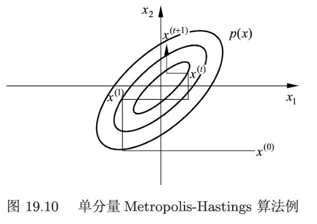

# 马尔可夫链蒙特卡罗法学习

## 概述

马尔可夫链蒙特卡罗法（Markov Chain MonteCarlo，MCMC），是以马尔可夫链为概率模型的蒙特卡罗法。

MCMC构建一个马尔可夫链，使其平稳分布就是要进行抽样的分布，并首先基于该马尔可夫链进行随机游走，产生样本的序列，之后使用该平稳分布的样本进行近似数值计算。

MCMC被应用于概率分布的估计、定积分的近似计算、最优化问题的近似求解等问题，特别是被应用于统计学习中概率模型的学习与推理，是重要的统计学习计算方法。

Metropolis-Hastings算法是最基本的MCMC，而吉布斯抽是更简单、使用更广泛的MCMC


## 蒙特卡罗法

### 概述

**蒙特卡罗法** (Monte Carlo Method) 的核心思想是依赖于重复的**随机抽样**来获得数值结果，通常用于解决难以精确求解的问题。

蒙特卡洛法由**大数定律**，保证足够多的样本下，样本期望可以趋近真实期望

一般的蒙特卡罗法有直接抽样法、接受-拒绝抽样法、重要性抽样法等，其中PDF复杂的情况下更适用于后两者

蒙特卡罗法的有效性依赖于我们能够有效地从目标分布 $p(x)$ 中抽取样本。当 $p(x)$ 非常复杂、维度很高，或者只知道其未归一化的形式时，直接采样就变得非常困难。这正是**马尔可夫链蒙特卡罗法**要解决的问题。

### 接受-拒绝抽样法

假设有随机变量 $x$，取值 $x \in \mathcal{X}$，其概率密度函数为 $p(x)$。目标是得到该概率分布的随机样本，以对这个概率分布进行分析。

接受-拒绝法的基本想法如下：

- 假设 $p(x)$ 不可以直接抽样。找一个可以直接抽样的分布，称为**建议分布** (proposal distribution)。

- 假设 $q(x)$ 是建议分布的概率密度函数，并且有 $q(x)$ 的 $c$ 倍一定大于等于 $p(x)$，其中 $c > 0$

- 按照 $q(x)$【而不是$cq(x)$】 进行抽样，假设得到结果是 $x^*$，再按照 $\frac{p(x^*)}{cq(x^*)}$ 的比例**随机决定**是否接受 $x^*$。直观上，落到 $p(x^*)$ 范围内的就接受 (绿色)，落到 $p(x^*)$ 范围外的就拒绝 (红色)。接受-拒绝法实际是按照 $p(x)$ 的涵盖体积占 $cq(x)$ 的涵盖体积)的比例进行抽样。

重复抽样过程，即可获得指定数量的样本。

正确性证明思路：有样本被接受且是$x$的条件概率为
$$
p(x | A) = \frac{P(X=x \text{ and accepted})}{P(A)}= \frac{p(x)/c}{1/c} = p(x)
$$
需要注意由于高维度的涵盖体积差异容易偏大，该方法存在**效率较低**的缺点

### 积分近似计算

一般的蒙特卡罗法也可以用于定积分的近似计算，称为蒙特卡罗积分。

例如，求$h(x)$的积分，我们将其分解为期望形式（实际上，给定一个概率密度函数$p(x)$，只要取$f(x）=h(c)/p(c)$，都可以满足）

而函数的数学期望，我们可以使用蒙特卡洛法近似，进而求解积分结果。
$$
\begin{aligned}
\int_{\mathcal{X}} h(x) \,dx = \int_{\mathcal{X}} f(x) p(x) \,dx = E_{p(x)}[f(x)] \approx \frac{1}{n}\sum f_i(x)
\end{aligned}
$$


## 马尔可夫链 

### 概述

**马尔可夫链**是一个具有**马尔可夫性质**的随机过程。这意味着系统的下一个状态仅取决于当前状态，而与它如何到达当前状态的先前历史无关。本书主要讨论的是1阶马尔科夫链。（对与n阶同理）

以下是一些关键概念的复习（具体内容在随机过程相关课程）：

- 转移矩阵：有由状态$i$转移到状态$j$的概率为$p_{ij}$，有转移矩阵$P=[p_{ij}]$
- 不可约：任意状态间可互达
- 平稳分布：不可约的马尔科夫链中，计算稳态方程组的解，这是状态转移最后的平稳分布
- 周期：对某一状态，其自返步数的最大公约数。若马尔科夫链非周期，称为遍历（具有唯一的平稳分布）

### 连续状态马尔科夫链

连续状态马尔可夫链中，$X_t$ 的取值来自于一个连续的集合。下面我们仅讨论**离散时间**的情况。

定义 $X_t$ 在连续状态空间 $S$，转移概率分布由概率转移核或**转移核** (transition kernel) 表示。

对任意的 $x \in S, A \subset S$，转移核 $P(x,A)$ 定义为【注意，是落入集合的概率】
$$
\begin{aligned}
P(x,A)=P(X_t \in A | X_{t-1} = x)  = \int_A p(x,y) \,dy 
\end{aligned}
$$
其中 $p(x, \cdot)$ 是概率密度函数，满足 $p(x, \cdot) \ge 0$, $P(x,S) = \int_S p(x,y) \,dy = 1$。转移核 $P(x,A)$ 表示从 $x \sim A$ 的转移概率

有时也将概率密度函数 $p(x, \cdot)$ 称为转移核。【方便理解，也可以写作$p(y|x)$】

同样的，连续状态下也存在平稳分布，有：【注意，这里微元是$dx$】
$$
\begin{aligned} \pi(y) &= \int_{x \in S} p(x,y) \pi(x) \,dx, && \forall y \in S \\ \pi(A) &= \int_{x \in S} P(x,A) \pi(x) \,dx, && \forall A \subset S \end{aligned}
$$


## 马尔可夫链蒙特卡罗法

### 基本思想

我们利用马尔科夫链的平稳分布的性质，来获取目标分布的期望

具体而言，我们需要在随机变量$x$的状态空间$S$上定义一个满足遍历定理的马尔可夫链$\{X_t \}$，并令其平稳分布满足$p(x)$

随后，我们在这个马尔可夫链上进行随机游走，每个时刻得到一个样本。

根据遍历定理，当时间趋于无穷时，样本的分布趋近平稳分布，此时我们取足够长时间$m$后的一段样本集合，该集合就是就是目标概率分布的抽样结果，得到的函数均值（遍历均值）就是要计算的数学期望值。

其中，到时刻$m$为止的时期为燃烧期。

这个方法有几个重要问题：

- 如何定义马尔可夫链，保证马尔可夫链蒙特卡罗法的条件成立。
- 如何确定收敛步数m，保证样本抽样的无偏性。
- 如何确定迭代步数n，保证遍历均值计算的精度。

### MCMC与统计学习

MCMC往往作为统计学习中的一些辅助工具。

例如，贝叶斯方法下，往往需要计算归一化因子，有
$$
\int_{\mathcal{X}} p(y|x')p(x')\,dx'
$$
或者对后验概率分布求数学期望，有
$$
E_{P(x|y)}[f(x)] = \int_{\mathcal{X}} f(x)p(x|y)\,dx
$$
在实际情况中，这些积分并不好算，MCMC为此提供了一个通用的方法

实际当中，MCMC有基础的Metropolis-Hastings 算法，以及更广泛应用的吉布斯抽样

## MCMC算法

### Metropolis-Hastings 算法

假设要抽样的概率分布为 $p(x)$。Metropolis-Hastings 算法采用转移核为 $p(x,x')$ 的马尔可夫链：
$$
\begin{aligned}
p(x,x') = q(x,x')\alpha(x,x') 
\end{aligned}
$$
其中 $q(x,x')$ 和 $\alpha(x,x')$ 分别称为建议分布 (proposal distribution) 和接受分布 (acceptance distribution)。

建议分布 $q(x,x')$ 是另一个**不可约**的马尔可夫链的转移核（即其概率值恒不为 0），同时是一个容易抽样的分布。

接受分布 $\alpha(x,x')$有

$$
\begin{aligned}
\alpha(x,x') = \min \left\{ 1, \frac{p(x')q(x',x)}{p(x)q(x,x')} \right\} 
\end{aligned}
$$

这时，转移核 $p(x,x')$ 可以写成【满足非负和归一性，故是转移核】

$$
\begin{aligned}
p(x,x') = \begin{cases} q(x,x'), & p(x')q(x',x) \ge p(x)q(x,x') \\ q(x',x)\frac{p(x')}{p(x)}, & p(x')q(x',x) < p(x)q(x,x') \end{cases} 
\end{aligned}
$$

注意，以上讨论都有，$x \ne x'$，具体采样流程如下，我们分别执行$q(x,x')$和$\alpha(x,x')$

- 先按照建议分布$q(x,x')$抽取一个候选状态$x'$
- 按$\alpha(x,x')$抽样决定是否接受$x'$，以概率$1-\alpha$拒绝抽样，则下一时刻仍停留在$x$

通过以上设置，我们可以保证转移核$p(x,x')$下为**可逆马尔科夫链**

$$
\begin{aligned}
p(x)p(x,x') &= p(x)q(x,x') \min \left\{ 1, \frac{p(x')q(x',x)}{p(x)q(x,x')} \right\} \\
&= \min \{p(x)q(x,x'), p(x')q(x',x) \} \\
&= p(x')q(x',x) \min \left\{ \frac{p(x)q(x,x')}{p(x')q(x',x)}, 1 \right\} \\
&= p(x')p(x',x)
\end{aligned}
$$

基于此，可推出**平稳分布**为$p(x)$

$$
\begin{aligned}
\int p(x)p(x,x')\,dx &= \int p(x')p(x',x)\,dx \\
&= p(x') \int p(x',x)\,dx \\
&= p(x')
\end{aligned}
$$

### 建议分布

建议分布有两种常有形式

第一种形式，假设建议分布是对称的，如高斯分布、随机游走（$q(x,x')=q(|x-x'|)$）、

此时，接受分布简化为：
$$
\alpha(x,x') = \min \left\{ 1, \frac{p(x')}{p(x)} \right\}
$$


此时一般假设，当$x$和$x'$越接近，转移概率越高

第二种形式，则是将建议分布退化为独立抽样，即$q(x')$

此时有接受分布简化为：

$$
\alpha(x,x') = \min \left\{ 1, \frac{p(x')/q(x')}{p(x)/q(x)} \right\}
$$

独立抽样实现简单，但可能收敛速度慢，通常选择接近目标分布$p(x)$的分布作为建议分布$q(x)$

### 满条件分布

对于多元联合概率分布 $p(x) = p(x_1, x_2, \dots, x_k)$，其中 $x = (x_1, x_2, \dots, x_k)^{\text{T}}$ 为 $k$ 维随机变量。

如果条件概率分布 $p(x_I | x_{-I})$ 中所有 $k$ 个变量全部出现，其中 $x_I = \{x_i, i \in I\}$, $x_{-I} = \{x_i, i \notin I\}$, $I \subset K = \{1, 2, \dots, k\}$，那么称这种条件概率分布为满条件分布 (full conditional distribution)。

满条件分布有以下**性质**：对任意的 $x, x' \in \mathcal{X}$ 和任意的 $I \subset K$，有

$$
\begin{aligned}
p(x_I | x_{-I}) = \frac{p(x)}{\int p(x) \,dx_I} \propto p(x) 
\end{aligned}
$$

而且，对任意的 $x, x' \in \mathcal{X}$ 和任意的 $I \subset K$，有

$$
\begin{aligned}
\frac{p(x'_I | x'_{-I})}{p(x_I | x_{-I})} = \frac{p(x')}{p(x)} 
\end{aligned}
$$

Metropolis-Hastings 算法中，可以利用该性质，**简化计算**，提高计算效率。

具体地，通过满条件分布概率的比 $\frac{p(x'_I | x'_{-I})}{p(x_I | x_{-I})}$ 计算联合概率的比 $\frac{p(x')}{p(x)}$，而前者更容易计算。

### 单分量Metropolis-Hastings 算法

在Metropolis-Hastings算法中，通常需要对多元变量分布进行抽样，有时对多元变量分布的抽样是困难的。

在这个时候，可以对每一变量的**条件分布**依次分别进行抽样，从而实现对整个多元变量的一次抽样，这就是单分量算法。

对分量 $x_j$ 根据 Metropolis-Hastings 算法更新，得到其新的取值 $x_j^{(i)}$。首先，由建议分布 $q(x_j^{(i-1)}, x_j^{i} | x_{-j}^{(i)})$ 抽样产生分量 $x_j$ 的候选值 $x_j'^{(i)}$，这里 $x_{-j}^{(i)}$ 表示在第 $i$ 次迭代的第 $(j-1)$ 步后的 $x^{(i)}$ 除去 $x_j^{(i-1)}$ 的所有值，即

$$
\begin{aligned}
x_{-j}^{(i)} = (x_1^{(i)}, \dots, x_{j-1}^{(i)}, x_{j+1}^{(i-1)}, \dots, x_k^{(i-1)})^{\text{T}}
\end{aligned}
$$

其中分量 $1, 2, \dots, j-1$ **已经更新**。然后，有接收概率

$$
\begin{aligned}
\alpha(x_j^{(i-1)}, x_j'^{(i)} | x_{-j}^{(i)}) = \min \left\{ 1, \frac{p(x_j'^{(i)}|x_{-j}^{(i)})q(x_j'^{(i)}, x_j^{(i-1)}|x_{-j}^{(i)})}{p(x_j^{(i-1)}|x_{-j}^{(i)})q(x_j^{(i-1)}, x_j'^{(i)}|x_{-j}^{(i)})} \right\} && (19.47)
\end{aligned}
$$

实际上，这相当于每次迭代时，先后在对应单变量维度，进行转移（接受的情况下）




### 吉布斯抽样

吉布斯抽样实际上是Metropolis-Hastings 算法的一种特殊情况，但更容易实现，而被广泛使用

其核心思想，是通过轮流对每个**单变量**，在其给定其他所有变量当前值的**满条件分布** 下进行采样。

也就是，吉布斯抽样是单分量Metropolis-Hastings 算法，并令建议分布为满条件分布。

$$
q(x_j^{(i-1)}, x_j^{i} | x_{-j}^{(i)})=p(x_j | x_1^{(i)}, \dots, x_{j-1}^{(i)}, x_{j+1}^{(i-1)}, \dots, x_k^{(i-1)}), \quad j=2, \dots, k-1
$$

特别的，在这种情况，带入计算有接受概率为$\alpha=1$，也就是全都接受

可以看出，吉布斯抽样的实施需要我们能够**推导出**并从每个变量的满条件分布中直接采样。

吉布斯抽样适合于满条件概率分布容易抽样的情况，而单分量Metropolis-Hastings算法适合于满条件概率分布不容易抽样的情况，这时使用容易抽样的条件分布作建议分布。


## 代码实现

以正态分布为建议分布，具有对称性

```python
import numpy as np

def reject_or_accept(theta_cur, theta_cand, pdf):
    return min(1, pdf(theta_cur) / pdf(theta_cand))  # 返回接受概率

theta_cur = 0.5  # 初始值
std_dev = 0.1  # 标准差
burn_in = 100  # 燃烧期次数
n_samples = 100000  # 采样次数
sample_array = []

while len(sample_array) < n_samples:
    theta_cand = np.random.normal(theta_cur, std_dev)  # 生成候选值
    if reject_or_accept(theta_cur, theta_cand) > np.random.rand():
        theta_cur = theta_cand  # 接受候选值
    if burn_in > 0:
        burn_in -= 1
    
E_theta = np.mean(sample_array)  # 计算期望值
Var_theta = np.var(sample_array)  # 计算方差

print("期望值 E[θ]:", E_theta)
print("方差 Var[θ]:", Var_theta)
```

