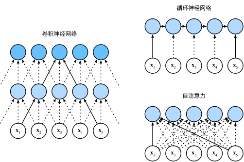

## Transformer

### 注意力机制

在现实中，人的注意力往往可以分为自主性的与非自主性的注意力（存在提示）

自主性的（无额外提示的）注意力，可以通过参数化的全连接层，甚至是非参数化的最大汇聚层来模拟

而“**是否包含自主性提示**”将注意力机制与全连接层或汇聚层区别开来，我们作出以下定义

- *查询*（query）：自主性提示，往往作为较少的意志线索进行输入
- *键*（key）：非意志线索，可以想象为感官输入
- *值*（value）：感觉输入，将查询与键匹配，引导出最匹配的值


我们可以写出一个通用的注意力汇聚公式：

$f(x) = \sum_{i=1}^n \alpha(x, x_i) y_i$

其中$(x_i,y_i)$是键值对，而$x$为查询，通过注意力权重$\alpha$，我们实现了对不同值分配不同注意力

一般来讲，我们会设置一个注意力评分函数，经过softmax函数后对值赋权

```python
class NWKernelRegression(nn.Module): #一个简单的注意力模型
    def __init__(self, **kwargs):
        super().__init__(**kwargs)
        self.w = nn.Parameter(torch.rand((1,), requires_grad=True))

    def forward(self, queries, keys, values):
        # queries和attention_weights的形状为(查询个数，“键－值”对个数)
        queries = queries.repeat_interleave(keys.shape[1]).reshape((-1, keys.shape[1]))
        self.attention_weights = nn.functional.softmax(
            -((queries - keys) * self.w)**2 / 2, dim=1)
        # values的形状为(查询个数，“键－值”对个数)
        return torch.bmm(self.attention_weights.unsqueeze(1),
                         values.unsqueeze(-1)).reshape(-1) #使用bmm进行高效的小批次矩阵乘法
```

在这里我们补充一下更细节的操作：

- Mask：遮掩无意义词元，使用大负数替代
- 加性注意力：$a(\mathbf q, \mathbf k) = \mathbf w_v^\top \text{tanh}(\mathbf W_q\mathbf q + \mathbf W_k \mathbf k) \in \mathbb{R}$，

- 缩放点积注意力$a(\mathbf q, \mathbf k) = \mathbf{q}^\top \mathbf{k}  /\sqrt{d}.$：
	- 点积可以得到**计算效率更高**的评分函数——但它要求相同的长度
	- 为了确保点积方差为1，我们再除以$\sqrt{d}$

### Bahdanau注意力

Bahdanau等人提出了一个没有<u>严格单向对齐限制</u>的 可微注意力模型 

在预测词元时，如果不是所有输入词元都相关，模型将仅对齐（或参与）输入序列中与当前预测相关的部分

这是通过将**上下文变量**视为注意力的输出（与解码器隐变量有关的函数）来实现的。

有$\mathbf{c}_{t'} = \sum_{t=1}^T \alpha(\mathbf{s}_{t' - 1}, \mathbf{h}_t) \mathbf{h}_t$ 

时间步$t^′−1$时的解码器隐状态$s_{t^′−1}$是查询， 编码器隐状态$h_t$**既是键，也是值**

在这里，我们每次计算注意力时，都会用到编码器所有时间步的状态，并用掩码遮蔽无效内容


### 多头注意力

为了在相同条件下，学习到不同的行为，我们可以使用多个注意力机制

对于每一个注意力头，我们用**线性投影**来变换查询、键和值
$$
\mathbf{h}_i = f(\mathbf W_i^{(q)}\mathbf q, \mathbf W_i^{(k)}\mathbf k,\mathbf W_i^{(v)}\mathbf v) \in \mathbb R^{p_v},
$$
对于它们的输出，我们进行连接，线性投影后，再作为我们原先的注意力输出


在具体实现上，为了减少开支，我们取每个头的计算维度为隐状态维度除以头数

即每个注意力头收到的信息为，通过**线性变换将输入投影到不同子空间**后，再按维度分割为 *n* 份的结果

同时为了并行化，我们通过变换维度，使用向量的整体进行计算，随后再变回

```python
class MultiHeadAttention(nn.Module):
    """多头注意力"""
    def __init__(self, key_size, query_size, value_size, num_hiddens,
                 num_heads, dropout, bias=False, **kwargs):
        super(MultiHeadAttention, self).__init__(**kwargs)
        self.num_heads = num_heads
        self.attention = d2l.DotProductAttention(dropout)
        self.W_q = nn.Linear(query_size, num_hiddens, bias=bias)
        self.W_k = nn.Linear(key_size, num_hiddens, bias=bias)
        self.W_v = nn.Linear(value_size, num_hiddens, bias=bias)
        self.W_o = nn.Linear(num_hiddens, num_hiddens, bias=bias)

    def forward(self, queries, keys, values, valid_lens):
        # queries，keys，values的形状:
        # (batch_size，查询或者“键－值”对的个数，num_hiddens)
        # valid_lens　的形状:
        # (batch_size，)或(batch_size，查询的个数)
        # 经过变换后，输出的queries，keys，values　的形状:
        # (batch_size*num_heads，查询或者“键－值”对的个数，
        # num_hiddens/num_heads)
        queries = transpose_qkv(self.W_q(queries), self.num_heads)
        keys = transpose_qkv(self.W_k(keys), self.num_heads)
        values = transpose_qkv(self.W_v(values), self.num_heads)

        if valid_lens is not None:
            # 在轴0，将第一项（标量或者矢量）复制num_heads次，
            # 然后如此复制第二项，然后诸如此类。
            valid_lens = torch.repeat_interleave(
                valid_lens, repeats=self.num_heads, dim=0)

        # output的形状:(batch_size*num_heads，查询的个数，
        # num_hiddens/num_heads)
        output = self.attention(queries, keys, values, valid_lens)

        # output_concat的形状:(batch_size，查询的个数，num_hiddens)
        output_concat = transpose_output(output, self.num_heads)
        return self.W_o(output_concat)
```


### 自注意力机制

我们将词元序列输入注意力池化中， 以同一组词元**同时充当查询、键和值**，我们称为自注意力



|     **模型/特性**      | **计算复杂度** | **顺序操作数量** | **最大路径长度** | **并行计算优势** |           **核心缺点**           |
| :--------------------: | :------------: | :--------------: | :--------------: | :--------------: | :------------------------------: |
| **卷积神经网络 (CNN)** |   $O(knd^2)$   |      $O(1)$      |     $O(n/k)$     |      ✅ 支持      | 感受野受限（需多层堆叠覆盖全局） |
| **循环神经网络 (RNN)** |   $O(nd^2)$    |      $O(n)$      |      $O(n)$      |    ❌ 无法并行    | 长序列梯度消失/爆炸，计算效率低  |
|    **自注意力机制**    |   $O(n^2d)$    |      $O(1)$      |      $O(1)$      |      ✅ 支持      |   长序列时二次复杂度计算代价高   |

其中，$k$为卷积核的大小，$n$为序列长度，$d$为通道数量

由此看来，自注意力有着最短的关联路径和较好的并行化——其缺点是计算代价的迅速增加

### 位置编码

自注意力采用并行计算，因而会丧失序列的位置信息。我们通过添加位置编码来补充

 位置编码可以通过学习得到也可以直接固定得到，这里我们介绍基于正弦函数和余弦函数的固定位置编码
 
$$
\begin{aligned} p_{i, 2j} &= \sin\left(\frac{i}{10000^{2j/d}}\right),\\p_{i, 2j+1} &= \cos\left(\frac{i}{10000^{2j/d}}\right).\end{aligned}
$$

对于$P \in R^{n \times d}$，有第$i,j$对应行、列。

对于绝对位置信息，通过三角函数在不同位置（输入变化），不同维度（频率变化）的不断交替，实现每个位置有独一无二的位置编码（每一个维度的可能重复，组合起来不会重复）

对于相对位置信息，任意有偏移$\delta$相同的两个位置编码，他们之间可以用仅由$j$决定的矩阵进行转换

$$
\begin{aligned}
&\begin{bmatrix} \cos(\delta \omega_j) & \sin(\delta \omega_j) \\  -\sin(\delta \omega_j) & \cos(\delta \omega_j) \\ \end{bmatrix}
\begin{bmatrix} p_{i, 2j} \\  p_{i, 2j+1} \\ \end{bmatrix}\\
=&\begin{bmatrix} \cos(\delta \omega_j) \sin(i \omega_j) + \sin(\delta \omega_j) \cos(i \omega_j) \\  -\sin(\delta \omega_j) \sin(i \omega_j) + \cos(\delta \omega_j) \cos(i \omega_j) \\ \end{bmatrix}\\
=&\begin{bmatrix} \sin\left((i+\delta) \omega_j\right) \\  \cos\left((i+\delta) \omega_j\right) \\ \end{bmatrix}\\
=&
\begin{bmatrix} p_{i+\delta, 2j} \\  p_{i+\delta, 2j+1} \\ \end{bmatrix},
\end{aligned}
$$

而模型可以自行学习到这一矩阵，进而获得同样的相对位置信息

### Transformer

Transformer打破了CNN，RNN框架，结合了**编码解码架构**、**自注意力**、**多头注意力**、**深层网络优化**

实现了一个，能解决可变序列的、关联能力强的、学习模式丰富的、模型潜能大的架构


####  基于位置的前馈网络

为了引入非线性变化，我们在每次多头注意层后加入该网络

对于输入的每一个token，相当于进行了两层的感知机，为了进行残差连接，输入输出形状一致

而不同token之间，并不会进行计算——它们共享一个相同参数的感知机，其作用为提取特征。

而token之间的关系，则由线性的多头注意力进行学习

#### 残差连接和层规范化

每个子层后都会进行残差连接和层规范化，以保证深层网络的收敛

其中，我们使用层规范化，而不是批次规范化，是因为我们

- 序列长度不同，层规范化更稳定
- 有利于残差网络的计算
- NLP问题中，每个位置的词的作用可能完全不一样，BN会把信息混杂，导致信息丢失
- Transformer的消融实验也表明LN的效果更好

####  解码器

解码器每层都有有掩码多头注意力和交叉多头注意力子层

前者以目前已有的目标序列，进行自注意力计算

训练时，我们采用**Teacher Forcing**方法，即解码器会直接使用目标序列，但通过掩码机制，保证生成第i个位置时只能获取前i-1个位置的标签——因此该层我们称为掩码层

而在交叉多头注意力层，我们以前者的输出作为查询，以编码器的输出固定为键和查询，进行计算


