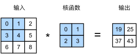
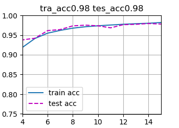

## 卷积神经网络

### 卷积函数

对于高维感知数据，多层感知机会造成过高的参数规模，进而消耗大量算力和时间

因此我们会使用函数来降维采样原本的数据，减少模型需求的参数

这样的架构需要以下的性质：

- **平移不变性**（translation invariance）：神经网络的前面几层对相同的图像区域具有相似的反应
- **局部性**（locality）：神经网络的前面几层应该只探索输入图像中的局部区域，而不过度在意图像中相隔较远区域的关系

对于原本的多层感知机的映射	$\begin{split}\begin{aligned} \left[\mathbf{H}\right]_{i, j} =  [\mathbf{U}]_{i, j} +
\sum_a \sum_b [\mathsf{V}]_{i, j, a, b}  [\mathbf{X}]_{i+a, j+b}.\end{aligned}\end{split}$

使得**V**仅与a,b有关，而与隐藏层H的位置无关，可以实现平移不变性

在加和时限制循环范围，则可以实现局限性

故而原映射可以优化为	$[\mathbf{H}]_{i, j} = u + \sum_{a = -\Delta}^{\Delta} \sum_{b = -\Delta}^{\Delta} [\mathbf{V}]_{a, b}  [\mathbf{X}]_{i+a, j+b}.$

使用卷积函数则可以满足上述的要求

常用的实现流程如下：



### 卷积架构

#### 填充和步幅

每次使用卷积层会导致失去k-1的数据宽度，在深层学习中会丢失很多边界信息

此时我们可以使用**填充**的方式，即在数据周边填充一圈的空数据，以来保存边界信息

而卷积窗口滑动的**步幅**也是可以调整的，调大步幅则能减少隐藏层的参数宽度

#### 多通道输入输出

对多通道的输入，卷积层也可以具有不同的通道


以上是多通道输入单通道输出的事例

事实上，通过增加卷积层组数可以实现更多的输入通道

比较特别例子如 1 X 1卷积层，可以看做通道的映射变化

#### 池化层

卷积层具有一定的局部性，它可能会对位置过于敏感，缺乏泛化性

同时卷积层的最后也需要进行汇聚，实现全局的映射

基于这两点，我们引入了池化层，它可以视为固定参量的窗口函数

常用的池化层如*最大池化层*（maximum pooling）和*平均池化层*（average pooling）

池化层也具有填充与步伐，它经常也能起到降低参数规模的作用

（P.S. 由于算力的增长，以及通过数据变化来扩展数据集的做法，池化层的重要性已经有所下降）


#### 代码实现

使用`Pytorch`可以方便地使用卷积层

以下为经典的LeNet架构

```python
#二维卷积层使用四维输入和输出格式（批量大小、通道、高度、宽度），
net = nn.Sequential(
    nn.Conv2d(1, 6, kernel_size=5, padding=2), nn.Sigmoid(),
    nn.AvgPool2d(kernel_size=2, stride=2), #平均池化层
    nn.Conv2d(6, 16, kernel_size=5), nn.Sigmoid(),
    nn.AvgPool2d(kernel_size=2, stride=2),
    nn.Flatten(),
    nn.Linear(16 * 5 * 5, 120), nn.Sigmoid(),
    nn.Linear(120, 84), nn.Sigmoid(),
    nn.Linear(84, 10))
```

使用卷积可以大大降低参数规模，以及增加模型对位置特征的学习

使用卷积神经网络可以很容易地在手写数字识别中获得高准确度

