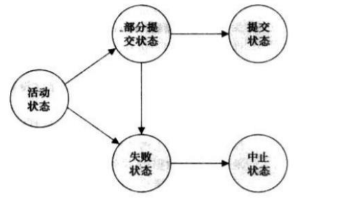

## 数据库进阶

## 并行化

### 事务与并行化

#### 事务

在执行SQL语句的时候，某些业务要求，一系列操作必须全部执行，而不能仅执行一部分

这种把多条语句作为一个整体的功能，被称为数据库**事务**，具有整体的性质。

具体而言，事务应该具有**ACID**的良好性质：

- 原子性（Atomicity）：事务可以确保该事务范围内的所有操作都可以<u>全部成功或者全部失败。</u>
- 隔离性（Isolation）：事务之间完全独立，不会互相影响
- 持久性（Durability）：事务一旦提交，对数据库的改变是永久性的
- 一致性（Consistency)：事务前后数据库、数据状态是合法的，各方数据一致（以上三点的目的）



（事务的状态图如上）

对单条语句，数据库会自动作为一个隐性事务执行

事务使用`BEGIN;`开始，中间为多条执行语句，最后使用`COMMIT`提交或者`ROLLBACK`取消。


#### 隔离级别

并发执行的事务，如果涉及到操作同一条记录的时候，可能会发生问题

对此SQL标准定义了4种隔离级别，对应不同情况

- 脏读：当一个事务读取到另一个失败事务的更新数据时，即为脏读
- 不可重复读：当一个事务多次读取同数据时，另一个事务对数据进行了更新，即会读到矛盾数据
- 幻读：当一个事务多次读取同数据时，另一个事务对数据进行了插入，即会读到不同的数据集

| Isolation Level  | 脏读（Dirty Read） | 不可重复读（Non Repeatable Read） | 幻读（Phantom Read） |
| ---------------- | ------------------ | --------------------------------- | -------------------- |
| Read Uncommitted | Yes                | Yes                               | Yes                  |
| Read Committed   | -                  | Yes                               | Yes                  |
| Repeatable Read  | -                  | -                                 | Yes                  |
| Serializable     | -                  | -                                 | -                    |

注意最后一种级别，事务其实是串行执行，一般不采用

当一个事务进行中发生其它事务提交，会存在**级联回滚**，即回滚所有相关事务以确保可恢复

如果对调度加以限制，保证提交操作在读取操作前，则称为无级联调度


#### 可串行化分析

如果一个调度执行效果等同于串行调度，则该调度**可串行化**

如果两个事务对相同数据项进行操作，且有一个存在写入指令，则称两个事务**冲突**

如果可以通过一系列非冲突指令的顺序交换，将调度S换为S‘，则称两个调度是**冲突等价**的

如果调度S与一个串行调度冲突等价，则称其为**冲突可串行化**

此外还有视图可串行化等概念。需记住冲突可串行化是相对严苛的条件。

为了化简事务调度，我们使用优先图描述

对于事务T1、T2，当存在：（简而言之，仅同时read不影响，）

- T2执行`read(Q)`之前，T1执行`write(Q)`
- T2执行`write(Q)`之前，T1执行`read(Q)`
- T2执行`write(Q)`之前，T1执行`write(Q)`

就需要画一条由T1指向T2的线（先后顺序）

如果优先图**有环**，则调度室**非**冲突可串行化


#### 并发控制实现

为了确保并发隔离性，会使用数据项加锁，包括<u>排他模式</u>和<u>共享模式</u>

锁协议下，事务需要对数据项进行加锁和解锁的申请，同时也允许锁模式的转换

为了预防权限冲突造成死锁，锁协议下会有预声明和顺序指定等机制

## 数据库进阶操作

### 过程

使用过程将储存代码段，方便后续反复调用，同时可以记录变量

过程使用范例如下：

```sql
CREATE PROCEDURE queryByLastName	-- 创造过程
    @lastName VARCHAR(50),			-- 定义输入变量
    @sameNameCnt INT OUTPUT			-- 定义输出变量
AS									-- 具体执行过程
SELECT @sameNameCnt = COUNT(id) FROM member
WHERE LastName = @lastName
GO									-- 执行片段

DECLARE @lastName VARCHAR(20) = 'Smith'; 
DECLARE @sameNameCnt INT;			-- 声明变量
EXEC queryByLastName @lastName, @sameNameCnt OUTPUT	-- 使用EXEC执行过程，并传递变量
SELECT '共' + CAST(@sameNameCnt AS VARCHAR) + '个' AS 结果 -- 继续使用输出变量
```


### 函数

用户自定义函数可以像系统函数一样在查询或过程中调用，也可以像过程一样使用EXECUTE命令来执行

函数的返回值可以是标量，也可以是表（类似于视图）

函数使用范例如下：

```sql
CREATE FUNCTION getMemberRecordByLastName(@lastName VARCHAR(50)) -- 定义函数和输入
RETURNS TABLE		-- 定义返回形式，Table是表类型，也可以使用标量
AS
RETURN
(SELECT * FROM member WHERE LastName = @lastName)
GO

SELECT * FROM dbo.getMemberRecordByLastName('Ma'); -- 调用库中的自定义函数
```


### 控制语句

- `DECLARE 变量名 类型`：变量声明
- `SET 变量 = 值`：变量赋值
- `IF 表达式 操作语句`：判断语句，后续可接`ELSE`
- `CASE input ... END`：条件语句，中间为`WHEN 条件 THEN 返回结果`
- `WHILE 表达式 操作事务`：循环语句，可以使用`BREAK`和`CONTINUE`


### 游标

游标类似于C语言中的指针，它可以指向结果集中的任意位置

可以把游标理解为一种数据访问机制，它允许用户访问单独的数据行并进行操作，减少系统开销

```sql
DECLARE @EmployeeID INT, @FirstName VARCHAR(50), @LastName VARCHAR(50), @Salary DECIMAL(10, 2);
-- 声明游标
DECLARE EmployeeCursor CURSOR FOR
SELECT EmployeeID, Salary FROM Employees;
-- 打开游标
OPEN EmployeeCursor;
-- 使用游标
FETCH NEXT FROM EmployeeCursor INTO @EmployeeID, @Salary; -- 读取游标数据（一行）
WHILE @@FETCH_STATUS = 0
BEGIN
    SELECT @Salary AS Salary,
           CASE     -- 使用 CASE 语句处理条件
               WHEN @Salary < 60000 THEN 'Low'
               WHEN @Salary BETWEEN 60000 AND 80000 THEN 'Medium'
               ELSE 'High'
           END AS SalaryCategory;
    FETCH NEXT FROM EmployeeCursor INTO @EmployeeID, @Salary;  -- 获取下一行数据
END;
-- 关闭并释放游标
CLOSE EmployeeCursor;
DEALLOCATE EmployeeCursor;
```


### 触发器

触发器（trigger）是一种<u>特殊类型的存储过程</u>（procedure），常用于完整性约束

不同之处在于存储过程是被过程名调用，而触发器由事务触发执行

创建、删除和修改触发器使用DDL类语句

#### DML触发器

触发器定义语法

```sql
CREATE TRIGGER trigger_name
 ON {table | view}
 {AFTER | INSTEAD OF} {DELETE, UPDATE, INSERT}
 AS
 SQL_statement -- 具体事务
```

`INSERT, UPDATE, DELETE`都有对应的触发器

在语句执行时，会在内存中创建两个特殊的临时表：`DELETED`表和`INSERTED` 表（`UPDATE`需要两个表）

这些表可被触发器暂时访问，进行额外处理，触发器的事务归属于整个操作事务中

使用`INSTEAD OF`会先建立临时表，但跳过对表中数据的操作

#### DDL触发器

触发器定义语法

```sql
CREATE TRIGGER trigger_name
 ON {ALL SERVER | DATABASE} 
 FOR {event_type}
 AS
 SQL_statement
```

- `ALL SERVER | DATABASE`：前者表示对整个服务器，后者则是当前数据库
- `event_type`：书写形式如`CREATE_TABLE`，`ALTER_VIEW`


### 索引

索引是⼀种特殊的⽂件，存储着对⽬标数据表中所有记录的引⽤指针

索引可以大大提高查询速度，加快分组、排序、连接时间

一般设计原则：

- 主键、外键必须有索引（自动定义）
- 经常与其他表进⾏连接的表，在<u>连接字段</u>上应该建⽴索引
- 经常出现在where /group by/order by⼦句中的字段应该建⽴索引
- 唯⼀性太差，或更新频繁的字段不适合建⽴索引

索引语法：

```sql
CREATE UNIQUE CLUSTERED INDEX idx_name
ON Table_name(col_name {ASC|DESC})
WITH
FILLFACTOR=30; -- 填充因子
```

- 普通|唯一性：索引列的值是否唯一（后者标注`UNIQUE`）
- 聚集|非聚集：每个表只能有一个聚集索引（使用`CLUSTERED`定义），数据表据此进行顺序排序
- 填充因子：在索引的每个叶级页上按因子保留一定百分比的空间，供将来扩充，以减少页拆分的可能性


